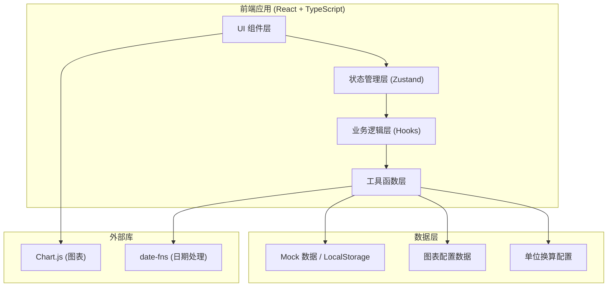

## 1. 架构设计



## 2. 技术描述

- **前端框架**：React@18 + TypeScript + Vite@5
- **样式方案**：TailwindCSS@3 + CSS 变量
- **状态管理**：Zustand（轻量级，适合中小规模应用）
- **图表库**：Chart.js + react-chartjs-2（轻量、易用、支持直方图和折线图）
- **路由**：React Router v6
- **工具库**：date-fns（日期格式化）
- **数据持久化**：LocalStorage（保存记录、筛选历史）
- **初始化工具**：Vite 脚手架

## 3. 路由定义

| 路由 | 页面 | 说明 |
|------|------|------|
| / | 误差图表主页 | 蒙特卡洛模拟主界面，图表 + 控制面板 + 指标卡 |
| /records | 数据记录管理 | 所有数据记录的列表、详情、新增 |
| /history | 筛选历史时间线 | 历史筛选操作记录与回溯 |
| /diagnosis | 异常诊断面板 | 重复样本检测、跳变原因分析 |
| /export | 导出报告 | 报告预览、进度汇总、导出功能 |

## 4. 核心数据模型

### 4.1 数据记录 (DataRecord)

```typescript
interface DataRecord {
  id: string;
  name: string;
  value: number;
  unit: string;           // 单位：mm, cm, m, kg, g 等
  error: number;          // 误差值
  source: 'normal' | 'draft' | 'verbal';  // 来源：正常/草稿/口头
  status: 'processed' | 'pending' | 'evidence_needed';  // 处理状态
  createdAt: Date;
  updatedAt: Date;
  notes: string;
  isDuplicate?: boolean;  // 是否为重复样本
  duplicateOf?: string;   // 重复的源记录 ID
}
```

### 4.2 筛选历史 (FilterHistory)

```typescript
interface FilterHistory {
  id: string;
  timestamp: Date;
  filterParams: {
    unit: string;
    confidenceLevel: number;
    simulationCount: number;
    sourceTypes: string[];
    dateRange?: [Date, Date];
  };
  resultSnapshot: {
    mean: number;
    stdDev: number;
    confidenceInterval: [number, number];
    recordCount: number;
  };
}
```

### 4.3 蒙特卡洛模拟结果 (MonteCarloResult)

```typescript
interface MonteCarloResult {
  samples: number[];           // 所有模拟样本值
  mean: number;                // 均值
  stdDev: number;              // 标准差
  variance: number;            // 方差
  confidenceInterval: {
    lower: number;
    upper: number;
    level: number;
  };
  histogram: {
    bins: number[];            // 区间边界
    counts: number[];          // 每个区间的计数
  };
  relativeError: number;       // 相对误差 (%)
}
```

### 4.4 异常诊断 (DiagnosisResult)

```typescript
interface DiagnosisResult {
  hasJump: boolean;             // 是否存在跳变
  jumpCause?: 'threshold' | 'unit' | 'single_record' | 'unknown';  // 跳变原因
  jumpDescription: string;      // 跳变描述
  duplicateRecords: string[];   // 重复样本 ID 列表
  suggestions: string[];        // 处理建议（人能照着做的步骤）
  affectedRecordId?: string;    // 受影响的记录 ID
}
```

### 4.5 单位配置 (UnitConfig)

```typescript
interface UnitConfig {
  category: 'length' | 'mass' | 'time' | 'temperature';
  baseUnit: string;
  units: {
    name: string;
    symbol: string;
    toBase: number | ((value: number) => number);
    fromBase: number | ((value: number) => number);
  }[];
}
```

## 5. 目录结构

```
src/
├── components/          # 通用组件
│   ├── Layout/         # 布局组件（导航、侧边栏）
│   ├── charts/         # 图表组件
│   └── ui/             # UI 基础组件（按钮、卡片、标签等）
├── pages/              # 页面组件
│   ├── Dashboard/      # 误差图表主页
│   ├── Records/        # 数据记录管理
│   ├── History/        # 筛选历史时间线
│   ├── Diagnosis/      # 异常诊断面板
│   └── Export/         # 导出报告
├── hooks/              # 自定义 Hooks
│   ├── useMonteCarlo.ts # 蒙特卡洛模拟 Hook
│   ├── useUnitConversion.ts # 单位换算 Hook
│   └── useDiagnosis.ts # 异常诊断 Hook
├── store/              # 状态管理
│   ├── useRecordStore.ts
│   ├── useFilterStore.ts
│   └── useHistoryStore.ts
├── utils/              # 工具函数
│   ├── monteCarlo.ts   # 蒙特卡洛算法
│   ├── units.ts        # 单位换算
│   ├── diagnosis.ts    # 异常诊断
│   └── format.ts       # 格式化工具
├── types/              # TypeScript 类型定义
│   └── index.ts
├── data/               # Mock 数据与配置
│   ├── mockRecords.ts  # 示例记录
│   └── unitConfigs.ts  # 单位配置
└── App.tsx
```

## 6. 核心算法说明

### 6.1 蒙特卡洛模拟算法

1. 输入：数据记录列表（值 + 误差）、模拟次数、单位
2. 过程：
   - 将所有记录统一转换为基准单位
   - 对每条记录，按正态分布生成 N 个随机样本（均值=记录值，标准差=误差）
   - 合并所有样本，计算统计量（均值、标准差、置信区间）
   - 生成直方图数据
3. 输出：MonteCarloResult

### 6.2 单位换算机制

- 所有计算统一在基准单位下进行
- 显示时根据用户选择的单位转换
- 公式中涉及的误差传递统一使用基准单位计算，再转换显示
- 确保：公式正确 + 单位一致 = 结果不偏

### 6.3 跳变诊断逻辑

1. 保存最近一次的模拟结果快照
2. 新结果与快照对比，检测均值/标准差的变化幅度
3. 若变化超过阈值，依次排查：
   - 单位是否切换 → 单位原因
   - 是否新增/删除单条高权重记录 → 单条记录原因
   - 阈值/置信水平是否调整 → 阈值原因
4. 生成诊断结论与处理建议

### 6.4 重复样本检测

- 基于数值相似度 + 名称相似度的双重检测
- 数值相似度：差值 < min(error1, error2) * 0.5
- 名称相似度：编辑距离 < 3
- 同时满足则标记为疑似重复
