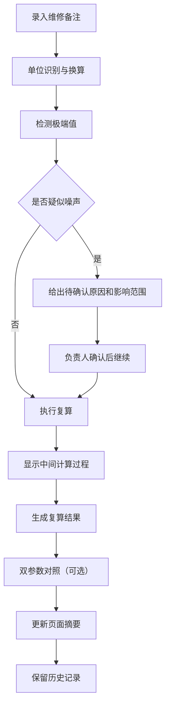

## 1. 产品概述

声学混响实验复算系统是专为声学实验数据处理设计的专业工具。主要解决维修备注材料断续、单位混写导致数量级错误、历史判断覆盖、极端值误判等实验复算中的常见问题。目标用户为实验老师和负责人，提供 Web3D 可视化、时间轴联动、双参数对照等核心功能。

## 2. 核心功能

### 2.1 用户角色
| 角色 | 注册方式 | 核心权限 |
|------|----------|----------|
| 实验老师 | 本地登录 | 录入维修备注、执行复算、查看历史记录 |
| 负责人 | 本地登录 | 双参数对照、异常确认、导出结果 |

### 2.2 功能模块
1. **主工作台**：Web3D 场景、时间轴控制、筛选面板、页面摘要
2. **维修备注管理**：分批录入、历史版本保留、单位识别
3. **实验复算引擎**：单位换算、中间过程展示、极端值检测
4. **双参数对照**：两组参数并行计算、结果对比
5. **异常处理**：噪声检测、待确认提示、影响范围分析

### 2.3 页面详情
| 页面名称 | 模块名称 | 功能描述 |
|----------|----------|----------|
| 主工作台 | Web3D 场景 | 点选实验对象、可视化展示、与时间轴联动 |
| 主工作台 | 时间轴控制 | 拖动切换时间点、筛选数据范围、联动 3D 场景 |
| 主工作台 | 维修备注面板 | 分批录入备注、查看历史版本、自动识别单位 |
| 主工作台 | 复算结果面板 | 显示中间计算过程、单位换算步骤、最终结果 |
| 主工作台 | 双参数对照 | 两组参数并行计算、结果差异对比 |
| 主工作台 | 异常提示 | 极端值检测、待确认原因、影响范围分析 |
| 主工作台 | 页面摘要 | 实验状态、关键指标、操作指引 |

## 3. 核心流程

## 4. 用户界面设计

### 4.1 设计风格
- **主色调**：深海蓝 (#0F172A) 作为背景，科技青 (#06B6D4) 作为主强调色，琥珀橙 (#F59E0B) 作为异常提示色
- **按钮风格**：扁平化设计，细微边框，hover 时有发光效果
- **字体**：JetBrains Mono 作为数据显示字体，Inter 作为界面字体
- **布局风格**：深色主题，三栏布局（左侧备注面板、中间3D场景、右侧结果面板），底部时间轴
- **图标风格**：Lucide 线性图标，配合颜色区分功能类型

### 4.2 页面设计概述
| 页面名称 | 模块名称 | UI 元素 |
|----------|----------|----------|
| 主工作台 | Web3D 场景 | 深色背景、线框模型、选中高亮、悬浮信息面板 |
| 主工作台 | 时间轴 | 渐变进度条、可拖动滑块、刻度标记、范围选择 |
| 主工作台 | 备注面板 | 卡片式历史记录、版本时间戳、单位标签、编辑按钮 |
| 主工作台 | 结果面板 | 等宽字体显示计算步骤、单位换算高亮、结果汇总卡片 |
| 主工作台 | 双参数对照 | 左右分栏对比、差异值高亮、同步滚动 |
| 主工作台 | 异常提示 | 橙色边框闪烁、原因列表、影响范围热力图 |
| 主工作台 | 页面摘要 | 顶部固定状态栏、关键指标卡片、快捷操作按钮 |

### 4.3 响应式
- 桌面端优先设计（≥1440px），三栏布局
- 平板端（≥768px）：两栏布局，底部时间轴保持
- 移动端（<768px）：单栏滚动布局，简化3D场景交互

### 4.4 3D 场景指引
- **环境**：深色渐变背景，微弱环境光，模拟实验室夜景
- **光照**：主光源 + 辅助轮廓光，突出物体边缘
- **相机**：透视相机，初始角度45度俯视，支持轨道控制
- **交互**：点击选中物体（高亮发光）、hover 显示信息、滚轮缩放
- **后处理**：轻微泛光效果，边缘抗锯齿
- **性能**：使用简化几何体模型，总面数控制在 5000 以内
