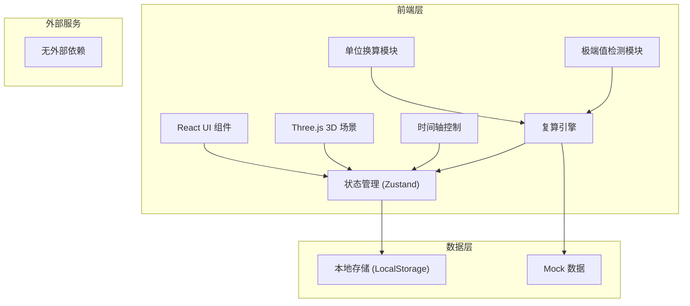
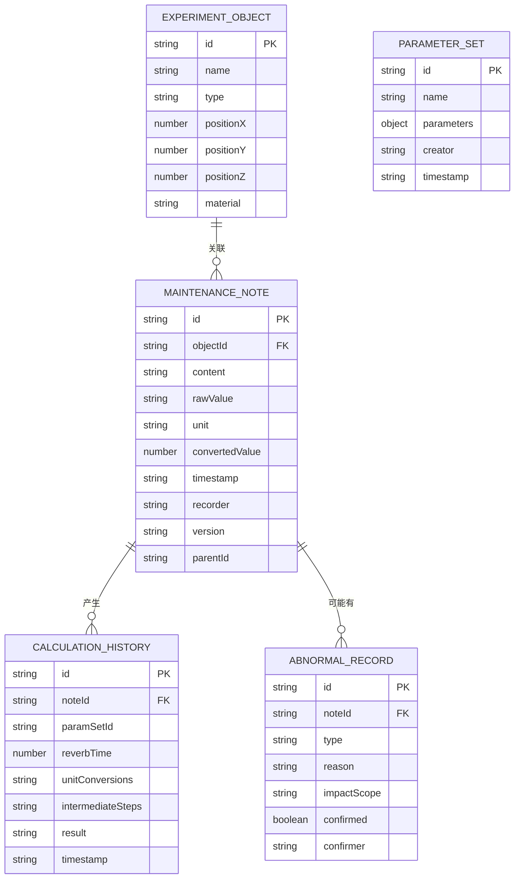

## 1. 架构设计



## 2. 技术描述

- **前端**: React@18 + TypeScript + tailwindcss@3 + vite
- **3D 引擎**: three@^0.160.0 + @react-three/fiber@^8.15.0 + @react-three/drei@^9.92.0 + @react-three/postprocessing@^2.15.0
- **状态管理**: zustand@^4.4.0
- **路由**: react-router-dom@^6.20.0
- **图标**: lucide-react@^0.294.0
- **初始化工具**: vite-init
- **后端**: 无（纯前端应用，数据存储在 LocalStorage）
- **数据库**: 无（使用 LocalStorage 持久化，内置 Mock 数据）

## 3. 路由定义

| 路由 | 用途 |
|------|------|
| / | 主工作台，包含所有功能模块 |

## 4. 数据模型

### 4.1 数据模型定义



### 4.2 TypeScript 类型定义

```typescript
// 实验对象
interface ExperimentObject {
  id: string;
  name: string;
  type: 'wall' | 'ceiling' | 'floor' | 'source' | 'receiver';
  position: { x: number; y: number; z: number };
  material: string;
  absorptionCoeff: number;
}

// 维修备注
interface MaintenanceNote {
  id: string;
  objectId: string;
  content: string;
  rawValue: string;
  unit: string;
  convertedValue: number;
  timestamp: string;
  recorder: string;
  version: number;
  parentId?: string;
}

// 单位换算
interface UnitConversion {
  fromUnit: string;
  toUnit: string;
  factor: number;
  formula: string;
}

// 计算步骤
interface CalculationStep {
  description: string;
  formula: string;
  input: Record<string, number>;
  output: number;
  unit: string;
}

// 复算结果
interface CalculationResult {
  id: string;
  noteId: string;
  paramSetId: string;
  reverbTime: number;
  unitConversions: UnitConversion[];
  intermediateSteps: CalculationStep[];
  timestamp: string;
  status: 'pending' | 'completed' | 'abnormal';
}

// 异常记录
interface AbnormalRecord {
  id: string;
  noteId: string;
  type: 'extreme_value' | 'unit_mismatch' | 'noise';
  reason: string;
  impactScope: string[];
  confirmed: boolean;
  confirmer?: string;
  confirmedAt?: string;
}

// 参数组
interface ParameterSet {
  id: string;
  name: string;
  parameters: {
    roomVolume: number;
    totalAbsorption: number;
    temperature: number;
    humidity: number;
  };
  creator: string;
  timestamp: string;
}

// 页面摘要
interface PageSummary {
  totalNotes: number;
  pendingConfirmations: number;
  lastCalculationTime: string;
  activeObjectId: string | null;
  selectedTimeRange: { start: number; end: number };
  quickActions: string[];
}

// 应用状态
interface AppState {
  objects: ExperimentObject[];
  notes: MaintenanceNote[];
  results: CalculationResult[];
  abnormalRecords: AbnormalRecord[];
  parameterSets: ParameterSet[];
  selectedObjectId: string | null;
  currentTime: number;
  timeRange: { start: number; end: number };
  compareMode: boolean;
  selectedParamSetIds: [string | null, string | null];
  summary: PageSummary;
}
```
