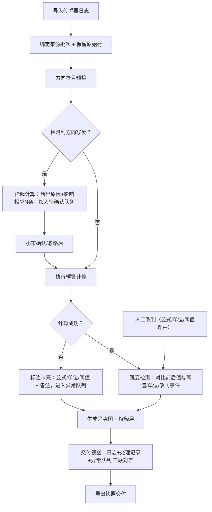

## 1. 产品概述

「声学混响阈值预警」是一款面向项目助理小宋的轻量化数据复盘工具，用于把传感器日志、处理记录、异常队列三者对齐交付。工具解决以下痛点：图表不再是无解释的黑盒、算不出的记录不会静默消失、脏数据保留原始痕迹、方向异常先停算再说清影响、跳变能定位到阈值/单位/人工改判、重启后状态与备注不丢失。

## 2. 核心功能

### 2.1 功能模块
1. **总览看板**：今日统计、状态分布、异常队列入口、交付导出入口
2. **传感器日志工作台**：CSV/粘贴导入、原始数据保留、字段映射、方向符号预检、待确认列表
3. **预警计算与人工改判**：公式与阈值可配置、单位校验、算不出的分类标注（公式/单位/阈值）、人工改判留痕
4. **图表复盘页**：混响趋势图 + 阈值线 + 每条异常/改判/跳变的解释浮层、按原因分类的图例
5. **交付视图**：把传感器日志、处理记录、异常队列三联对齐，支持筛选和导出

### 2.2 页面详情
| 页面名称 | 模块名称 | 功能描述 |
|---|---|---|
| 总览看板 | 状态卡片 | 已处理/待确认/异常/人工改判的数量与占比 |
| 总览看板 | 异常队列入口 | 列出 TOP 待处理异常，支持一键跳转 |
| 传感器日志工作台 | 导入区 | CSV 上传或文本粘贴，按批次绑定来源 |
| 传感器日志工作台 | 原始数据清单 | 逐行展示原文、解析后字段、脏数据标记（不自动修正，仅高亮） |
| 传感器日志工作台 | 方向预检 | 扫描方向符号写反的行，给出待确认原因与影响范围（前后相邻 N 条） |
| 预警计算与人工改判 | 阈值与单位配置 | 混响阈值（单值或分时段）、单位（dB/s 等）、计算公式版本 |
| 预警计算与人工改判 | 计算结果列表 | 每条记录：原始值 → 计算值 → 判定结果 → 计算链解释 |
| 预警计算与人工改判 | 算不出标注 | 对失败记录三选一卡壳原因：公式 / 单位 / 阈值，附备注 |
| 预警计算与人工改判 | 人工改判 | 可改判结果，必须填写改判理由（公式/单位/阈值）并留痕时间戳 |
| 图表复盘页 | 趋势图 | 时间轴 + 混响值 + 阈值带 + 异常/改判/跳变事件点（可点击查看解释） |
| 图表复盘页 | 跳变检测 | 前后差值超阈值自动标记，分析来源：阈值变更/单位变更/人工改判/原始数据波动 |
| 交付视图 | 三联对齐面板 | 左：原始传感器日志；中：处理记录；右：异常队列，支持按记录 ID 联动高亮 |
| 交付视图 | 导出 | 导出为带解释的 CSV/JSON 快照，含备注、改判原因、跳变分析 |

## 3. 核心流程

用户主要流程：导入传感器日志 → 系统做方向预检（有异常先停算，给出待确认原因与影响范围）→ 小宋确认或忽略方向问题 → 执行预警计算 → 对算不出的记录填写卡壳原因 → 对需要人工改判的记录加改判理由 → 在图表中查看带解释的点与跳变分析 → 切到交付视图把三联数据导出给他人。

## 4. 用户界面设计

### 4.1 设计风格
- 主题色：深蓝科技感 `#0B2545` 主色 + 琥珀警告 `#D97706` + 珊瑚预警 `#DC2626` + 墨绿通过 `#059669`
- 按钮：直角微圆 `rounded-md`，强对比边框与阴影，禁用态灰化
- 字体：标题用思源宋体/Noto Serif SC（沉稳可交付感），正文与数据用 JetBrains Mono 等宽字体（对齐原始日志）
- 布局：左右双栏或三栏「面板对齐」风格，适合小宋对数据的场景
- 图标：Lucide 线性图标 + 数据看板用的徽章色点
- 视觉细节：日志区域使用等宽字体 + 轻微网格底纹；解释层用右侧侧滑抽屉；状态标签带细微噪点纹理

### 4.2 页面设计概览
| 页面名称 | 模块名称 | UI 要素 |
|---|---|---|
| 总览看板 | 状态卡片 | 等宽数字、左上角色条、悬停微动效 |
| 日志工作台 | 原始数据清单 | 斑马纹行、脏数据高亮（但不改动文本）、右侧状态徽标 |
| 预警计算 | 计算结果列表 | 三段式行：原始值 → 计算链 → 判定结果；人工改判有琥珀对角标 |
| 图表复盘 | 趋势图解释层 | 事件点可点击，右侧抽屉展示公式/阈值/单位/改判理由 |
| 交付视图 | 三联面板 | 三栏独立滚动，同 ID 行同步高亮，顶部筛选器联动 |

### 4.3 响应式
桌面优先，最小宽度 1280px。日志与交付表格在 1440px 以下保持横向滚动，不挤压数据列。

### 4.4 数据持久化
所有状态（日志批次、处理记录、异常队列、人工改判、当前筛选、备注）写入 localStorage，key 带版本号；重启页面后自动恢复到上次离开时的状态。
