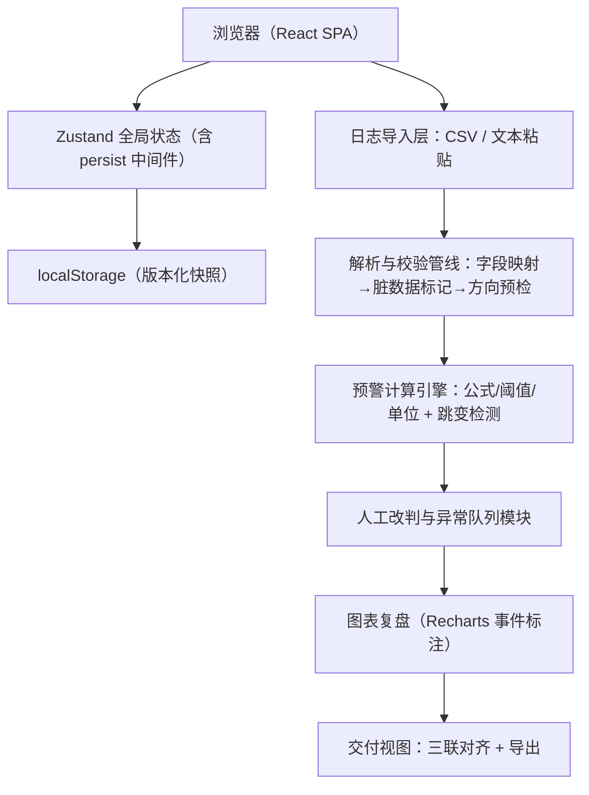
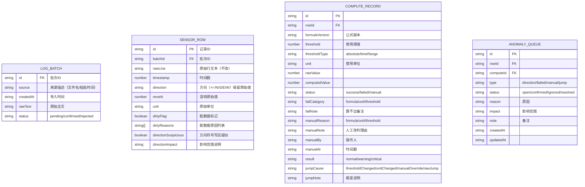

## 1. 架构设计

纯前端单页应用，数据持久化在浏览器 localStorage，交付通过导出 CSV/JSON 快照。不依赖后端，方便小宋单机使用与交接。



## 2. 技术选型

- 前端：React 18 + TypeScript + Vite
- 样式：Tailwind CSS 3
- 状态管理：Zustand + persist（localStorage 持久化）
- 图表：Recharts（轻量、支持事件点自定义）
- 路由：react-router-dom（4 个页面：/dashboard /logs /compute /chart /handover，单栏导航）
- 图标：lucide-react
- CSV 解析：内置简单 CSV parser（避免额外依赖）

## 3. 路由定义

| Route | 用途 |
|---|---|
| /dashboard | 总览看板（默认首页） |
| /logs | 传感器日志工作台（导入 + 原始清单 + 方向预检） |
| /compute | 预警计算与人工改判 |
| /chart | 图表复盘页（带解释层） |
| /handover | 交付视图（三联对齐 + 导出） |

## 4. 数据模型

### 4.1 核心数据定义



### 4.2 Zustand Store 切片

- `logStore`：批次、原始行、方向预检结果
- `configStore`：阈值、单位、公式版本
- `computeStore`：计算记录、人工改判、跳变分析
- `anomalyStore`：异常队列 CRUD + 状态流转
- `uiStore`：当前页面、筛选条件、选中记录 ID、侧边栏展开

## 5. 核心算法简述

1. **方向符号写反检测**：以同批次最近 10 条的众数方向为基准，出现反向或符号位（+/-）不一致即标记；影响范围为该行前后各 3 条 + 同时间窗口。
2. **预警计算**：`computedValue = |rawValue × unitFactor|`，与阈值（或分时段阈值）比较，输出 normal/warning/critical；任一环节异常（单位未知、公式版本空、阈值缺失）对应到 failCategory。
3. **跳变检测**：相邻两条的 `computedValue` 相对变化 >30% 或越过阈值线，检查当时是否有阈值/单位变更或人工改判，归因到 `jumpCause`。
4. **持久化**：Zustand `persist` 中间件，key=`reverb-warning:v1`，按模型切片分别序列化；加载时做版本校验，不匹配则提示迁移。

## 6. 项目结构

```
src/
  components/     Header、Sidebar、StatusBadge、DataTable、EventDrawer、ExportPanel
  pages/          Dashboard、Logs、Compute、Chart、Handover
  store/          5 个 Zustand slice + index
  utils/          csvParser、directionCheck、computeEngine、jumpDetector、exporter
  types/          全局类型定义（models、events）
  hooks/          useAnomalyStats、useLinkedRows
  App.tsx + main.tsx + router
```
