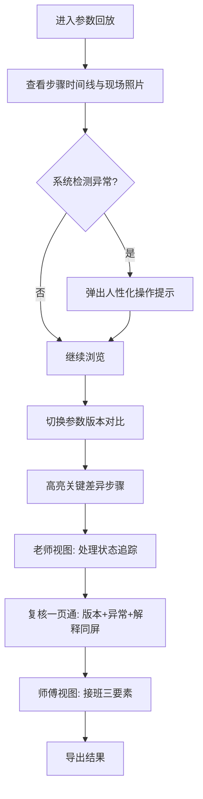

## 1. 产品概述
热泵循环参数回放系统，用于现场维修场景下的参数追踪与问题复核。解决维修材料零散、单位混写导致数量级错误、参数变更无法追溯等痛点。
- 目标用户：维修师傅（阿岑）、现场老师、复核人员
- 核心价值：让参数变化过程透明可追溯，异常点即时高亮，接班交接零障碍

## 2. 核心功能

### 2.1 用户角色
| 角色 | 描述 | 核心需求 |
|------|------|----------|
| 维修师傅阿岑 | 现场实操，交接班 | 快速看懂样例位置、异常位置、结果导出方式 |
| 现场老师 | 调整参数、验证方案 | 能看出哪一步参数变化导致结果改变 |
| 复核人员 | 事后审核、补证 | 参数版本、异常点、解释同屏查看 |

### 2.2 功能模块
1. **参数回放主页面**：时间线式步骤展示、现场照片嵌入、撤回记录混入
2. **参数版本对比**：多版本参数并列对比，差异步骤高亮
3. **异常检测与提示**：方向符号反写检测、单位混写数量级异常检测、人性化下一步操作
4. **复核一页通**：参数版本、异常点、解释说明同屏呈现
5. **老师视图**：处理状态追踪、证据补全清单
6. **师傅接班视图**：极简三要素（样例在哪、异常在哪、怎么导出）

### 2.3 页面详情
| 页面名称 | 模块名称 | 功能描述 |
|---------|----------|---------|
| 回放主页 | 步骤时间线 | 按步骤展示参数变化，可点击展开详情 |
| 回放主页 | 现场照片墙 | 嵌入贴近现场的照片，混入撤回记录标记 |
| 回放主页 | 单位异常标记 | 自动检测单位混写导致的数量级偏差并高亮 |
| 版本对比 | 参数对比表 | 两版参数并排，差异单元格高亮显示 |
| 版本对比 | 结果变化追踪 | 标注导致最终结果变化的关键步骤 |
| 异常提示 | 方向符号检测 | 检测方向符号反写并给出可操作的修正步骤 |
| 复核一页通 | 信息聚合面板 | 参数版本、异常点、解释说明同屏展示 |
| 老师视图 | 处理进度卡 | 已处理/待补证据分类展示 |
| 师傅视图 | 接班三要素 | 样例入口、异常位置、导出按钮极简布局 |

## 3. 核心流程

维修师傅打开回放 → 查看步骤时间线与现场照片 → 系统检测到方向符号反写并弹出可操作提示 → 切换参数版本对比 → 高亮显示导致结果变化的关键步骤 → 老师查看处理状态与证据补全清单 → 复核人员一页通查看所有信息 → 师傅接班极简查看三样要素 → 导出结果

## 4. 用户界面设计

### 4.1 设计风格
- 主色：工业蓝 `#1E40AF`，辅色：警示橙 `#F97316`，异常红 `#DC2626`，成功绿 `#16A34A`
- 背景：深色工控面板风格，带细微网格纹理，营造现场维修工作台氛围
- 按钮：硬朗圆角矩形，带轻微边框凹陷感，工业控制风格
- 字体：标题用"思源黑体 Heavy"，正文用"JetBrains Mono"配合等宽数字便于读数对比
- 布局：卡片式分区，信息密度偏高但层次清晰，符合工程工具属性
- 图标：线性工业风图标，配合状态色点

### 4.2 页面设计概览
| 页面名称 | 模块名称 | UI 元素 |
|---------|----------|---------|
| 回放主页 | 步骤时间线 | 竖向时间轴，每步带参数卡片、照片缩略图、撤回斜线标记 |
| 回放主页 | 异常标记 | 红色闪烁边框 + 橙色叹号徽标 + 底部操作建议条 |
| 版本对比 | 参数对比表 | 左右双栏，差异行黄色底色闪烁动画 |
| 复核一页通 | 信息聚合 | 三栏等分布局：版本列表、异常时间点、文字解释，顶部导航切换 |
| 老师视图 | 进度追踪 | 两列卡片：已处理（绿色对勾）、待补证据（橙色数字徽章） |
| 师傅视图 | 接班极简 | 三大卡片占满屏幕：样例入口、异常定位、一键导出 |

### 4.3 响应式
桌面端优先布局，针对现场平板设备做适配；触控区最小 44px；关键按钮支持大尺寸触控操作。

### 4.4 动效设计
- 异常点：脉冲式红色光晕循环，吸引注意力
- 版本切换：横向滑动过渡，差异处从右向左滑入高亮
- 步骤展开：手风琴式垂直展开，带轻微高度过渡
- 撤回记录：半透明灰色叠加 + 斜纹背景 + "撤回"红色印章角标
