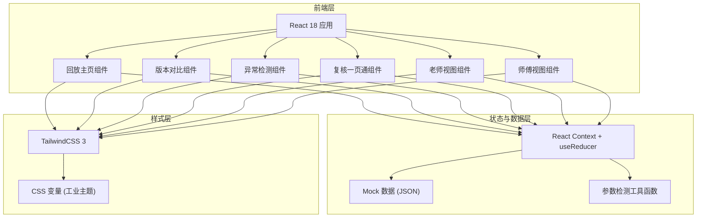
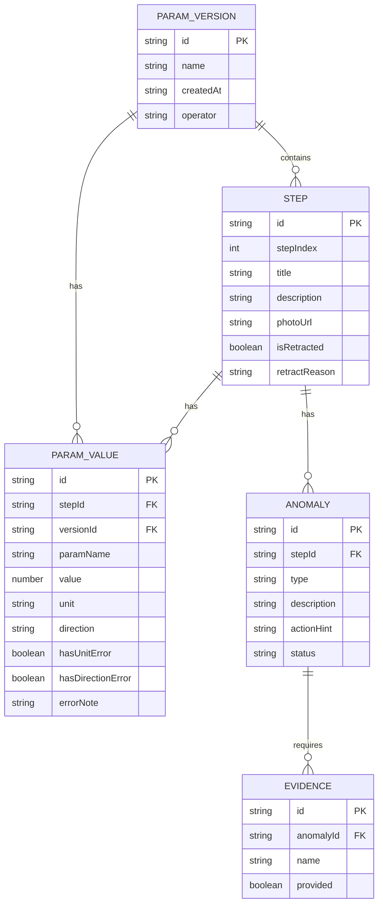

## 1. 架构设计

## 2. 技术描述
- 前端框架：React@18 + TypeScript
- 构建工具：Vite@5
- 样式方案：TailwindCSS@3 + CSS 变量主题系统
- 路由：React Router@6
- 状态管理：React Context + useReducer（轻量方案，避免过度设计）
- 图表/可视化：原生 SVG + CSS 动画绘制时间线与对比标记
- 图标：Lucide React（工业风线性图标库）
- 后端：无（纯前端，使用本地 Mock 数据贴近现场场景）
- 数据：JSON Mock 数据，包含参数版本、现场照片描述、撤回记录、异常点

## 3. 路由定义
| 路由 | 用途 |
|------|------|
| / | 回放主页：步骤时间线、现场照片、参数展示、异常检测提示 |
| /compare | 版本对比：双版本参数并排对比、差异高亮、结果变化追踪 |
| /review | 复核一页通：参数版本、异常点、解释说明同屏聚合 |
| /teacher | 老师视图：已处理/待补证据分类进度追踪 |
| /handover | 师傅接班视图：极简三要素展示 |

## 4. 数据模型

### 4.1 数据模型定义

### 4.2 Mock 数据结构说明

- **参数版本**：至少 2 组版本用于对比，名称如"初调版 0612"、"修正版 0613"
- **步骤数据**：5-7 条贴近现场的步骤，其中混入 1 条标记 `isRetracted: true` 的撤回记录
- **参数值**：包含正常参数、单位混写（如 kW 与 W 混用导致数量级偏差）、方向符号反写（如流向箭头写反）
- **异常点**：对应单位错误和方向错误，每条附带 `actionHint` 人性化操作建议
- **证据清单**：部分标记 `provided: false` 的待补证据项

## 5. 核心工具函数

| 函数名 | 用途 |
|--------|------|
| `detectUnitError(param)` | 检测单位混写导致的数量级异常，返回异常描述与修正建议 |
| `detectDirectionError(param)` | 检测方向符号反写，返回可操作的下一步处理 |
| `diffParamVersions(v1, v2)` | 对比两版参数，返回差异步骤列表 |
| `findResultChangingStep(diffs)` | 从差异列表中定位导致最终结果变化的关键步骤 |
| `exportReport(versionId)` | 生成回放结果导出（前端模拟下载 JSON/文本） |
