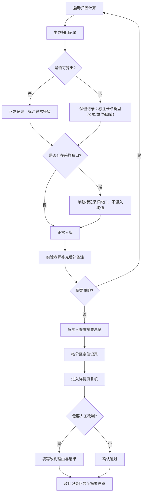

## 1. 产品概述

热泵循环误差归因系统——面向热泵实验场景的误差溯源工具，解决极端值被平均化后风险隐匿、采样缺口混入正常结果、材料口径变更无追踪等核心痛点。目标用户为实验老师与项目负责人，确保每条归因记录有迹可循、异常不被掩盖。

## 2. 核心功能

### 2.1 用户角色
| 角色 | 进入方式 | 核心权限 |
|------|----------|----------|
| 实验老师 | 直接使用 | 启动归因、录入后补备注、标注材料口径变更、人工改判 |
| 负责人 | 直接使用 | 查看页面摘要、复核归因记录、审批人工改判 |

### 2.2 功能模块
1. **摘要总览页**：三区卡片（已处理 / 待补材料 / 人工改判），快速掌握整体状态
2. **归因记录页**：全量记录列表，极端值独立展示不混入均值，采样缺口记录单独标记，后补备注标注卡点类型（公式/单位/阈值）
3. **记录详情页**：参数版本、异常点与解释同页呈现，材料口径变更时间线，支持人工改判与备注

### 2.3 页面详情
| 页面名称 | 模块名称 | 功能描述 |
|----------|----------|----------|
| 摘要总览页 | 状态分区卡片 | 已处理/待补材料/人工改判三区数量统计与快速跳转 |
| 摘要总览页 | 操作入口 | 启动归因、重跑归因两个核心操作按钮 |
| 归因记录页 | 记录列表 | 全部归因记录，极端值行标红且不参与均值，采样缺口行加底纹标记 |
| 归因记录页 | 后补备注标签 | 每条未完成记录标注卡点类型：公式/单位/阈值，悬停显示备注全文 |
| 归因记录页 | 筛选与排序 | 按状态（已处理/待补/改判）、卡点类型、异常等级筛选 |
| 记录详情页 | 参数版本区 | 当前与历史参数版本对比，高亮变更字段 |
| 记录详情页 | 异常点与解释 | 异常数据点列表 + 对应解释文本，同页可滚动对照 |
| 记录详情页 | 材料口径时间线 | 设备铭牌/后补备注/口头说明三份材料的变更记录，标注改过口径的材料 |
| 记录详情页 | 人工改判区 | 改判理由输入、改判结果、改判人签名 |

## 3. 核心流程

用户（实验老师）启动归因计算 → 系统逐条生成归因记录，无法计算的记录保留并标注卡点类型 → 实验老师补充备注或修改参数后重跑 → 采样缺口记录被自动标记，不混入正常均值 → 用户（负责人）查看摘要总览，按分区快速定位 → 点击记录进入详情页复核，查看参数版本、异常解释、材料口径变更 → 确认或发起人工改判 → 改判记录回显至摘要总览页

## 4. 用户界面设计

### 4.1 设计风格
- 主色：深铁灰 (#1C1C1E) 背景搭配琥珀色 (#F59E0B) 强调色，体现工业仪表质感
- 辅色：冷灰 (#6B7280) 用于常规文字，警示红 (#EF4444) 用于极端值/采样缺口
- 按钮风格：圆角矩形，主操作按钮琥珀色实心，次操作按钮描边
- 字体：正文使用 Noto Sans SC，数据使用 JetBrains Mono
- 布局：顶部导航 + 左侧紧凑侧边栏 + 主内容区卡片式布局
- 图标：Lucide 图标库，线性风格

### 4.2 页面设计概述
| 页面名称 | 模块名称 | UI要素 |
|----------|----------|--------|
| 摘要总览页 | 状态分区卡片 | 三列卡片布局，每列顶部大数字 + 底部简要说明，琥珀/灰/红三色区分 |
| 摘要总览页 | 操作入口 | 两个大按钮居中，琥珀色渐变背景，启动/重跑图标 |
| 归因记录页 | 记录列表 | 表格布局，极端值行红色左边框 + 浅红底色，采样缺口行斜线底纹，正常行交替灰白 |
| 归因记录页 | 后补备注标签 | 行内小标签（公式/单位/阈值），圆角胶囊样式，不同颜色区分 |
| 记录详情页 | 参数版本区 | 双栏对比布局，变更字段高亮黄色背景 |
| 记录详情页 | 异常点与解释 | 左侧异常数据列表 + 右侧解释面板，联动滚动 |
| 记录详情页 | 材料口径时间线 | 垂直时间线，每个节点显示材料类型、变更内容、改口径标记 |
| 记录详情页 | 人工改判区 | 底部固定面板，文本输入框 + 提交按钮 |

### 4.3 响应式设计
- 桌面优先设计，主内容区最大宽度 1440px
- 平板端摘要总览页三列变两列，记录详情页双栏变单栏
- 移动端隐藏侧边栏，使用底部导航

### 4.4 3D 场景
- 不涉及
