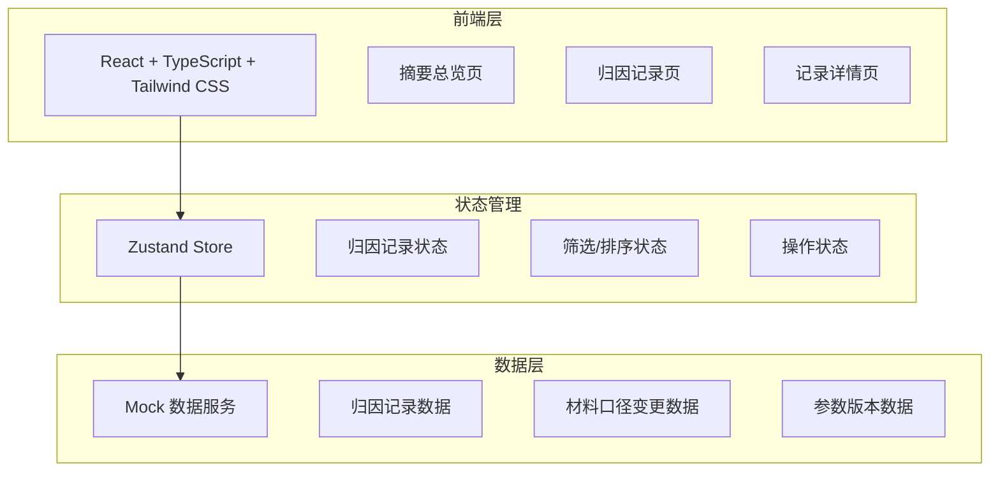
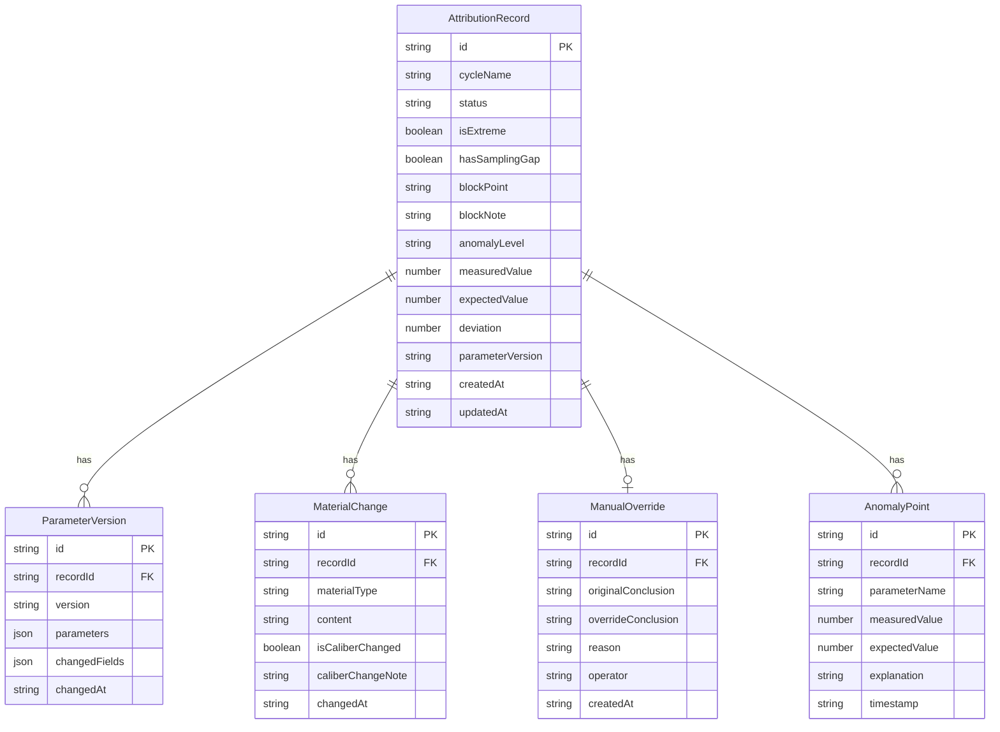

## 1. 架构设计



## 2. 技术说明
- 前端：React@18 + TypeScript + Tailwind CSS@3 + Vite
- 初始化工具：vite-init
- 后端：无（纯前端，使用 Mock 数据）
- 数据库：无（使用 Zustand 进行客户端状态管理 + Mock 数据）
- 状态管理：Zustand
- 路由：react-router-dom@6
- 图标：lucide-react

## 3. 路由定义
| 路由 | 用途 |
|------|------|
| / | 摘要总览页：状态分区卡片 + 启动/重跑操作入口 |
| /records | 归因记录页：全量记录列表，极端值/采样缺口标记，筛选排序 |
| /records/:id | 记录详情页：参数版本对比、异常解释、材料口径时间线、人工改判 |

## 4. API 定义
不涉及后端 API，全部使用前端 Mock 数据。

### 4.1 数据类型定义

```typescript
type BlockPointType = 'formula' | 'unit' | 'threshold'

type RecordStatus = 'processed' | 'pending_material' | 'manual_override'

type MaterialType = 'nameplate' | 'supplementary_note' | 'verbal_note'

interface AttributionRecord {
  id: string
  cycleName: string
  status: RecordStatus
  isExtreme: boolean
  hasSamplingGap: boolean
  blockPoint?: BlockPointType
  blockNote?: string
  anomalyLevel: 'low' | 'medium' | 'high'
  measuredValue: number
  expectedValue: number
  deviation: number
  parameterVersion: string
  createdAt: string
  updatedAt: string
}

interface ParameterVersion {
  id: string
  recordId: string
  version: string
  parameters: Record<string, number | string>
  changedFields: string[]
  changedAt: string
}

interface MaterialChange {
  id: string
  recordId: string
  materialType: MaterialType
  content: string
  isCaliberChanged: boolean
  caliberChangeNote?: string
  changedAt: string
}

interface ManualOverride {
  id: string
  recordId: string
  originalConclusion: string
  overrideConclusion: string
  reason: string
  operator: string
  createdAt: string
}

interface AnomalyPoint {
  id: string
  recordId: string
  parameterName: string
  measuredValue: number
  expectedValue: number
  explanation: string
  timestamp: string
}
```

## 5. 服务器架构图
不涉及后端服务器。

## 6. 数据模型

### 6.1 数据模型定义



### 6.2 Mock 数据初始化
使用 TypeScript 常量文件初始化 Mock 数据，包含：
- 12 条归因记录（覆盖已处理/待补材料/人工改判三种状态，含极端值和采样缺口）
- 每条记录关联的参数版本（1-2个历史版本）
- 材料口径变更记录（设备铭牌/后补备注/口头说明各若干条）
- 2 条人工改判记录
- 每条记录的异常点与解释
