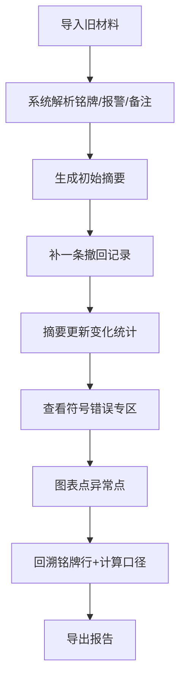

## 1. 产品概述
热泵循环报告导出工具是一款面向工业运维团队的可交接小工具，解决报警记录、人工备注与设备铭牌信息脱节的问题。目标用户为训练教练（老唐）、算法值班人员，通过可视化复核、异常追溯、计算过程透明化，确保数据质量与可审计性。

## 2. 核心功能

### 2.1 用户角色
| 角色 | 核心权限 |
|------|----------|
| 训练教练 | 查看设备铭牌、报警备注关联、撤回记录、报告导出 |
| 算法值班人 | 导入材料、补录撤回记录、参数对照、符号错误审查、中间计算查看 |

### 2.2 功能模块
1. **报告概览页**：材料导入、摘要变化、异常指标概览
2. **设备铭牌面板**：原始铭牌数据行、报警-备注关联标注、坏数据定位
3. **计算过程面板**：两组参数对照、单位换算明细、中间计算步骤
4. **异常审查面板**：方向符号错误单独拎出、撤回记录、后补说明
5. **图表复核区**：循环曲线、异常点点击回溯铭牌与计算口径

### 2.3 页面详情
| 页面名称 | 模块名称 | 功能描述 |
|-----------|-------------|---------------------|
| 报告概览 | 材料导入区 | 支持导入旧材料JSON，显示导入状态 |
| 报告概览 | 变化摘要卡片 | 显示新增撤回记录条数、符号错误数、坏数据标记数、备注对齐率 |
| 报告概览 | 快捷操作栏 | 补撤回记录、导出报告、切换参数组 |
| 设备铭牌面板 | 铭牌数据表格 | 展示原始行号、设备参数、报警列、人工备注列、关联状态标记 |
| 设备铭牌面板 | 坏数据标注 | 高亮异常行，指出原始行号或具体对象 |
| 计算过程面板 | 参数对照表格 | A/B两组参数并排对比，差异高亮 |
| 计算过程面板 | 单位换算明细 | 每一步换算公式、来源单位、目标单位、中间值 |
| 异常审查面板 | 符号错误专区 | 单独列出方向符号写反的记录，含原值、修正值、影响范围 |
| 异常审查面板 | 撤回记录时间线 | 撤回原因、操作人、时间戳、后补说明 |
| 图表复核区 | 热泵循环P-h图 | 点击异常点弹出铭牌原始行+计算口径弹窗 |

## 3. 核心流程
用户按周一早会前真实节奏操作：先导入历史材料JSON → 系统自动解析并在摘要区呈现基础统计 → 手动补录一条撤回记录（含原因、后补说明）→ 页面摘要实时更新变化统计 → 进入异常审查面板查看符号错误专区 → 通过图表点击异常点回溯至设备铭牌原始行与计算口径 → 导出完整报告。

## 4. 用户界面设计

### 4.1 设计风格
- 主色调：工业深蓝 #1B3A5C + 警示橙 #FF6B35 + 数据绿 #2EC4B6
- 按钮风格：方形微圆角（4px），深色填充配细边框，强调工业工具感
- 字体：标题用 Space Mono（等宽工业感），正文用 JetBrains Mono（代码友好）
- 布局风格：左侧导航 + 主工作区三栏分屏（铭牌/计算/异常），图表区底部通栏
- 视觉细节：细网线格背景、数据行斑马纹、异常行红色斜纹填充、终端风格等宽数字

### 4.2 页面设计概览
| 页面名称 | 模块名称 | UI元素 |
|-----------|-------------|-------------|
| 报告概览 | 材料导入区 | 拖拽区虚线边框、工业图标、文件名终端风格显示 |
| 报告概览 | 变化摘要卡片 | 四卡片网格，大数字等宽字体，变化量带上下箭头 |
| 设备铭牌面板 | 铭牌表格 | 固定表头、行号列锁左、异常行整行红底斜纹 |
| 计算过程面板 | 参数对照 | A/B双栏对照，差异单元格黄底高亮 |
| 异常审查面板 | 符号错误专区 | 醒目标题栏、卡片式错误项、修正前后对比 |
| 异常审查面板 | 撤回记录时间线 | 竖线时间轴、撤回/后补节点标签 |
| 图表复核区 | P-h循环图 | SVG绘制，异常点脉冲动画，点击浮层 |

### 4.3 响应性
桌面端优先（≥1440px），三栏并列布局；1024-1439px两栏折行；<1024px单栏堆叠，支持触控滚动。
