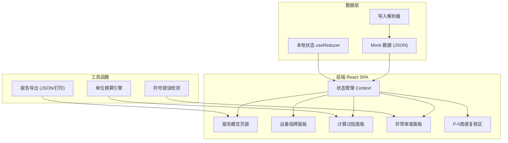
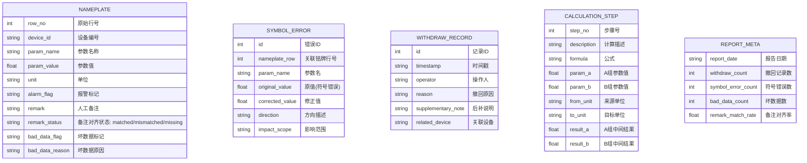

## 1. 架构设计

## 2. 技术描述
- 前端：React@18 + Vite@5 + TypeScript
- 样式：TailwindCSS@3 + 自定义CSS变量（工业深蓝主题）
- 图表：原生 SVG 绘制 P-h 压焓图（零依赖，便于交接）
- 状态管理：React Context + useReducer（简单场景，避免 Redux 复杂度）
- 数据：内置 Mock JSON 数据，支持导入外部 JSON
- 字体：Google Fonts - Space Mono + JetBrains Mono

## 3. 路由定义
| Route | 用途 |
|-------|------|
| / | 报告概览（默认页，含导入+摘要+快捷操作） |
| /nameplate | 设备铭牌面板 |
| /calculation | 计算过程面板（参数对照+单位换算） |
| /anomaly | 异常审查面板（符号错误+撤回记录） |
| /chart | P-h 图表复核区 |

## 4. 数据模型

### 4.1 数据模型定义

### 4.2 Mock 数据结构（内置示例）
- 设备铭牌：5-8 条记录，含 1 条坏数据、2 条备注未对齐
- 符号错误：2 条记录（如蒸发压力方向写反）
- 撤回记录：初始 1 条（演示用），支持新增
- 计算过程：6-8 步换算，含 A/B 两组参数对照
