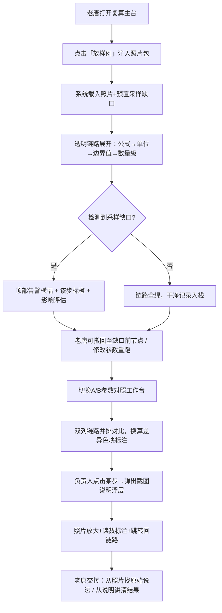

## 1. 产品概述

海浪浮标实验复算系统是面向训练教练老唐的透明化数据复核工具，解决现场照片材料中「单位混写→数量级变化」讲不清的痛点，将公式、单位、边界值、截图说明摆在明处而非只吐最终数字。

核心价值：让训练负责人无需追问细节即可从现场照片追溯原始说法、从截图说明讲清处理结果，两组参数对照时中间计算过程与单位换算全程可视。

---

## 2. 核心功能

### 2.1 用户角色

| 角色 | 登录方式 | 核心权限 |
|------|----------|----------|
| 训练教练老唐 | 直接进入（本地训练工具） | 放样例、重跑复算、查看截图说明、撤回记录、两组参数对照 |
| 负责人（对照用户） | 同机查看 | 切换两组参数、核对中间计算链路、对比截图说明 |

### 2.2 功能模块

1. **复算主台页面**：照片包加载、三件事操作入口（放样例 / 重跑 / 截图说明）、主计算流程区
2. **透明计算链路区**：公式展开、单位换算追踪链、边界值判定、数量级变化高亮
3. **历史撤回栈面板**：操作时间线、撤回/重做按钮、干净记录与异常记录分色标记
4. **参数对照工作台**：A/B两组参数并列、差异高亮、采样缺口异常提示
5. **截图说明浮层**：现场照片放大、读数标注、关联计算步骤跳转

### 2.3 页面详情

| 页面名称 | 模块名称 | 功能描述 |
|----------|----------|----------|
| 复算主台 | 照片包加载区 | 拖入「一小包现场照片」驱动主流程，含撤回记录位 |
| 复算主台 | 三件事快捷栏 | 放样例（注入预置照片与缺口）、重跑（当前参数复算）、截图说明（弹出浮层） |
| 复算主台 | 透明链路面板 | 公式→代入数值→单位换算→边界值检查→数量级→结果，每一步可展开 |
| 复算主台 | 历史撤回栈 | 左侧时间线，绿色=干净记录 / 橙色=含缺口记录，点击任意节点回退 |
| 参数对照工作台 | A/B组参数区 | 左右并列两组参数输入，数值与单位独立编辑，差异实时标红 |
| 参数对照工作台 | 对照链路视图 | 双列计算链路并排滚动，换算系数/数量级差异用对比色块标出 |
| 参数对照工作台 | 缺口告警条 | 检测到采样缺口时顶部横幅告警，提示哪一步数据异常、影响多大 |
| 截图说明浮层 | 照片放大区 | 支持缩放、标注框高亮读数位置 |
| 截图说明浮层 | 说明关联条 | 每条说明绑定对应计算步骤ID，点击跳转至链路该步 |
| 截图说明浮层 | 原始说法追溯 | 照片文字OCR展示 + 人工备注双栏，可对照修改 |

---

## 3. 核心流程

主流程：训练教练老唐打开系统 → 放样例（自动载入海浪浮标现场照片包与预置采样缺口）→ 系统展示透明计算链路（公式、单位、边界值、数量级全部展开）→ 遇到缺口时系统告警标橙 → 可随时点击历史栈撤回 → 切换A/B两组参数对照 → 负责人查看截图说明浮层追溯现场原始说法与处理结果。

---

## 4. 用户界面设计

### 4.1 设计风格

- **主辅色**：深海靛青 `#0A1628` 背景 + 数据荧光青 `#00E5FF` 链路高亮 + 告警琥珀 `#FFB020` + 对照洋红 `#FF2D87` 差异色
- **按钮风格**：半透明玻璃拟态圆角（12px），悬停时边框荧光描边 + 微弱发光
- **字体**：工程等宽字体 `JetBrains Mono` 用于公式/数值链路，现代无衬线 `Noto Sans SC` 用于中文说明
- **布局风格**：三栏仪表盘式 — 左撤回栈（18%）/ 中主链路区（52%）/ 右参数对照（30%），顶部固定三件事快捷栏
- **图标风格**：线性描边图标，节点状圆形标记代表计算步，虚线箭头连接形成链路

### 4.2 页面设计总览

| 页面名称 | 模块名称 | UI元素 |
|----------|----------|--------|
| 复算主台 | 三件事快捷栏 | 顶部固定条，三个大按钮横向排列，放样例（主色填充）/ 重跑（描边+刷新图标）/ 截图说明（描边+相机图标） |
| 复算主台 | 透明链路区 | 竖向时间轴，每步为玻璃卡片，含公式块（等宽字体深色底）、换算箭头、单位标签、数量级徽章 |
| 复算主台 | 历史撤回栈 | 左栏垂直时间线，节点圆点 + 操作摘要，绿色/橙色点区分，hover显示撤回按钮 |
| 参数对照工作台 | A/B双列 | 卡片左右并排，顶部组名标签，内部参数网格，差异行底色微粉 |
| 参数对照工作台 | 对照链路 | 双滚动列同步，对应步骤间有虚线连接，系数不同时连接线变色 |
| 截图说明浮层 | 照片放大区 | Modal中央80%宽，照片支持鼠标滚轮缩放，标注框为荧光描边矩形 |
| 截图说明浮层 | 说明列表 | 右侧侧栏，每条带步骤锚点徽章，点击联动 |

### 4.3 响应式

桌面优先设计（≥1280px），主三栏布局；≤1024px 参数对照栏折叠为标签页；≤768px 撤回栈变为顶部下拉抽屉，链路区占满全宽。触摸操作优化：链路步卡片最小高度72px，按钮最小触控区48px。

### 4.4 动效与氛围

- 入场：三栏从左中右依次滑入 + 透明度过渡，链路节点按序淡入（delay阶梯式）
- 微交互：链路步hover时边缘荧光脉冲，点击展开时内部子项高度弹性展开
- 告警：采样缺口出现时顶部横幅滑入 + 琥珀色呼吸闪烁3次
- 背景：极淡的波浪纹理SVG平铺，中心弱径向渐变营造深海空间感
