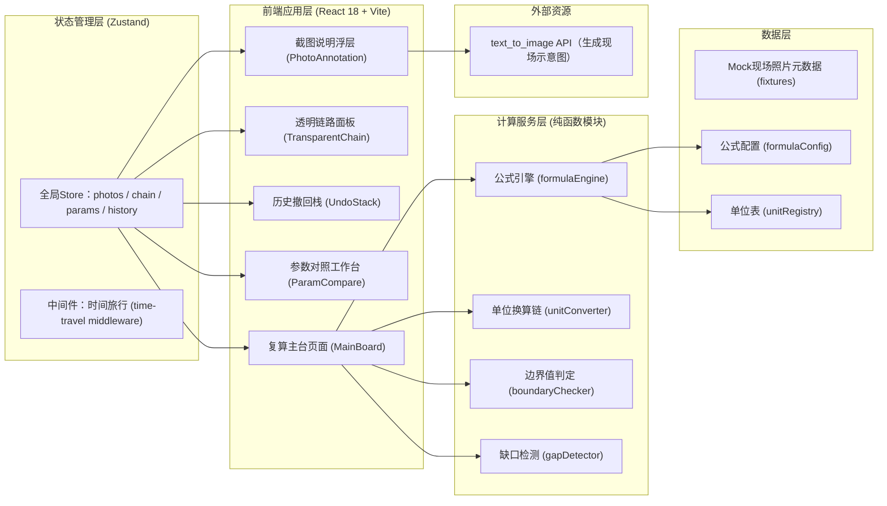
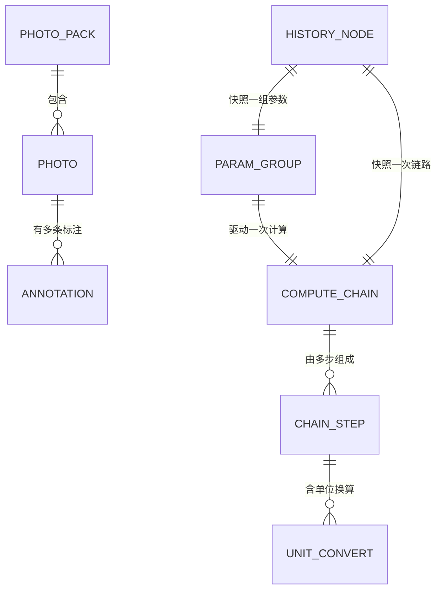

## 1. 架构设计



## 2. 技术描述

- **前端**：React@18 + TypeScript + tailwindcss@3 + Vite@6
- **初始化工具**：`npm create vite@latest` (React + TS 模板)
- **状态管理**：Zustand@4（含 immer middleware + 自定义时间旅行中间件）
- **样式**：Tailwind CSS 3 + CSS 变量定义设计令牌，自定义背景纹理
- **图标**：lucide-react（线性图标库，与设计风格匹配）
- **字体**：Google Fonts 引入 JetBrains Mono + Noto Sans SC
- **后端**：无后端（纯前端训练工具，数据全量 Mock）
- **数据库**：无（使用 fixtures + localStorage 持久化撤回栈）

## 3. 路由定义

| Route | 用途 |
|-------|------|
| `/` | 复算主台（默认页，包含所有模块：三件事栏/链路区/撤回栈/对照区） |

单页应用架构，所有功能模块通过条件渲染/浮层切换呈现，无需多路由跳转。

## 4. 数据模型

### 4.1 数据模型定义



### 4.2 TypeScript 核心类型

```typescript
// 现场照片
interface Photo {
  id: string;
  url: string;
  caption: string;
  annotations: Annotation[];
  takenAt: string;
}

// 截图说明（标注）
interface Annotation {
  id: string;
  photoId: string;
  stepId?: string;           // 关联的计算步
  bbox: [number, number, number, number]; // x,y,w,h (相对比例)
  originalReading: string;   // 现场原始说法
  processedNote: string;     // 处理结果说明
}

// 计算链路一步
interface ChainStep {
  id: string;
  index: number;
  title: string;
  formula: string;           // LaTeX风格字符串或纯文本公式
  inputValues: { label: string; value: number; unit: string }[];
  unitConverts: UnitConvert[];
  boundaryCheck?: { rule: string; passed: boolean; actual: number; limit: number };
  magnitudeDelta?: number;   // 相对上一步的数量级变化(log10)
  result: { value: number; unit: string };
  hasGap: boolean;           // 是否含采样缺口
  gapReason?: string;
}

// 单位换算记录
interface UnitConvert {
  from: string;
  to: string;
  factor: number;
  intermediate: number;
}

// 参数组（A/B对照用）
interface ParamGroup {
  id: 'A' | 'B';
  name: string;
  params: Record<string, { value: number; unit: string }>;
}

// 撤回栈节点
interface HistoryNode {
  id: string;
  timestamp: string;
  summary: string;
  isClean: boolean;          // 干净/含缺口
  paramGroups: ParamGroup[];
  chain: ChainStep[];
  activeGroup: 'A' | 'B';
}
```

## 5. 核心模块设计

| 模块 | 文件位置 | 职责 |
|------|----------|------|
| 公式引擎 | `src/engine/formulaEngine.ts` | 输入参数组→逐步计算，产出ChainStep数组，注入单位换算与边界值 |
| 单位换算 | `src/engine/unitConverter.ts` | 单位注册表 + 换算因子查找 + 数量级差计算 |
| 边界检查 | `src/engine/boundaryChecker.ts` | 规则配置匹配，判定每步是否越界，写入ChainStep |
| 缺口检测 | `src/engine/gapDetector.ts` | 扫描参数/步骤，标记采样缺口，评估影响范围 |
| 时间旅行Store | `src/store/useMainStore.ts` | Zustand + 自定义undo/redo中间件，管理所有状态 |
| 主台组件 | `src/pages/MainBoard.tsx` | 三栏布局容器，组装所有子组件 |
| 透明链路 | `src/components/TransparentChain.tsx` | 竖向时间轴，每步玻璃卡片展开详情 |
| 撤回栈 | `src/components/UndoStack.tsx` | 左栏时间线，节点点击回退或重做 |
| 参数对照 | `src/components/ParamCompare.tsx` | A/B双列编辑与双链路对比 |
| 截图说明 | `src/components/PhotoAnnotation.tsx` | Modal浮层，照片缩放+标注列表+步骤跳转 |
| 数据夹具 | `src/fixtures/*.ts` | 海浪浮标照片包(含缺口)、公式配置、单位表 |
