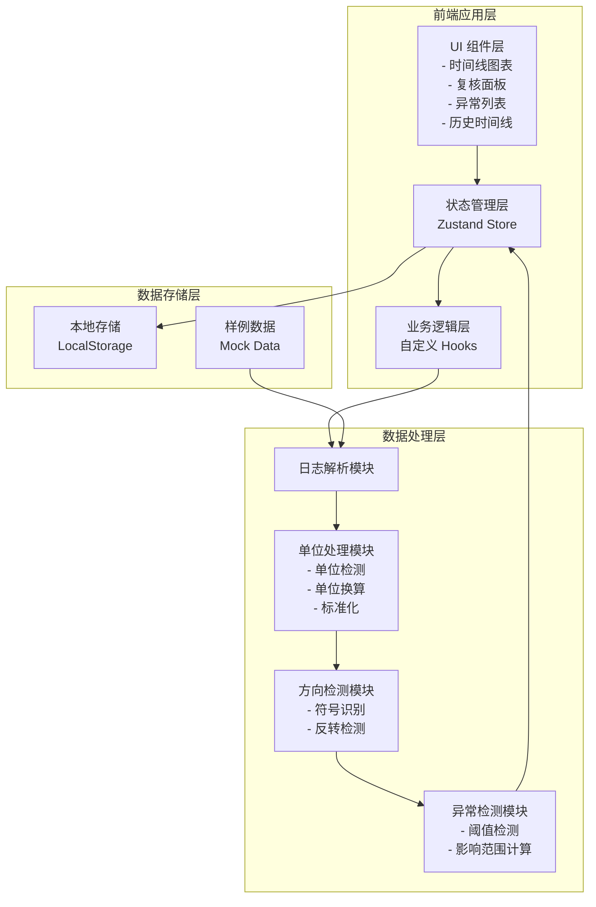

## 1. 架构设计



## 2. 技术描述

- **前端框架**：React 18 + TypeScript
- **构建工具**：Vite 5
- **样式方案**：Tailwind CSS 3
- **状态管理**：Zustand
- **图表库**：D3.js + 原生 SVG
- **图标库**：Lucide React
- **数据存储**：LocalStorage（本地持久化）
- **后端**：无，纯前端应用，数据处理在浏览器端完成
- **初始化模板**：react-ts（纯前端）

## 3. 目录结构

```
src/
├── components/          # UI 组件
│   ├── TimelineChart/   # 时间线图表组件
│   ├── ReviewPanel/     # 复核面板组件
│   ├── Sidebar/         # 侧边栏组件
│   ├── DataImport/      # 数据导入组件
│   ├── AnomalyList/     # 异常列表组件
│   └── common/          # 通用组件
├── hooks/               # 自定义 Hooks
│   ├── useSensorData.ts # 传感器数据处理
│   ├── useUnitConversion.ts # 单位换算
│   ├── useAnomalyDetection.ts # 异常检测
│   └── useHistory.ts    # 历史记录管理
├── store/               # Zustand Store
│   └── useAppStore.ts   # 全局状态
├── utils/               # 工具函数
│   ├── parser.ts        # 日志解析
│   ├── units.ts         # 单位定义与换算
│   ├── direction.ts     # 方向处理
│   └── thresholds.ts    # 阈值配置
├── types/               # TypeScript 类型定义
│   └── index.ts
├── data/                # 样例数据
│   └── sampleLogs.ts    # 样例传感器日志
├── pages/               # 页面组件
│   └── App.tsx          # 主页面
└── main.tsx             # 入口文件
```

## 4. 核心数据模型

### 4.1 数据类型定义

```typescript
// 原始传感器日志记录
interface RawSensorLog {
  id: string;
  timestamp: Date;
  rawValue: string;      // 原始值（含单位）
  rawUnit: string;       // 原始单位
  rawDirection?: string; // 原始方向（如 N, S, E, W）
  source: string;        // 来源标识
  lineNumber: number;    // 在原始文件中的行号
}

// 标准化后的传感器数据
interface StandardizedData {
  id: string;
  timestamp: Date;
  value: number;         // 标准化后的值
  unit: string;          // 标准单位
  direction?: string;    // 标准化方向
  rawLog: RawSensorLog;  // 保留原始数据引用
  unitConversion?: {
    fromUnit: string;
    toUnit: string;
    factor: number;
  };
}

// 单位混写检测结果
interface UnitMismatch {
  id: string;
  logId: string;
  expectedUnit: string;
  actualUnit: string;
  valueBefore: number;
  valueAfter: number;
  conversionFactor: number;
  severity: 'warning' | 'critical';
}

// 方向符号写反检测结果
interface DirectionReversal {
  id: string;
  logId: string;
  detectedDirection: string;
  expectedDirection?: string;
  possibleCauses: string[];
  impactScope: {
    startTime: Date;
    endTime: Date;
    affectedCount: number;
  };
  confirmed: boolean;
}

// 阈值异常
interface ThresholdAnomaly {
  id: string;
  dataId: string;
  value: number;
  threshold: {
    min: number;
    max: number;
  };
  type: 'below_min' | 'above_max';
  severity: 'warning' | 'critical';
}

// 异常记录（统一类型）
interface Anomaly {
  id: string;
  type: 'unit_mismatch' | 'direction_reversal' | 'threshold';
  timestamp: Date;
  severity: 'info' | 'warning' | 'critical';
  status: 'pending' | 'confirmed' | 'dismissed';
  data: StandardizedData;
  details: UnitMismatch | DirectionReversal | ThresholdAnomaly;
  impactScope?: {
    startTime: Date;
    endTime: Date;
    affectedCount: number;
  };
}

// 分析参数版本
interface ParameterVersion {
  id: string;
  version: string;
  createdAt: Date;
  unitRules: UnitConversionRule[];
  directionRules: DirectionRule[];
  thresholds: ThresholdConfig[];
}

// 分析历史记录
interface AnalysisHistory {
  id: string;
  timestamp: Date;
  sourceFile: string;
  recordCount: number;
  anomalyCount: number;
  parameterVersionId: string;
  status: 'completed' | 'pending';
}

// 应用状态
interface AppState {
  rawLogs: RawSensorLog[];
  standardizedData: StandardizedData[];
  anomalies: Anomaly[];
  selectedAnomalyId: string | null;
  parameterVersion: ParameterVersion;
  history: AnalysisHistory[];
  currentHistoryId: string | null;
}
```

### 4.2 单位换算规则

```typescript
interface UnitConversionRule {
  category: string;  // 如 'length', 'speed', 'temperature'
  baseUnit: string;  // 标准单位
  units: {
    [unit: string]: {
      symbol: string;
      toBase: (value: number) => number;
      fromBase: (value: number) => number;
    }
  };
}
```

## 5. 核心模块设计

### 5.1 日志解析模块 (parser.ts)

- 支持 CSV、JSON、纯文本等多种日志格式
- 自动识别分隔符和字段结构
- 保留原始行号和来源信息
- 不修改原始数据，仅做结构化解析

### 5.2 单位处理模块 (units.ts)

- 预定义长度、速度、温度等物理量的单位换算规则
- 自动检测日志中的单位表示
- 识别常见的单位混写（如 m vs km, m/s vs km/h）
- 计算数量级差异
- 保留原始单位和换算因子，便于追溯

### 5.3 方向检测模块 (direction.ts)

- 识别方向符号（N/S/E/W、正负号、角度）
- 基于历史数据模式检测可能的符号反转
- 计算影响范围（受影响的时间段和记录数）
- 标记为"待确认"状态，不直接修改数据

### 5.4 异常检测模块 (anomaly.ts)

- 基于配置的阈值范围检测超限
- 检测单位混写导致的数量级跳变
- 计算每个异常的影响范围
- 生成可追溯的异常记录，包含原始数据引用

### 5.5 状态管理 (store/useAppStore.ts)

- 使用 Zustand 管理全局状态
- 支持历史记录的保存和加载
- 实现重跑功能：使用相同参数重新分析
- 状态变更持久化到 LocalStorage

## 6. 关键技术实现点

### 6.1 数据可追溯性

每个处理后的数据点都保留对原始日志记录的引用，包括：
- 原始文件行号
- 原始值和单位
- 换算因子和过程
- 参数版本信息

### 6.2 单位混写检测算法

1. 分析同类型数据的单位分布
2. 识别占比最高的单位作为预期单位
3. 检测异常单位并计算数量级差异
4. 对于差异超过 10 倍的标记为严重异常

### 6.3 方向符号反转检测

1. 建立正常方向模式（基于历史数据）
2. 检测与模式不符的方向变化
3. 分析连续记录的方向一致性
4. 计算受影响的时间范围和记录数
5. 输出可能原因列表

### 6.4 交互式时间线

- 使用 D3.js 实现 SVG 绘制
- 支持缩放和平移
- 异常点可点击，联动复核面板
- 影响范围半透明高亮
- 原始数据与标准化数据双轨展示

## 7. 本地存储设计

```typescript
// 存储键定义
enum StorageKeys {
  RAW_LOGS = 'buoy_alert_raw_logs',
  STANDARDIZED_DATA = 'buoy_alert_standardized',
  ANOMALIES = 'buoy_alert_anomalies',
  HISTORY = 'buoy_alert_history',
  PARAMETER_VERSIONS = 'buoy_alert_param_versions',
  CURRENT_STATE = 'buoy_alert_current_state',
}
```

## 8. 样例数据设计

样例数据包含以下场景：
1. 正常数据段
2. 单位混写段（m 与 km 混用）
3. 速度单位混写段（m/s 与 km/h 混用）
4. 方向符号写反段（N/S 写反）
5. 阈值超限段
6. 多种异常组合段
