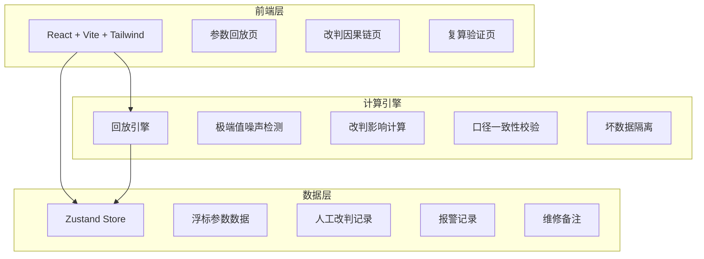
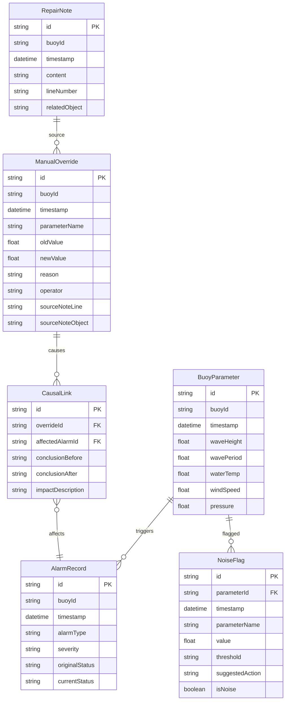

## 1. 架构设计



纯前端项目，所有数据和计算在浏览器内完成，使用 mock 数据模拟真实浮标回放场景。

## 2. 技术说明

- 前端：React@18 + TypeScript + Tailwind CSS@3 + Vite
- 初始化工具：vite-init（react-ts 模板）
- 状态管理：Zustand
- 图表库：recharts（轻量、React 原生）
- 后端：无（纯前端，mock 数据）
- 数据库：无（内存数据 + mock）

## 3. 路由定义

| 路由 | 用途 |
|------|------|
| `/` | 参数回放页（主页），时序图表 + 明细表 + 噪声提示 + 坏数据溯源 |
| `/causal-chain` | 改判因果链页，改判→影响→结论的完整路径 |
| `/recalc` | 复算验证页，一键重跑 + 口径校验 + 前后对比 |

## 4. 数据模型

### 4.1 数据模型定义



### 4.2 TypeScript 类型定义

```typescript
interface BuoyParameter {
  id: string
  buoyId: string
  timestamp: string
  waveHeight: number
  wavePeriod: number
  waterTemp: number
  windSpeed: number
  pressure: number
}

interface AlarmRecord {
  id: string
  buoyId: string
  timestamp: string
  alarmType: string
  severity: 'critical' | 'warning' | 'info'
  originalStatus: 'active' | 'resolved' | 'suppressed'
  currentStatus: 'active' | 'resolved' | 'suppressed'
}

interface ManualOverride {
  id: string
  buoyId: string
  timestamp: string
  parameterName: string
  oldValue: number
  newValue: number
  reason: string
  operator: string
  sourceNoteLine: string
  sourceNoteObject: string
}

interface RepairNote {
  id: string
  buoyId: string
  timestamp: string
  content: string
  lineNumber: string
  relatedObject: string
}

interface CausalLink {
  id: string
  overrideId: string
  affectedAlarmId: string
  conclusionBefore: string
  conclusionAfter: string
  impactDescription: string
}

interface NoiseFlag {
  id: string
  parameterId: string
  timestamp: string
  parameterName: string
  value: number
  threshold: string
  suggestedAction: string
  isNoise: boolean
}
```

## 5. 计算引擎逻辑

### 5.1 极端值噪声检测

- 对每个参数使用 3σ 原则检测极端值
- 超过 mean + 3σ 的值标记为疑似噪声
- 生成人话提示："[时间] [参数名] 值 [value] 疑似噪声，建议：[具体操作步骤]"

### 5.2 改判影响计算

- 当录入改判时，自动计算：
  1. 该参数改判影响了哪些报警（时间窗口内的报警）
  2. 改判前后的报警状态变化
  3. 最终结论的变化（如从"需维修"变为"正常"）

### 5.3 口径一致性校验

- 复算后，图表数据点与明细表行逐一比对
- 所有数值必须完全一致
- 不一致项标红并显示具体差异

### 5.4 坏数据隔离

- 被标记为坏数据/噪声的行不参与统计计算
- 在明细表中保留显示，但以红色删除线标注
- 溯源卡片显示：来源（维修备注第X行）、对象（XX传感器）
