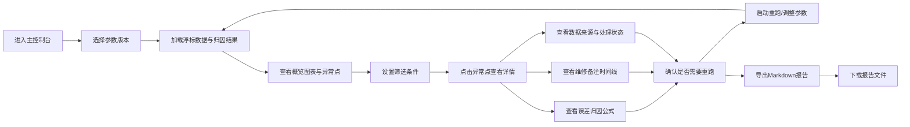

# 海浪浮标误差归因系统 - 产品需求文档

## 1. 产品概述

海浪浮标误差归因系统是一款面向海洋监测领域的数据质量分析工具，用于对海浪浮标采集数据进行误差归因、异常识别和质量复核。系统解决了浮标数据材料零散、维修备注字段不统一、极端噪声难以区分、复核缺乏过程记录等痛点，帮助项目助理和现场老师高效完成数据质量复盘工作。

### 核心价值
- 将零散的维修备注与浮标数据串联，形成完整的误差归因主线
- 公式、单位、边界值透明化，避免"黑盒"结论
- 异常点全链路标记，筛选、详情、导出处处留痕
- 一页式复核视图，参数版本、异常点、解释同屏呈现
- Markdown报告与页面状态严格一致，导出即可用

## 2. 核心功能

### 2.1 用户角色

| 角色 | 使用场景 | 核心需求 |
|------|----------|----------|
| 项目助理（小宋） | 日常数据整理、报告生成 | 快速拼接维修备注、批量导出报告 |
| 现场老师 | 提交维修备注、复核结果 | 标记异常点、查看归因详情 |
| 质量复核人员 | 最终质量审核 | 参数版本追溯、全链路状态一致 |

### 2.2 功能模块

1. **主控制台**：数据概览图表、参数版本切换、异常筛选、启动/重跑操作
2. **数据详情面板**：误差归因公式、单位说明、边界值定义、处理状态追踪、数据来源
3. **维修备注管理**：多字段名兼容、备注时间线、来源标记、处理状态
4. **异常点标记系统**：极端值识别、噪声标注、筛选过滤、详情查看
5. **Markdown报告导出**：页面状态同步、公式参数嵌入、异常点清单、版本信息

### 2.3 页面详情

| 页面名称 | 模块名称 | 功能描述 |
|-----------|-------------|---------------------|
| 主控制台 | 顶部操作栏 | 参数版本选择、启动/重跑按钮、导出报告按钮 |
| 主控制台 | 数据概览图表 | 波高/周期时序图、异常点高亮标记、悬浮详情 |
| 主控制台 | 筛选工具栏 | 按日期范围、异常类型、处理状态筛选 |
| 主控制台 | 异常点列表 | 表格展示异常点，含来源标记和处理状态标签 |
| 详情面板 | 误差归因公式 | 公式展示、变量说明、单位标注、边界值 |
| 详情面板 | 维修备注时间线 | 按时间排序的备注记录，字段名统一展示 |
| 详情面板 | 数据来源追踪 | 原始数据字段、处理过程、当前状态 |
| 报告预览 | Markdown预览 | 实时预览报告内容，与页面状态一致 |
| 报告预览 | 导出操作 | 下载Markdown文件、复制到剪贴板 |

## 3. 核心流程

### 3.1 主流程描述

用户进入主控制台后，首先选择参数版本，系统加载对应版本的浮标数据和误差归因结果。用户可通过筛选条件定位异常数据点，点击异常点查看详情，包括误差归因公式、相关维修备注、数据来源和处理状态。确认无误后，用户可启动重跑或直接导出Markdown报告，报告内容与当前页面所见完全一致。

### 3.2 核心流程图

## 4. 用户界面设计

### 4.1 设计风格

- **设计理念**：专业海洋科技感，数据驱动的精密仪表盘风格
- **主色调**：深海蓝 (#0A2540) 为主色，配合青蓝 (#00D4FF) 作为数据高亮
- **辅助色**：橙色 (#FF6B35) 标记异常/警告，绿色 (#00C853) 标记正常/已处理
- **中性色**：深灰到浅灰的阶梯色系，营造层次感
- **字体**：标题使用现代几何无衬线字体，正文使用清晰易读的等宽与无衬线组合
- **布局**：左右分栏布局，左侧为主数据区，右侧为详情面板，顶部固定操作栏
- **图标风格**：线性简洁图标，配合数据可视化的专业感
- **动效**：数据加载时的渐入动画，异常点脉冲提示，面板切换平滑过渡

### 4.2 页面设计概览

| 页面名称 | 模块名称 | UI元素 |
|-----------|-------------|-------------|
| 主控制台 | 顶部操作栏 | 深色背景、版本选择下拉、主操作按钮组、状态指示灯 |
| 主控制台 | 数据概览图表 | 大面积折线图、异常点散点高亮、Y轴双刻度、网格背景 |
| 主控制台 | 筛选工具栏 | 标签式筛选、日期范围选择器、搜索框 |
| 主控制台 | 异常点列表 | 斑马纹表格、状态徽标、来源标签、悬停高亮 |
| 详情面板 | 公式区块 | 卡片式容器、公式居中、变量说明列表、边界值徽章 |
| 详情面板 | 维修备注时间线 | 时间轴样式、交替颜色卡片、来源标记、处理状态标签 |
| 详情面板 | 来源追踪 | 面包屑导航、字段映射表、状态进度条 |
| 报告预览 | Markdown预览 | 仿真文档样式、语法高亮、可滚动内容区 |

### 4.3 响应式

采用桌面端优先设计，主操作区域最小宽度1200px。在平板设备上，详情面板可折叠为底部抽屉。移动端保留核心数据查看功能，操作按钮适配触控。

### 4.4 数据可视化指导

- 时序图表采用平滑曲线，数据点清晰可辨
- 异常点使用橙色光晕脉冲动画，视觉上突出显示
- 图表支持缩放和平移，方便查看细节
- 悬浮提示框展示完整数据信息，包括原始值、归因误差、处理状态
- 双Y轴设计同时展示波高和误差值
