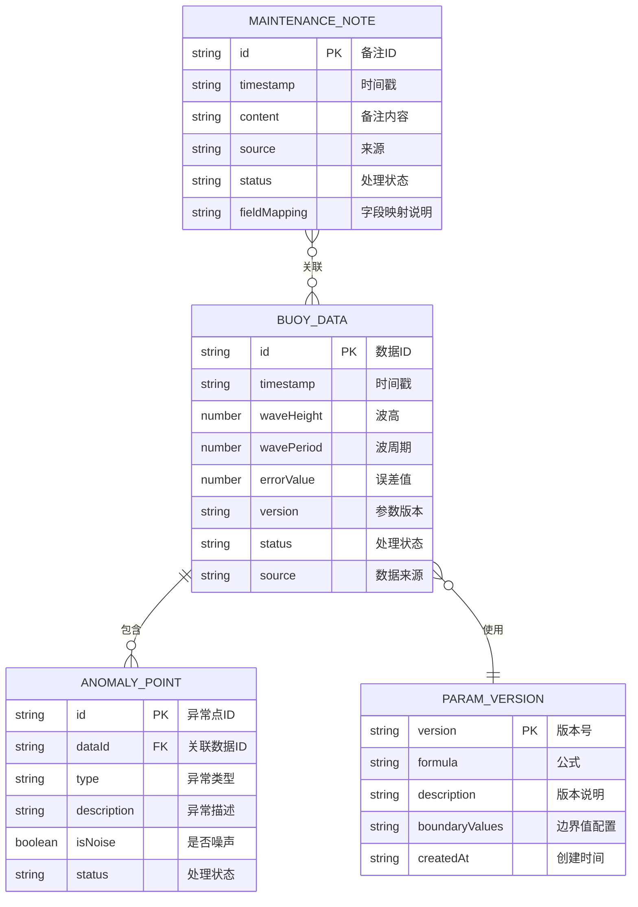

# 海浪浮标误差归因系统 - 技术架构文档

## 1. 架构设计

```mermaid
graph TD
    subgraph "前端应用层"
        A["主控制台页面"]
        B["详情面板组件"]
        C["Markdown报告预览"]
    end
    
    subgraph "状态管理层 (Zustand)
        D["数据状态管理 Store"]
        E["筛选状态 Store"]
        F["参数版本 Store"]
    end
    
    subgraph "业务逻辑层"
        G["误差归因计算模块"]
        H["异常检测模块"]
        I["维修备注解析模块"]
        J["Markdown报告生成模块"]
    end
    
    subgraph "数据层"
        K["模拟数据 (Mock Data)"]
        L["工具函数 (Utils)"]
    end
    
    A --> D
    A --> E
    A --> F
    B --> D
    B --> E
    C --> D
    C --> F
    D --> G
    D --> H
    D --> I
    E --> H
    F --> G
    G --> K
    H --> K
    I --> K
    J --> G
    J --> H
    J --> I
    J --> L
```

## 2. 技术描述

- **前端框架**：React@18 + TypeScript
- **构建工具**：Vite@5
- **样式方案**：Tailwind CSS@3
- **状态管理**：Zustand@4
- **路由管理**：React Router DOM@6
- **图表库**：Recharts（用于时序数据可视化）
- **图标库**：Lucide React
- **Markdown渲染**：react-markdown
- **数据方案**：前端纯前端架构，使用 Mock 数据模拟后端接口
- **部署方式**：静态资源打包部署

## 3. 目录结构

```
src/
├── components/          # 可复用组件
│   ├── Chart/          # 图表组件
│   ├── FilterBar/        # 筛选工具栏
│   ├── DetailPanel/  # 详情面板
│   ├── AnomalyList/  # 异常点列表
│   ├── FormulaCard/       # 公式卡片
│   ├── NoteTimeline/ # 维修备注时间线
│   ├── SourceTracker/   # 来源追踪
│   └── ReportPreview/ # 报告预览
├── pages/              # 页面组件
│   └── Dashboard/      # 主控制台页面
├── store/              # 状态管理
│   ├── useDataStore.ts    # 数据状态
│   ├── useFilterStore.ts # 筛选状态
│   └── useParamStore.ts # 参数版本状态
├── utils/              # 工具函数
│   ├── attribution.ts    # 误差归因计算
│   ├── anomaly.ts    # 异常检测
│   ├── notes.ts      # 维修备注解析
│   ├── markdown.ts   # Markdown生成
│   └── format.ts     # 格式化工具
├── data/               # Mock 模拟数据
│   ├── buoyData.ts    # 浮标数据
│   ├── notes.ts       # 维修备注
│   └── formulas.ts    # 公式参数
├── types/              # TypeScript 类型定义
│   └── index.ts
├── App.tsx
├── main.tsx
└── index.css
```

## 4. 数据模型

### 4.1 数据模型定义



### 4.2 核心类型定义

```typescript
// 浮标数据点
interface BuoyDataPoint {
  id: string;
  timestamp: string;
  waveHeight: number;  // 单位：米 (m)
  wavePeriod: number;  // 单位：秒 (s)
  errorValue: number;  // 误差值
  attribution: string;  // 参数版本
  status: 'normal' | 'warning' | 'error' | 'processed';
  source: string;
  anomalyIds?: string[];
}

// 异常点
interface AnomalyPoint {
  id: string;
  dataId: string;
  type: 'extreme' | 'noise' | 'drift' | 'missing';
  description: string;
  isSuspectedNoise: boolean;
  status: 'pending' | 'reviewed' | 'resolved';
  attribution: string;  // 归因说明
}

// 维修备注
interface MaintenanceNote {
  id: string;
  timestamp: string;
  content: string;
  source: string;  // 来源
  status: 'draft' | 'submitted' | 'verified';
  rawFields: Record<string, string>;  // 原始字段（可能字段名不一致
  relatedDataIds: string[];
}

// 参数版本
interface ParamVersion {
  version: string;
  formula: string;
  formulaLatex: string;
  description: string;
  boundaryValues: BoundaryValue[];
  createdAt: string;
}

// 边界值
interface BoundaryValue {
  name: string;
  value: number;
  unit: string;
  description: string;
}
```

## 5. 核心功能实现方案

### 5.1 误差归因公式模块

- 支持多版本参数管理，每个版本包含完整的公式定义、变量说明和边界值

- 公式展示使用 LaTeX 渲染，保证数学公式的可读性

- 版本切换时实时重新计算所有数据点的误差归因结果

### 5.2 维修备注解析模块

- 字段名映射：自动识别不同来源的字段名差异，统一映射到标准字段

- 时间线展示：按时间轴方式展示维修备注，关联到对应的数据点

- 来源标记：每条备注都带有来源标签，便于追溯

### 5.3 异常检测与标记模块

- 多种异常类型识别：极端值、噪声、漂移、缺失

- 疑似噪声标记：对疑似噪声的异常点单独标记，支持筛选过滤

- 全链路状态：异常点在图表、列表、详情、导出中保持一致的状态标记

### 5.4 Markdown报告生成模块

- 状态同步：导出的报告与当前页面所见状态完全一致

- 内容完整性：包含参数版本、公式说明、边界值、异常点清单、维修备注摘要

- 导出方式：支持下载 .md 文件和复制到剪贴板

### 5.5 启动/重跑功能

- 模拟计算过程，带有进度反馈

- 重跑后更新数据状态和异常检测结果

- 操作记录保留历史版本

## 6. 状态管理设计

### 6.1 数据状态 Store

- buoyData: BuoyDataPoint[]
- anomalies: AnomalyPoint[]
- notes: MaintenanceNote[]
- selectedDataId: string | null
- loading: boolean
- runStatus: 'idle' | 'running' | 'completed'

### 6.2 筛选状态 Store

- dateRange: [string, string] | null
- anomalyTypes: string[]
- statuses: string[]
- showNoiseOnly: boolean
- searchKeyword: string

### 6.3 参数版本 Store

- versions: ParamVersion[]
- currentVersion: string
- versionHistory: string[]
