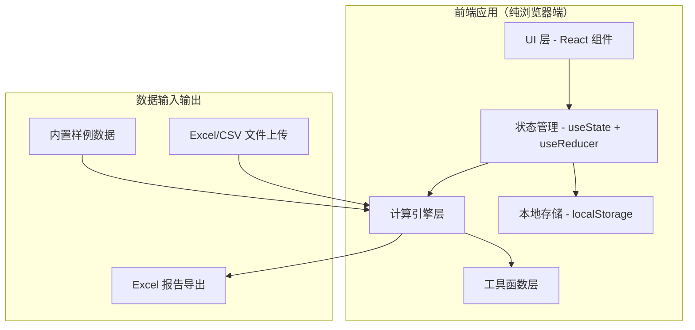

## 1. 架构设计



纯前端单页应用，无后端服务，所有计算在浏览器端完成，数据存储于 localStorage。

## 2. 技术说明

- **前端框架**：React@18 + TypeScript
- **构建工具**：Vite@5
- **样式方案**：TailwindCSS@3
- **图表库**：recharts（React 生态，轻量易集成）
- **Excel 处理**：xlsx（SheetJS） - 读写 Excel/CSV
- **图标**：lucide-react（线性图标，工业感）
- **状态管理**：React 内置 useState + useContext，轻量够用
- **数据持久化**：localStorage 存储历史批次和配置

## 3. 路由定义

| 路由 | 页面 | 功能 |
|------|------|------|
| / | 数据导入页 | 上传 Excel/CSV、查看历史批次、加载样例 |
| /detail | 复算明细页 | 数据表格、异常高亮、溯源面板 |
| /chart | 图表可视化页 | 扭矩柱状图、阈值线、联动明细 |

## 4. 核心数据模型

### 4.1 铭牌原始记录 (NameplateRecord)

```typescript
interface NameplateRecord {
  id: string;                    // 唯一标识
  deviceId: string;              // 设备编号
  deviceName?: string;           // 设备名称
  torqueValue: number | null;    // 扭矩原始值
  torqueUnit: string;            // 原始单位字符串
  ratedSpeed?: number;           // 额定转速
  power?: number;                // 功率
  threshold?: number;            // 安全阈值（来自铭牌）
  thresholdSource?: string;      // 阈值来源描述
  sourceFile: string;            // 来源文件名
  sourceRow: number;             // 来源行号
  sourceBatch: string;           // 批次 ID
  sourceContent: string;         // 原始行内容快照
  importedAt: number;            // 导入时间戳
}
```

### 4.2 复算结果 (TorqueCalcResult)

```typescript
interface TorqueCalcResult {
  recordId: string;
  deviceId: string;
  originalValue: number | null;
  originalUnit: string;
  normalizedValue: number;       // 换算到 N·m 的值
  unitConversion: {
    fromUnit: string;
    toUnit: string;
    factor: number;
    detected: boolean;           // 是否自动识别成功
  };
  calculatedTorque: number;      // 复算扭矩值
  calcMethod: string;            // 复算方法说明
  status: 'normal' | 'warning' | 'error' | 'unknown';
  anomalies: AnomalyItem[];      // 异常列表
  thresholdCheck?: {
    passed: boolean;
    threshold: number;
    thresholdSource: string;
    ratio: number;               // 实际值/阈值
  };
}

interface AnomalyItem {
  type: 'unit_unclear' | 'order_of_magnitude' | 'over_threshold' | 'missing_data' | 'batch_conflict';
  severity: 'high' | 'medium' | 'low';
  message: string;
  sourceRef?: string;            // 溯源引用
}
```

### 4.3 批次信息 (DataBatch)

```typescript
interface DataBatch {
  id: string;
  fileName: string;
  importedAt: number;
  recordCount: number;
  note?: string;
}
```

## 5. 核心模块设计

### 5.1 单位换算模块 (unitConverter.ts)
- 支持单位：N·m, Nm, 牛米, 牛顿米, kgf·m, kgfm, 公斤米, lbf·ft, lb-ft, 磅英尺
- 统一基准：N·m（牛·米）
- 模糊匹配：容忍空格、大小写、特殊符号差异
- 数量级检测：与同批次均值差异超过 10 倍标记为异常

### 5.2 复算引擎模块 (torqueCalculator.ts)
- 基础公式：T = 9550 × P / n（扭矩 = 9550 × 功率 / 转速）
- 多方法校验：铭牌值 vs 计算值 对比
- 阈值校验：对比铭牌标注的安全阈值

### 5.3 数据管理模块 (dataStore.ts)
- 批次管理：分批追加、不覆盖历史
- 冲突处理：同设备多条记录时保留全部，标记批次来源
- 本地持久化：localStorage 存储

### 5.4 导出模块 (excelExporter.ts)
- 三个 Sheet：原始数据、复算结果、异常清单
- 保留溯源字段：来源文件、行号、批次
- 条件格式：异常行标红

## 6. 目录结构

```
src/
├── components/          # React 组件
│   ├── layout/         # 布局组件
│   ├── upload/         # 上传组件
│   ├── table/          # 数据表格
│   ├── chart/          # 图表组件
│   └── common/         # 通用组件
├── hooks/              # 自定义 hooks
├── utils/              # 工具函数
│   ├── unitConverter.ts
│   ├── torqueCalculator.ts
│   ├── excelExporter.ts
│   └── dataStore.ts
├── types/              # TypeScript 类型定义
├── data/               # 样例数据
├── pages/              # 页面组件
├── App.tsx
├── main.tsx
└── index.css
```
