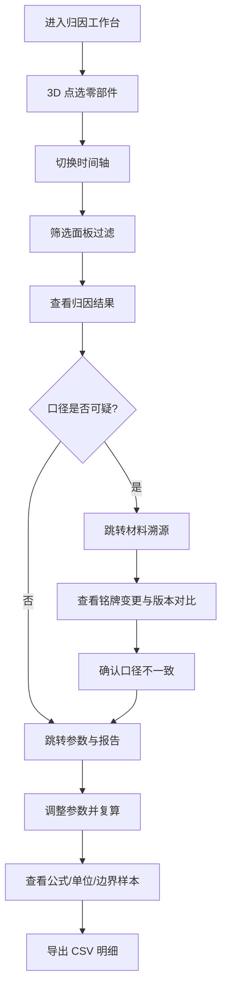

## 1. 产品概述
电机扭矩误差归因系统是一套面向设备运维与质量归因的 Web3D 交互工具，帮助项目助理从设备铭牌、运行记录和口头说明等多源材料中快速定位扭矩误差根因，并确保材料口径一致、阈值安全、归因过程可复盘可导出。

- 目标用户：项目助理小宋及其班组成员，关注设备铭牌数据与运行记录的口径一致性
- 核心价值：将散乱的多源材料结构化，让扭矩误差归因判断有据可查、有迹可循

## 2. 核心功能

### 2.1 用户角色
| 角色 | 权限说明 |
|------|----------|
| 项目助理 | 选择设备、切换时间轴、调整参数、导出 CSV 明细、查看材料溯源 |
| 班组成员 | 查看归因结果、导出 CSV 明细（只读） |

### 2.2 功能模块
1. **归因工作台**：Web3D 电机模型交互、时间轴切换、筛选面板、实时归因结果
2. **材料溯源**：铭牌记录变更追溯、口头说明版本对比、材料口径一致性检测
3. **参数与报告**：参数调节与复算、公式/单位/边界样本展示、CSV 导出一致性校验

### 2.3 页面详情
| 页面名称 | 模块名称 | 功能描述 |
|----------|----------|----------|
| 归因工作台 | 3D 电机场景 | 可旋转/缩放的电机 3D 模型，点击选中零部件高亮并联动右侧面板 |
| 归因工作台 | 时间轴 | 水平时间轴，拖拽切换时间窗口，联动 3D 高亮与筛选结果 |
| 归因工作台 | 筛选面板 | 按设备编号、误差等级、材料来源等维度筛选，联动 3D 与时间轴 |
| 归因工作台 | 归因结果面板 | 实时显示当前选中对象的误差归因结论、安全阈值状态 |
| 材料溯源 | 铭牌变更记录 | 展示设备铭牌字段的修改历史，标记被改口径的字段 |
| 材料溯源 | 版本对比 | 正常记录 vs 当前记录的逐字段对比，口头说明变更标注 |
| 材料溯源 | 口径检测 | 自动检测材料间矛盾，高亮提示"口径不一致"警告 |
| 参数与报告 | 参数调节器 | 调整安全阈值、计算系数等参数，一键复算归因结果 |
| 参数与报告 | 公式与边界展示 | 展示计算公式、单位说明、边界样本对结果影响的解释 |
| 参数与报告 | CSV 导出 | 导出当前筛选结果的 CSV 明细，页表一致性校验提示 |

## 3. 核心流程

用户进入归因工作台，在 3D 场景中点选电机零部件 → 时间轴切换到异常时段 → 筛选面板聚焦误差等级 → 归因结果面板显示误差原因 → 发现材料口径可疑，跳转材料溯源页 → 查看铭牌变更与版本对比 → 确认口径不一致 → 回到参数与报告页调整阈值复算 → 查看公式/单位/边界样本解释 → 导出 CSV 明细

## 4. 用户界面设计

### 4.1 设计风格
- 主色：深灰蓝（#1B2A4A），辅色：警示橙（#FF6B35），安全绿（#2ECC71）
- 按钮：圆角微凸 3D 风格，hover 时带轻微上浮阴影
- 字体：JetBrains Mono（数据/代码区）+ Noto Sans SC（正文），标题 20px，正文 14px，标注 12px
- 布局：左侧 3D 场景 + 右侧信息面板，底部时间轴，顶部导航栏
- 图标：lucide-react 线性图标风格

### 4.2 页面设计概览
| 页面名称 | 模块名称 | UI 元素 |
|----------|----------|---------|
| 归因工作台 | 3D 电机场景 | 深色背景、网格地面、聚光灯照明、零部件 hover 发光描边、选中高亮橙色轮廓 |
| 归因工作台 | 时间轴 | 底部水平条、可拖拽时间窗口、异常时段红色标记、安全阈值线 |
| 归因工作台 | 筛选面板 | 右侧折叠面板、下拉筛选器、标签式已选条件、清除按钮 |
| 归因工作台 | 归因结果面板 | 右侧卡片式面板、误差值用颜色编码、安全状态图标、联动提示 |
| 材料溯源 | 铭牌变更记录 | 表格布局、变更字段行高亮橙色、变更时间戳、变更前后值对比 |
| 材料溯源 | 版本对比 | 双列对比布局、差异字段用红色删除线+绿色新增文字标记 |
| 材料溯源 | 口径检测 | 顶部警告横幅、不一致项用橙色边框卡片、点击跳转详情 |
| 参数与报告 | 参数调节器 | 滑块+数字输入框组合、调节后自动触发复算、变化量 Δ 标注 |
| 参数与报告 | 公式与边界展示 | 公式用等宽字体渲染、单位紧跟数值、边界样本用虚线框标注 |
| 参数与报告 | CSV 导出 | 导出按钮带下载图标、一致性校验状态徽章（通过/不通过）、预览表格 |

### 4.3 响应式设计
- 桌面优先设计，最小宽度 1280px
- 3D 场景占左侧 60%，信息面板占右侧 40%
- 时间轴横跨底部全宽

### 4.4 3D 场景指引
- 环境：工业风深色 HDRI，冷色调环境光，营造车间氛围
- 灯光：主聚光灯从上方 45° 打在电机上，补光用冷蓝色环境光
- 相机：默认 45° 俯视角，可 OrbitControls 旋转/缩放，限制最近 2m 最远 10m
- 构图：电机居中，底座网格辅助空间感，选中零部件时相机平滑聚焦
- 交互：hover 零部件发光描边（emissive），点击选中后橙色轮廓线 + 右侧面板联动更新
- 后处理：轻微 Bloom 效果增强选中发光，SSAO 增加深度感
- 性能预算：帧率 ≥ 30fps，模型面数 ≤ 50K 三角面
