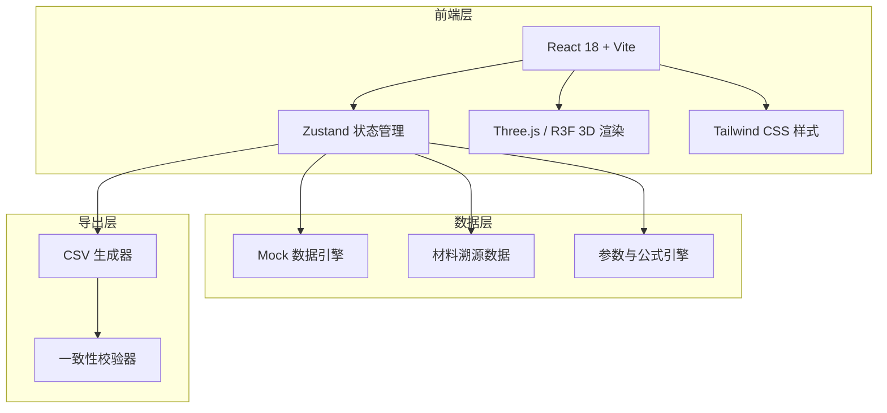
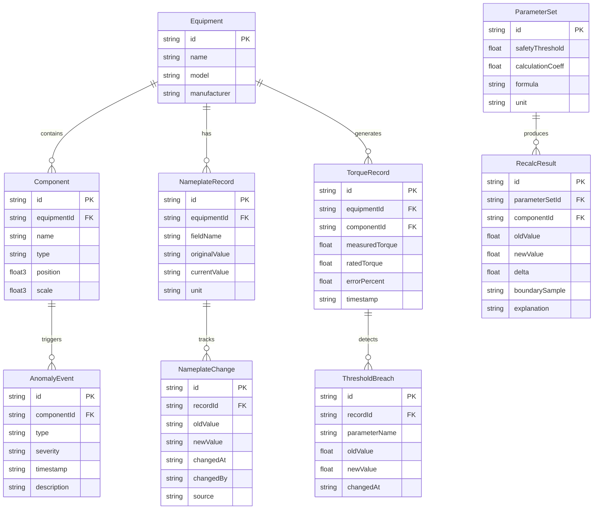

## 1. 架构设计



## 2. 技术说明
- 前端：React@18 + Tailwind CSS@3 + Vite
- 初始化工具：vite-init
- 3D 渲染：three + @react-three/fiber + @react-three/drei + @react-three/postprocessing
- 状态管理：zustand
- 路由：react-router-dom
- 后端：无（纯前端，Mock 数据）
- 数据库：无（内存 Mock 数据）

## 3. 路由定义
| 路由 | 用途 |
|------|------|
| / | 归因工作台主页，含 3D 场景、时间轴、筛选面板、归因结果 |
| /trace | 材料溯源页，铭牌变更记录、版本对比、口径检测 |
| /report | 参数与报告页，参数调节、公式展示、CSV 导出 |

## 4. 数据模型

### 4.1 数据模型定义



### 4.2 数据定义

```sql
-- 设备表
CREATE TABLE equipment (
    id TEXT PRIMARY KEY,
    name TEXT NOT NULL,
    model TEXT NOT NULL,
    manufacturer TEXT NOT NULL
);

-- 零部件表
CREATE TABLE component (
    id TEXT PRIMARY KEY,
    equipment_id TEXT NOT NULL REFERENCES equipment(id),
    name TEXT NOT NULL,
    type TEXT NOT NULL,
    position_x REAL, position_y REAL, position_z REAL,
    scale_x REAL, scale_y REAL, scale_z REAL
);

-- 铭牌记录表
CREATE TABLE nameplate_record (
    id TEXT PRIMARY KEY,
    equipment_id TEXT NOT NULL REFERENCES equipment(id),
    field_name TEXT NOT NULL,
    original_value TEXT NOT NULL,
    current_value TEXT NOT NULL,
    unit TEXT NOT NULL
);

-- 铭牌变更表
CREATE TABLE nameplate_change (
    id TEXT PRIMARY KEY,
    record_id TEXT NOT NULL REFERENCES nameplate_record(id),
    old_value TEXT NOT NULL,
    new_value TEXT NOT NULL,
    changed_at TEXT NOT NULL,
    changed_by TEXT NOT NULL,
    source TEXT NOT NULL
);

-- 扭矩记录表
CREATE TABLE torque_record (
    id TEXT PRIMARY KEY,
    equipment_id TEXT NOT NULL REFERENCES equipment(id),
    component_id TEXT NOT NULL REFERENCES component(id),
    measured_torque REAL NOT NULL,
    rated_torque REAL NOT NULL,
    error_percent REAL NOT NULL,
    timestamp TEXT NOT NULL
);

-- 异常事件表
CREATE TABLE anomaly_event (
    id TEXT PRIMARY KEY,
    component_id TEXT NOT NULL REFERENCES component(id),
    type TEXT NOT NULL,
    severity TEXT NOT NULL,
    timestamp TEXT NOT NULL,
    description TEXT NOT NULL
);

-- 阈值违规表
CREATE TABLE threshold_breach (
    id TEXT PRIMARY KEY,
    record_id TEXT NOT NULL REFERENCES torque_record(id),
    parameter_name TEXT NOT NULL,
    old_value REAL NOT NULL,
    new_value REAL NOT NULL,
    changed_at TEXT NOT NULL
);

-- 参数集表
CREATE TABLE parameter_set (
    id TEXT PRIMARY KEY,
    safety_threshold REAL NOT NULL,
    calculation_coeff REAL NOT NULL,
    formula TEXT NOT NULL,
    unit TEXT NOT NULL
);

-- 复算结果表
CREATE TABLE recalc_result (
    id TEXT PRIMARY KEY,
    parameter_set_id TEXT NOT NULL REFERENCES parameter_set(id),
    component_id TEXT NOT NULL REFERENCES component(id),
    old_value REAL NOT NULL,
    new_value REAL NOT NULL,
    delta REAL NOT NULL,
    boundary_sample TEXT,
    explanation TEXT NOT NULL
);
```

## 5. 关键模块说明

### 5.1 3D 场景模块
- 使用 @react-three/fiber 创建 Canvas
- 电机模型用基础几何体（Cylinder + Box）组合模拟
- @react-three/drei 提供 OrbitControls、Environment、Select 等
- @react-three/postprocessing 提供 Bloom + SSAO 后处理
- 点击零部件通过 Raycaster 检测，选中后更新 Zustand store

### 5.2 状态联动机制
- Zustand 统一管理：选中零部件、时间窗口、筛选条件、参数集
- 任何状态变更触发联动更新：选零件 → 过滤时间轴 + 筛选 + 归因结果；切时间 → 过滤记录 + 筛选 + 归因
- CSV 导出从同一 Zustand slice 取数据，保证页表一致

### 5.3 材料溯源引擎
- 对比铭牌原始值与当前值，标记变更字段
- 版本对比按字段逐一 diff，生成变更链
- 口径检测：检查铭牌字段值、正常记录、口头说明之间是否矛盾

### 5.4 参数复算引擎
- 参数调节后立即触发复算
- 公式展示：误差% = (实测扭矩 - 额定扭矩) / 额定扭矩 × 100%
- 边界样本：当误差恰好等于阈值时的计算过程展示
- 单位一致性校验

### 5.5 CSV 导出与一致性
- 导出数据直接从 Zustand 当前视图状态生成
- 导出前执行一致性校验：页面展示状态 vs 即将导出字段
- 校验通过显示绿色徽章，不通过显示红色徽章并阻止导出
