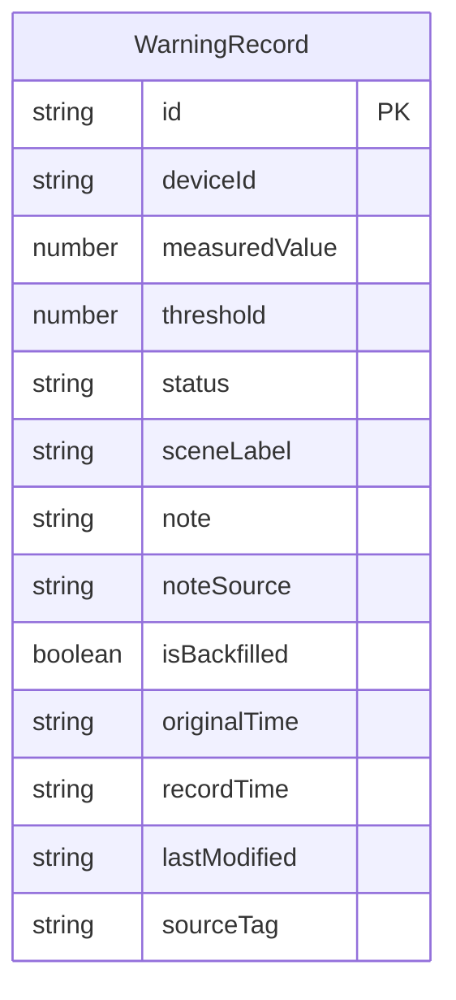

## 1. 架构设计

```mermaid
flowchart TB
    "前端 React 应用" --> "Zustand 状态管理"
    "Zustand 状态管理" --> "localStorage 持久化"
    "前端 React 应用" --> "页面组件层"
    "页面组件层" --> "预警总览页"
    "页面组件层" --> "预警详情面板"
    "预警总览页" --> "摘要区组件"
    "预警总览页" --> "卡片列表组件"
    "预警总览页" --> "侧边说明组件"
    "预警详情面板" --> "记录表单组件"
    "预警详情面板" --> "补录表单组件"
    "预警详情面板" --> "挂起确认组件"
```

## 2. 技术说明

- 前端：React@18 + TypeScript + TailwindCSS@3 + Vite
- 初始化工具：vite-init
- 后端：无（纯前端，localStorage 持久化）
- 数据库：无（localStorage 模拟持久化）
- 状态管理：Zustand（含 persist 中间件自动同步 localStorage）

## 3. 路由定义

| 路由 | 用途 |
|------|------|
| / | 预警总览页，展示所有预警记录、摘要与侧边说明 |

单页应用，详情操作通过模态框/滑入面板完成，无需额外路由。

## 4. 数据模型

### 4.1 数据模型定义



### 4.2 数据定义

```typescript
interface WarningRecord {
  id: string
  deviceId: string
  measuredValue: number
  threshold: number
  status: 'normal' | 'warning' | 'suspended' | 'confirmed' | 'rejected'
  sceneLabel: string
  note: string
  noteSource: 'sensor' | 'manual' | 'backfill'
  isBackfilled: boolean
  originalTime: string | null
  recordTime: string
  lastModified: string
  sourceTag: string
}

interface AppState {
  records: WarningRecord[]
  addRecord: (record: Omit<WarningRecord, 'id' | 'lastModified'>) => void
  updateRecord: (id: string, updates: Partial<WarningRecord>) => void
  confirmSuspended: (id: string) => void
  rejectSuspended: (id: string) => void
}
```

### 4.3 初始测试数据

| 设备编号 | 实测值 | 阈值 | 状态 | 场景标注 | 备注 | 来源 | 是否补录 |
|----------|--------|------|------|----------|------|------|----------|
| SB-DQ-0037 | 12.8mm | 10.0mm | warning | 跨中挠度超限 | 巡检发现跨中下挠明显，已限速 | sensor | 否 |
| SB-DQ-0041 | 8.2mm | 10.0mm | normal | 定期检测正常 | 季度检测，挠度在安全范围 | manual | 否 |
| SB-DQ-0037 | 13.5mm | 10.0mm | suspended | 跨中挠度持续超限 | （重复编号）补报上次巡检遗漏数据，原时间6月10日 | backfill | 是 |
| SB-DQ-0052 | 11.1mm | 10.0mm | warning | 支座附近挠度异常 | 支座处发现裂缝伴随挠度增大 | sensor | 否 |

## 5. 关键设计决策

1. **一致性保障**：场景标注（sceneLabel）作为单一数据源，侧边说明和页面摘要均从 sceneLabel 派生，确保三处描述一致
2. **挂起机制**：添加记录时检查 deviceId 是否与已有 warning 状态记录重复，重复则自动设为 suspended 状态
3. **持久化**：Zustand persist 中间件自动同步 localStorage，重启后数据完整恢复
4. **来源追溯**：每条记录的 sourceTag 字段标注数据来源，界面展示时附带来源标签
