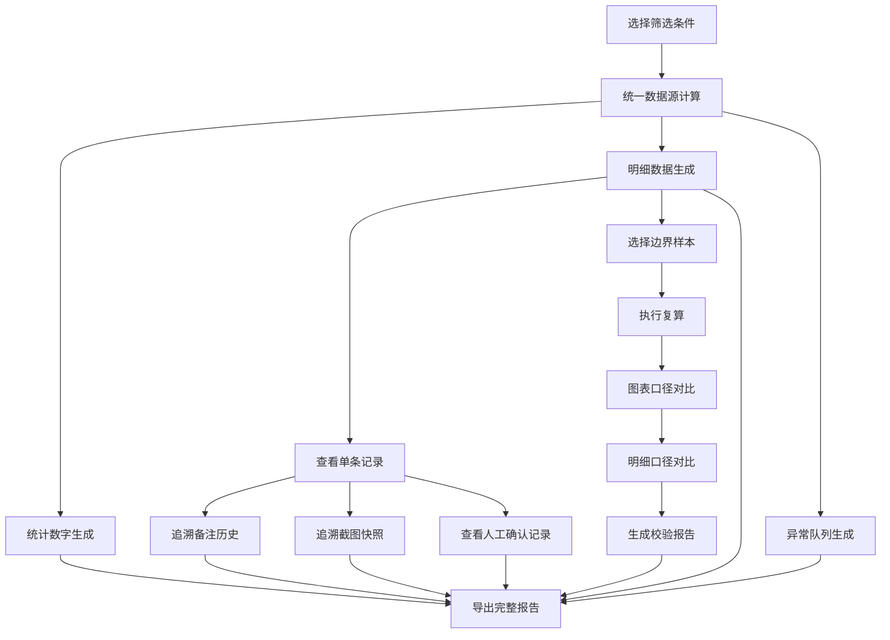

## 1. 产品概述
梁体挠度报告导出系统是面向桥梁检测领域的专业数据处理平台，解决检测数据从采集到出报告全流程中数据口径不一致、历史追溯困难、异常值处理模糊等核心痛点。目标用户包括训练教练、检测工程师、运营主管等多角色。

产品核心价值在于：
- 从同一数据源生成筛选条件、统计数字、明细表和异常队列，确保全链路口径一致
- 完整保留维修备注历史（含补录备注和旧版本截图），而非仅保留最终值
- 明确区分极端值/噪声与正常通过记录，避免误判
- 支持边界样本复算校验，确保图表与明细口径统一
- 记录人工确认全过程，便于公示前复盘解释

---

## 2. 核心功能

### 2.1 用户角色

| 角色 | 核心权限 | 典型使用场景 |
|------|----------|--------------|
| 检测工程师 | 数据录入、异常标记、报告导出 | 日常检测数据处理，生成报告 |
| 训练教练 | 数据审核、备注补充、边界样本校验 | 培训考核、早会问题复盘 |
| 运营主管 | 历史追溯、公示前复盘、异常队列查看 | 社区公示前审计、质量把控 |

### 2.2 功能模块

1. **报告导出主页**：筛选条件面板、统计概览、异常队列、操作入口
2. **明细数据页**：统一数据源明细表格、极端值高亮、历史追溯入口
3. **历史追溯页**：维修备注时间线、版本快照对比、人工确认记录
4. **边界样本校验页**：复算执行、图表口径对比、校验报告生成
5. **异常处理中心**：噪声识别、疑似异常标记、处理结果分类展示

### 2.3 页面详情

| 页面名称 | 模块名称 | 功能描述 |
|----------|----------|----------|
| 报告导出主页 | 筛选条件面板 | 多维度筛选（时间、梁号、检测类型），筛选结果同时驱动统计、明细、异常队列 |
| 报告导出主页 | 统计概览卡片 | 总检测数、正常通过、疑似噪声、待人工确认、异常值，数字实时联动 |
| 报告导出主页 | 异常队列列表 | 按优先级排序的异常记录，点击跳转明细 |
| 报告导出主页 | 报告导出按钮 | 一键导出含历史快照的完整报告 |
| 明细数据页 | 统一数据源表格 | 展示所有检测记录，极端值红色高亮，噪声值黄色标记 |
| 明细数据页 | 处理状态标签 | 明确区分「正常通过」「疑似噪声」「极端值待确认」「人工确认通过」 |
| 明细数据页 | 历史记录入口 | 每条记录旁可查看完整备注和截图历史 |
| 历史追溯页 | 备注时间线 | 按时间倒序展示所有备注（含补录），标注创建人、时间、版本号 |
| 历史追溯页 | 截图快照对比 | 旧版本截图并排对比，支持差异高亮 |
| 历史追溯页 | 人工确认记录 | 确认前后数值变化、确认人、确认时间、确认理由 |
| 边界样本校验页 | 复算执行面板 | 选择边界样本，一键重新计算 |
| 边界样本校验页 | 口径对比视图 | 图表曲线与明细数据并排展示，标注计算口径 |
| 边界样本校验页 | 校验结果报告 | 自动生成一致性校验报告 |
| 异常处理中心 | 噪声识别引擎 | 自动标记偏离阈值3σ以上的疑似噪声 |
| 异常处理中心 | 分类处理视图 | 按噪声、极端值、待确认分类展示，避免与正常通过混淆 |

---

## 3. 核心流程

用户从筛选数据开始，系统基于同一数据源同步生成统计、明细、异常队列；查看明细时可追溯完整历史（备注+截图+人工确认）；对边界样本执行复算校验；最后导出包含所有历史快照的完整报告。

---

## 4. 用户界面设计

### 4.1 设计风格

采用**工业/专业工程风**，强调数据的严谨性和可追溯性：
- **主色调**：深蓝 #1e3a5f（专业、可靠），配合钢铁灰 #4a5568
- **强调色**：
  - 正常通过：墨绿 #2f855a
  - 疑似噪声：琥珀黄 #d69e2e
  - 极端值/异常：锈红 #c53030
  - 人工确认：靛蓝 #5a67d8
- **按钮风格**：硬朗直角，2px边框，hover时有细微下沉效果
- **字体**：标题使用 [JetBrains Mono](https://fonts.google.com/specimen/JetBrains+Mono)（等宽专业感），正文使用 [Noto Sans SC](https://fonts.google.com/noto/specimen/Noto+Sans+SC)
- **布局风格**：模块化栅格布局，清晰的视觉分区，数据密度适中
- **图标风格**：线性轮廓图标，统一2px描边，无填充

### 4.2 页面设计概述

| 页面名称 | 模块名称 | UI元素设计要点 |
|----------|----------|----------------|
| 报告导出主页 | 筛选条件面板 | 固定左侧边栏，深蓝背景，白色标签，筛选条件联动时数字实时跳动动画 |
| 报告导出主页 | 统计概览卡片 | 4张卡片横向排列，每张左侧图标右侧数字，底部趋势箭头，异常卡片红色边框闪烁提示 |
| 报告导出主页 | 异常队列 | 右侧列表，按优先级排序，每条记录有状态标签、时间、梁号，hover显示预览 |
| 报告导出主页 | 主操作区 | 底部固定导出按钮栏，深蓝渐变背景，按钮有发光效果 |
| 明细数据页 | 统一数据源表格 | 斑马纹交替行，异常行整行浅红背景，噪声行浅黄背景，悬停高亮 |
| 明细数据页 | 状态标签 | 胶囊形状，不同状态不同背景色，带对应状态图标 |
| 历史追溯页 | 备注时间线 | 垂直时间线，节点为圆形状态指示器，连线为虚线，每个节点可展开详情 |
| 历史追溯页 | 截图快照 | 卡片式布局，版本号在右上角，支持点击放大对比 |
| 边界样本校验页 | 口径对比视图 | 左右分栏，左侧折线图，右侧数据表格，相同数据点联动高亮 |
| 异常处理中心 | 分类视图 | Tab切换，每个分类独立计数，卡片网格布局 |

### 4.3 响应式设计

采用 **Desktop-first** 设计：
- 桌面端（≥1280px）：完整多栏布局，侧边栏常驻
- 平板端（768px-1279px）：侧边栏可折叠，统计卡片换行
- 移动端（<768px）：单列布局，筛选条件折叠为下拉，表格支持横向滚动
- 触控优化：按钮最小44x44px，表格行高增加便于点击

### 4.4 动效设计

- 数据加载：骨架屏逐行渐入，从左到右波浪式加载
- 数字变化：数字滚动动画，异常数字红色闪烁3次后稳定
- 状态切换：标签颜色渐变过渡，时间线节点点亮动画
- 截图对比：滑动门效果，左右拖动对比不同版本
- 异常提醒：新异常产生时，队列项从右侧滑入，带轻微弹跳效果
