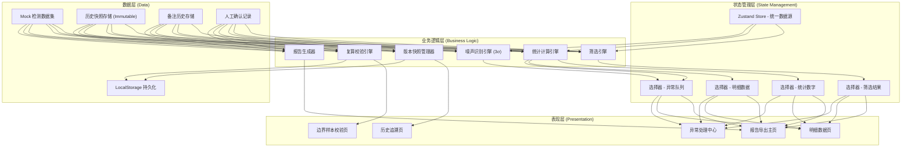
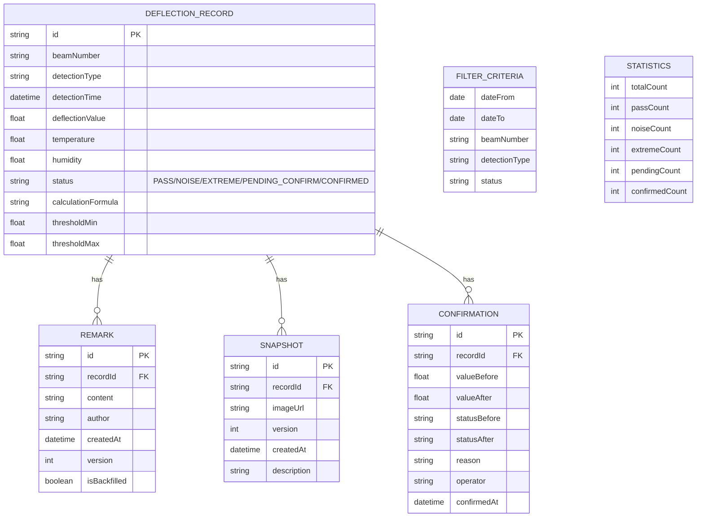

## 1. 架构设计

本系统采用**单数据源驱动**的前端架构，核心设计原则是确保筛选条件、统计数字、明细表和异常队列从同一套计算结果生成，从架构上杜绝口径不一致问题。



---

## 2. 技术描述

| 层级 | 技术选型 | 版本 | 选型理由 |
|------|----------|------|----------|
| 前端框架 | React | 18.x | 组件化开发，良好的生态支持 |
| 开发语言 | TypeScript | 5.x | 类型安全，避免运行时数据口径错误 |
| 构建工具 | Vite | 5.x | 快速开发体验，热更新 |
| 样式方案 | TailwindCSS | 3.x | 原子化CSS，工业风快速实现 |
| 状态管理 | Zustand | 4.x | 轻量、可预测，支持派生状态，完美实现单数据源 |
| 图表库 | Recharts | 2.x | React原生，支持折线图、散点图，可自定义交互 |
| 图标库 | Lucide React | 0.x | 线性图标，符合设计风格 |
| 日期处理 | date-fns | 3.x | 轻量，Tree-shakable，中文本地化 |
| 导出功能 | file-saver + xlsx | 最新 | 支持Excel导出，含多Sheet |
| 数据持久化 | localStorage | - | 存储历史快照和用户操作记录 |
| 动画库 | framer-motion | 11.x | 流畅的列表动画、数字滚动、状态过渡 |

**初始化方式**：`npm create vite@latest . -- --template react-ts`

---

## 3. 核心目录结构

```
src/
├── types/              # 类型定义（全局统一）
│   └── index.ts       # DeflectionRecord, Snapshot, Remark, Confirmation
├── store/              # Zustand 统一数据源
│   └── useDeflectionStore.ts
├── engines/            # 业务逻辑引擎
│   ├── filterEngine.ts      # 筛选引擎
│   ├── statsEngine.ts       # 统计计算引擎
│   ├── noiseEngine.ts       # 噪声识别引擎
│   ├── snapshotEngine.ts    # 版本快照引擎
│   ├── recalcEngine.ts      # 复算校验引擎
│   └── reportEngine.ts      # 报告生成引擎
├── data/               # Mock 数据
│   ├── mockRecords.ts
│   ├── mockHistory.ts
│   └── mockRemarks.ts
├── components/         # 组件
│   ├── layout/         # 布局组件
│   ├── filters/        # 筛选组件
│   ├── stats/          # 统计卡片组件
│   ├── table/          # 明细表格组件
│   ├── timeline/       # 历史时间线组件
│   ├── chart/          # 图表组件
│   └── common/         # 通用组件
├── pages/              # 页面组件
│   ├── HomePage.tsx
│   ├── DetailPage.tsx
│   ├── HistoryPage.tsx
│   ├── VerifyPage.tsx
│   └── ExceptionPage.tsx
├── utils/              # 工具函数
│   ├── formatters.ts
│   ├── validators.ts
│   └── constants.ts
├── hooks/              # 自定义 Hooks
│   ├── useUnifiedDataSource.ts
│   ├── useHistoryTracking.ts
│   └── useRecalibration.ts
├── App.tsx
├── main.tsx
└── index.css
```

---

## 4. 路由定义

| 路由路径 | 页面名称 | 核心功能 |
|----------|----------|----------|
| `/` | 报告导出主页 | 筛选条件、统计概览、异常队列、报告导出入口 |
| `/detail` | 明细数据页 | 统一数据源明细表格、状态标签、历史入口 |
| `/history/:recordId` | 历史追溯页 | 备注时间线、截图快照对比、人工确认记录 |
| `/verify` | 边界样本校验页 | 复算执行、图表口径对比、校验报告 |
| `/exceptions` | 异常处理中心 | 噪声分类视图、极端值处理、批量确认 |

---

## 5. 数据模型

### 5.1 数据模型定义



### 5.2 核心类型定义

```typescript
// 统一数据源根类型 - 所有页面从此派生
export interface UnifiedDataSource {
  records: DeflectionRecord[];
  statistics: Statistics;
  exceptionQueue: DeflectionRecord[];
  filterCriteria: FilterCriteria;
  lastUpdated: Date;
  calculationVersion: string;
}

// 检测记录 - 包含计算口径元数据
export interface DeflectionRecord {
  id: string;
  beamNumber: string;
  detectionType: 'static' | 'dynamic' | 'ambient';
  detectionTime: Date;
  deflectionValue: number;
  temperature: number;
  humidity: number;
  status: RecordStatus;
  calculationFormula: string;
  threshold: { min: number; max: number };
  noiseScore: number;
  isBoundary: boolean;
  dataSource: string;
}

// 状态枚举 - 严格区分处理结果
export type RecordStatus = 
  | 'PASS'           // 正常通过
  | 'NOISE_SUSPECTED' // 疑似噪声
  | 'EXTREME_VALUE'  // 极端值
  | 'PENDING_CONFIRM' // 待人工确认
  | 'CONFIRMED_PASS'  // 人工确认通过
  | 'CONFIRMED_REJECT'; // 人工确认驳回

// 历史备注 - 保留所有版本
export interface Remark {
  id: string;
  recordId: string;
  content: string;
  author: string;
  createdAt: Date;
  version: number;
  isBackfilled: boolean; // 是否为补录
  attachmentUrls?: string[];
}

// 截图快照 - 保留旧版本
export interface Snapshot {
  id: string;
  recordId: string;
  imageUrl: string;
  version: number;
  createdAt: Date;
  description: string;
  dataHash: string; // 数据快照哈希，确保不可篡改
}

// 人工确认记录
export interface Confirmation {
  id: string;
  recordId: string;
  valueBefore: number;
  valueAfter: number;
  statusBefore: RecordStatus;
  statusAfter: RecordStatus;
  reason: string;
  operator: string;
  confirmedAt: Date;
  formulaVersion: string;
}
```

---

## 6. 核心算法规范

### 6.1 统一数据源计算流程

```typescript
// 所有计算必须经过此单一入口
function computeUnifiedDataSource(
  rawRecords: DeflectionRecord[],
  criteria: FilterCriteria
): UnifiedDataSource {
  // 1. 筛选 - 同一套筛选逻辑
  const filtered = applyFilter(rawRecords, criteria);
  
  // 2. 噪声识别 - 3σ原则
  const withNoiseScore = detectNoise(filtered);
  
  // 3. 状态标记 - 基于同一套规则
  const withStatus = markStatus(withNoiseScore);
  
  // 4. 统计计算 - 基于标记后的同一数据集
  const statistics = computeStatistics(withStatus);
  
  // 5. 异常队列 - 从同一数据集提取
  const exceptionQueue = extractExceptions(withStatus);
  
  return {
    records: withStatus,
    statistics,
    exceptionQueue,
    filterCriteria: criteria,
    lastUpdated: new Date(),
    calculationVersion: FORMULA_VERSION
  };
}
```

### 6.2 噪声识别算法（3σ原则）

```typescript
function detectNoise(records: DeflectionRecord[]): DeflectionRecord[] {
  const values = records.map(r => r.deflectionValue);
  const mean = calculateMean(values);
  const std = calculateStdDev(values, mean);
  const threshold = 3 * std;
  
  return records.map(record => {
    const deviation = Math.abs(record.deflectionValue - mean);
    const noiseScore = deviation / threshold;
    const isNoise = noiseScore > 1.0;
    
    return {
      ...record,
      noiseScore,
      status: isNoise && record.status === 'PASS' 
        ? 'NOISE_SUSPECTED' 
        : record.status
    };
  });
}
```

### 6.3 版本快照机制

```typescript
// 每次修改前自动创建快照
function createSnapshot(record: DeflectionRecord, operator: string): Snapshot {
  return {
    id: generateId(),
    recordId: record.id,
    imageUrl: generateChartSnapshot(record),
    version: getNextVersion(record.id),
    createdAt: new Date(),
    description: `修改前快照 - ${operator}`,
    dataHash: hashRecordData(record)
  };
}
```

---

## 7. 状态管理设计（Zustand Store）

```typescript
interface DeflectionStore {
  // 单一数据源 - 所有组件共享
  unifiedDataSource: UnifiedDataSource | null;
  
  // 操作方法
  setFilterCriteria: (criteria: Partial<FilterCriteria>) => void;
  refreshDataSource: () => void;
  addRemark: (recordId: string, content: string, author: string) => void;
  confirmRecord: (recordId: string, newStatus: RecordStatus, reason: string, operator: string) => void;
  recalibrateBoundary: (recordId: string) => RecalcResult;
  exportReport: () => Promise<Blob>;
  
  // 选择器 (Selectors) - 派生数据，确保口径一致
  getStatistics: () => Statistics | null;
  getRecords: () => DeflectionRecord[];
  getExceptionQueue: () => DeflectionRecord[];
  getRecordHistory: (recordId: string) => HistoryBundle | null;
}

// 使用方式
const { getStatistics, getRecords, getExceptionQueue } = useDeflectionStore();
// 三者始终基于同一数据集，不存在口径差异
```

---

## 8. 报告导出规范

导出的 Excel 报告包含以下 Sheet，均从同一数据源生成：

| Sheet 名称 | 内容 | 备注 |
|-----------|------|------|
| 统计概览 | 统计数字、筛选条件、计算版本 | 与页面显示完全一致 |
| 明细数据 | 所有检测记录，含状态标记 | 含极端值/噪声标记列 |
| 异常队列 | 待处理异常记录 | 按优先级排序 |
| 备注历史 | 所有备注的完整时间线 | 标注补录和版本号 |
| 截图快照 | 各版本截图缩略图和链接 | 保留所有历史版本 |
| 人工确认记录 | 所有确认操作的审计日志 | 含确认前后对比 |
| 边界样本校验 | 复算结果对比、口径说明 | 图表与数据一致性验证 |

---

## 9. 性能与可靠性保障

1. **数据不可变性**：使用 Immer 确保状态更新的不可变性，避免意外修改
2. **计算缓存**：使用 Zustand 选择器 + memo 缓存派生计算，避免重复计算
3. **错误边界**：页面级错误边界，单模块崩溃不影响整体
4. **操作日志**：所有修改操作记录审计日志，便于追溯
5. **数据校验**：导出前自动校验数据源一致性，确保报告准确
