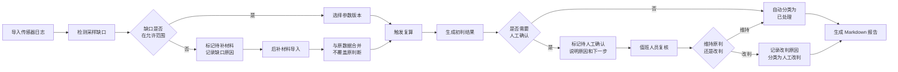

## 1. 产品概述

激光散斑实验复算系统是面向实验人员和算法值班人员的专业工具，用于管理传感器日志、追踪参数版本、通过 Web3D 可视化辅助复算判断，并生成可追溯的 Markdown 报告。解决了"靠人记太累"的痛点，确保日志-参数-判断的完整链路可追溯。

- **核心问题**：传感器日志分批凑齐、参数版本易混淆、复算判断无留痕、换班交接无依据
- **目标用户**：实验操作人员、算法值班人员、项目助理
- **产品价值**：每一次复算都有迹可循，每一个数字都有来源，每一次交接都清晰透明

## 2. 核心功能

### 2.1 用户角色

| 角色 | 使用场景 | 核心诉求 |
|------|----------|----------|
| 实验操作人员 | 导入传感器日志、触发复算、查看结果 | 操作简单、数据不丢、判断有据 |
| 算法值班人员 | 复核结果、人工改判、导出报告 | 异常醒目、改判留痕、交接方便 |
| 项目助理 | 整理材料、跟踪进度 | 状态清晰、报告规范、分类明确 |

### 2.2 功能模块

1. **数据管理面板**：传感器日志导入、参数版本管理、日志-参数关联
2. **Web3D 复算视图**：设备点位展示、散斑数据可视化、点选联动、时间轴播放
3. **筛选与时间轴**：按时间/传感器/参数版本筛选，时间轴拖拽定位
4. **Markdown 报告中心**：自动生成报告、三分类（已处理/待补材料/人工改判）、一键导出
5. **人工确认机制**：采样缺口检测、异常预警、改判原因记录、下一步指引
6. **换班交接板**：数字来源线索、待办事项、材料存放位置、异常快速入口

### 2.3 页面详情

| 页面名称 | 模块名称 | 功能描述 |
|-----------|-------------|---------------------|
| 主工作台 | 左侧数据管理 | 传感器日志列表、参数版本列表、关联关系展示 |
| 主工作台 | 中间 Web3D 场景 | 3D 设备点位、散斑云图、点选高亮、时间轴 |
| 主工作台 | 右侧详情面板 | 选中对象详情、参数对比、复算结果、判断状态 |
| 主工作台 | 底部筛选栏 | 时间范围筛选、传感器筛选、参数版本筛选 |
| 报告中心 | 报告列表 | 按分类展示报告、搜索、排序 |
| 报告中心 | 报告预览 | Markdown 实时预览、分类标签、操作按钮 |
| 交接板 | 换班摘要 | 关键数字、数字来源线索、待办清单 |
| 交接板 | 快速入口 | 材料上传区、异常查看、重新导出 |

## 3. 核心流程

### 3.1 复算主流程

实验人员导入传感器日志 → 系统自动检测采样缺口 → 选择/创建参数版本 → 触发复算 → 系统生成初判结果 → 如遇缺口/异常则标记待人工确认 → 值班人员复核 → 确认或改判 → 生成 Markdown 报告（自动分类）

### 3.2 流程图

## 4. 用户界面设计

### 4.1 设计风格

- **主色调**：深靛蓝 (#0f172a) 背景，科技感深色主题
- **强调色**：激光红 (#ef4444) 用于异常/警告，激光绿 (#22c55e) 用于正常/通过，琥珀色 (#f59e0b) 用于待确认
- **辅助色**：钢青色 (#0ea5e9) 用于选中/联动，冷灰色系用于层级区分
- **按钮风格**：方中带圆（4px 圆角），轻微内阴影，按下有凹陷感
- **字体**：标题用 Space Grotesk（现代几何无衬线），数据展示用 JetBrains Mono（等宽字体），正文用系统无衬线
- **布局风格**：三栏式工作台，左侧数据树、中间 3D 场景、右侧详情面板，顶部状态栏，底部时间轴
- **视觉元素**：细微扫描线纹理、数据发光效果、网格背景、科技感边框

### 4.2 页面设计概述

| 页面名称 | 模块名称 | UI 元素 |
|-----------|-------------|-------------|
| 主工作台 | 数据管理面板 | 折叠面板、文件上传区、版本标签、关联连线、状态色点 |
| 主工作台 | Web3D 场景 | 深色空间网格、设备点位发光球体、散斑热色映射、选中高亮描边、时间轴刻度 |
| 主工作台 | 详情面板 | 卡片式分组、数据表格、参数对比 diff、状态徽章、操作按钮 |
| 主工作台 | 底部筛选栏 | 时间范围选择器、传感器多选、参数版本下拉、筛选重置 |
| 报告中心 | 报告列表 | 三栏分类卡片、搜索框、排序下拉、报告条目（标题+时间+状态+摘要） |
| 报告中心 | 报告预览 | Markdown 渲染区、分类标签栏、导出按钮、版本信息 |
| 交接板 | 换班摘要 | 大号数字卡片、数字来源小脚印图标、悬停显示线索、待办 checklist |
| 交接板 | 快速入口 | 三个大图标卡片：材料上传、异常查看、重新导出 |

### 4.3 响应性

- 桌面端优先设计（1440px 及以上）
- 平板端折叠左侧面板为可抽屉式
- 移动端简化为单页标签切换（暂不做深度适配）

### 4.4 3D 场景指引

- **环境**：深色空间，微弱环境光 + 方向光，地面网格线（半透明）
- **光照**：主光源冷白色，辅光源带淡蓝色调，设备点位自发光
- **相机**：透视相机，初始角度 45° 俯视，可拖拽旋转、滚轮缩放
- **构图**：设备点位呈阵列分布，散斑数据以平面热图叠加在设备上方
- **交互**：点击设备点位高亮 + 右侧面板联动，时间轴拖拽数据随之变化
- **后处理**：轻微泛光（Bloom）效果，选中物体有描边
- **性能**：控制设备点位数在 100 以内，散斑数据用着色器实时计算
