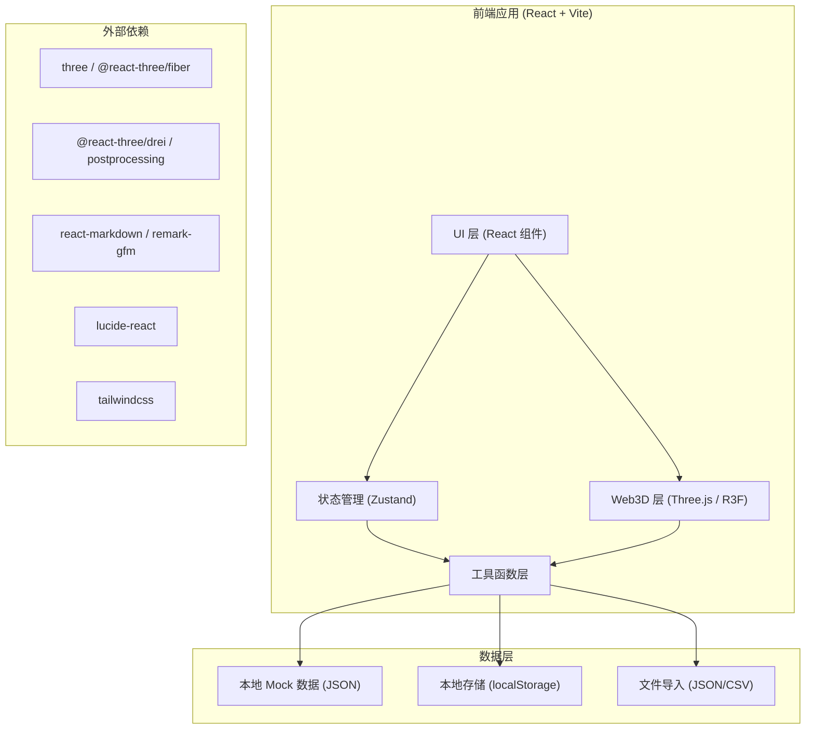
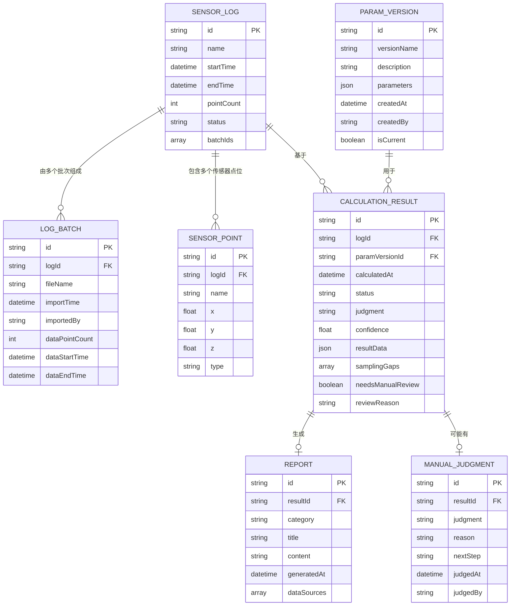

## 1. 架构设计



## 2. 技术描述

- **前端框架**：React@18 + TypeScript
- **构建工具**：Vite@5
- **状态管理**：Zustand
- **样式方案**：TailwindCSS@3
- **路由**：react-router-dom
- **3D 引擎**：three + @react-three/fiber + @react-three/drei + @react-three/postprocessing
- **Markdown 渲染**：react-markdown + remark-gfm
- **图标库**：lucide-react
- **后端**：无（纯前端，数据通过本地文件导入 + localStorage 持久化）
- **数据库**：localStorage 模拟，数据以 JSON 格式存储

## 3. 路由定义

| 路由 | 页面 | 用途 |
|-------|------|------|
| / | 主工作台 | 三栏式布局：数据管理 + Web3D + 详情面板 |
| /reports | 报告中心 | Markdown 报告列表与预览，三分类展示 |
| /handover | 换班交接板 | 换班摘要、数字线索、快速入口 |

## 4. 数据模型

### 4.1 数据模型 ER 图



### 4.2 核心数据类型定义

```typescript
// 传感器日志
interface SensorLog {
  id: string;
  name: string;
  startTime: string;
  endTime: string;
  pointCount: number;
  status: 'incomplete' | 'complete' | 'pending_review';
  batchIds: string[];
}

// 日志批次（分批导入）
interface LogBatch {
  id: string;
  logId: string;
  fileName: string;
  importTime: string;
  importedBy: string;
  dataPointCount: number;
  dataStartTime: string;
  dataEndTime: string;
}

// 传感器点位（3D 空间位置）
interface SensorPoint {
  id: string;
  logId: string;
  name: string;
  x: number;
  y: number;
  z: number;
  type: 'laser' | 'detector' | 'reference';
}

// 参数版本
interface ParamVersion {
  id: string;
  versionName: string;
  description: string;
  parameters: Record<string, number | string | boolean>;
  createdAt: string;
  createdBy: string;
  isCurrent: boolean;
}

// 采样缺口
interface SamplingGap {
  id: string;
  startTime: string;
  endTime: string;
  duration: number; // 秒
  severity: 'low' | 'medium' | 'high';
  sensorIds: string[];
}

// 复算结果
interface CalculationResult {
  id: string;
  logId: string;
  paramVersionId: string;
  calculatedAt: string;
  status: 'calculating' | 'done' | 'error';
  judgment: 'pass' | 'fail' | 'pending';
  confidence: number; // 0-1
  resultData: Record<string, any>;
  samplingGaps: SamplingGap[];
  needsManualReview: boolean;
  reviewReason?: string;
}

// 人工改判
interface ManualJudgment {
  id: string;
  resultId: string;
  judgment: 'pass' | 'fail';
  reason: string;
  nextStep: string;
  judgedAt: string;
  judgedBy: string;
}

// Markdown 报告
interface Report {
  id: string;
  resultId: string;
  category: 'processed' | 'pending_material' | 'manual_override';
  title: string;
  content: string;
  generatedAt: string;
  dataSources: string[]; // 数据来源线索
}

// 时间序列数据点
interface TimeSeriesPoint {
  timestamp: string;
  values: Record<string, number>; // sensorId -> value
}
```

## 5. 项目结构

```
src/
├── components/          # 通用组件
│   ├── ui/             # 基础 UI 组件（按钮、卡片、徽章等）
│   └── layout/         # 布局组件
├── pages/              # 页面组件
│   ├── Workbench/      # 主工作台
│   ├── Reports/        # 报告中心
│   └── Handover/       # 换班交接板
├── store/              # Zustand 状态管理
│   ├── useLogStore.ts
│   ├── useParamStore.ts
│   ├── useResultStore.ts
│   └── useReportStore.ts
├── three/              # Three.js 相关
│   ├── Scene.tsx       # 3D 场景主组件
│   ├── SensorPoints.tsx # 传感器点位
│   ├── SpecklePlane.tsx # 散斑平面
│   └── controls.ts     # 相机控制
├── utils/              # 工具函数
│   ├── calculation.ts  # 复算算法
│   ├── gapDetection.ts # 采样缺口检测
│   ├── reportGen.ts    # Markdown 报告生成
│   └── fileImport.ts   # 文件导入解析
├── data/               # Mock 数据
│   ├── mockLogs.ts
│   ├── mockParams.ts
│   └── mockResults.ts
├── types/              # TypeScript 类型定义
│   └── index.ts
├── hooks/              # 自定义 Hooks
│   └── useTimeSeries.ts
├── App.tsx
├── main.tsx
└── index.css
```

## 6. 核心模块说明

### 6.1 数据管理层
- 支持 JSON/CSV 格式的传感器日志导入
- 日志分批存储，合并时保留原始批次信息
- 参数版本管理，支持版本对比
- localStorage 持久化，刷新不丢失

### 6.2 Web3D 可视化层
- 使用 @react-three/fiber 声明式构建 3D 场景
- 传感器点位：发光球体，点击高亮，右侧面板联动
- 散斑数据：平面热图，随时间轴变化，着色器实时渲染
- 轨道控制器：支持旋转、缩放、平移
- 后处理：Bloom 发光效果，选中物体描边

### 6.3 复算引擎
- 基于参数版本 + 传感器数据执行复算
- 采样缺口检测算法：时间连续性检查
- 自动判断逻辑：根据阈值给出 pass/fail/pending
- 异常识别：数据越界、缺口过大等触发人工确认

### 6.4 报告生成器
- 自动从复算结果生成 Markdown 报告
- 三分类：已处理 / 待补材料 / 人工改判
- 包含数字来源线索（哪批日志、哪个参数版本）
- 支持一键导出 .md 文件

### 6.5 换班交接板
- 关键指标卡片：今日复算数、待确认数、异常数
- 数字来源追踪：每个数字点击可查看来源链路
- 待办清单：待补材料、待人工确认、待重新导出
- 快速入口：材料上传、异常查看、重新导出
