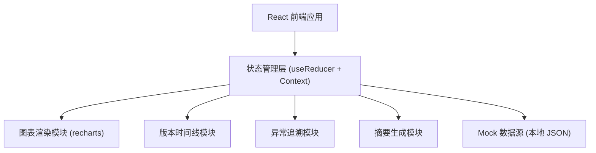
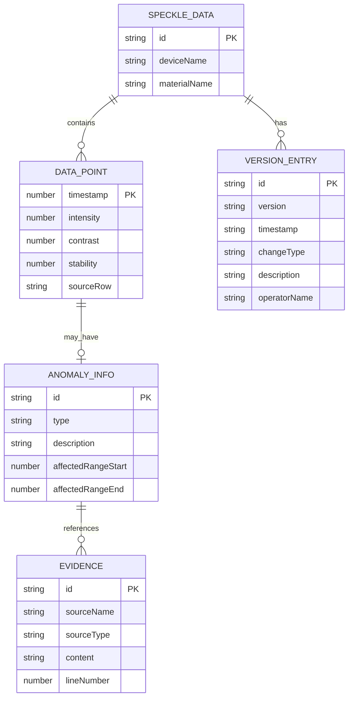

## 1. 架构设计



## 2. 技术说明

- 前端：React@18 + TypeScript + Vite
- 样式：TailwindCSS@3 + CSS 自定义动画
- 图表：recharts（React 生态轻量图表库）
- 状态：React Context + useReducer 本地状态管理
- 数据：内置 Mock 数据，无需后端服务
- 初始化工具：npm create vite@latest

## 3. 路由定义

| 路由 | 用途 |
|------|------|
| / | 激光散斑参数回放主页（单页应用，仅此一个路由） |

## 4. 数据模型

### 4.1 数据结构定义



### 4.2 核心 TypeScript 类型

```typescript
interface DataPoint {
  timestamp: number;
  intensity: number;
  contrast: number;
  stability: number;
  sourceRow: string;
  anomaly?: AnomalyInfo;
}

interface AnomalyInfo {
  id: string;
  type: 'extreme' | 'noise' | 'missing';
  description: string;
  affectedRangeStart: number;
  affectedRangeEnd: number;
  evidences: Evidence[];
}

interface Evidence {
  id: string;
  sourceName: string;
  sourceType: '铭牌' | '材料报告' | '操作日志';
  content: string;
  lineNumber: number;
}

interface VersionEntry {
  id: string;
  version: string;
  timestamp: string;
  changeType: '初始' | '补充' | '修正';
  description: string;
  operatorName: string;
}

interface SpeckleDataset {
  id: string;
  deviceName: string;
  materialName: string;
  dataPoints: DataPoint[];
  versions: VersionEntry[];
  summary: {
    paramVersion: string;
    anomalyCount: number;
    conclusion: string;
  };
}
```
