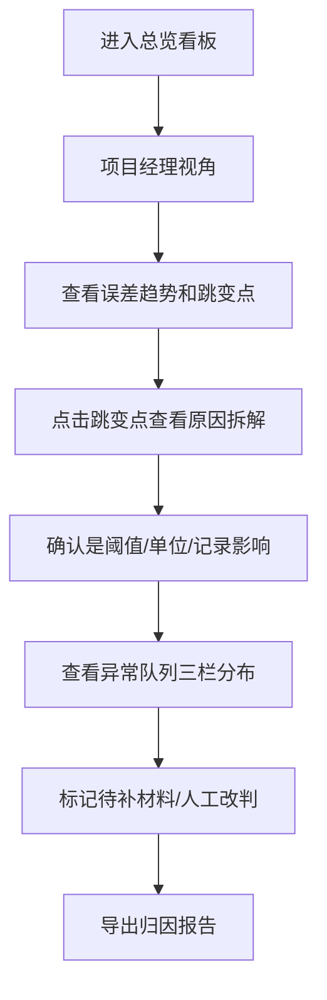
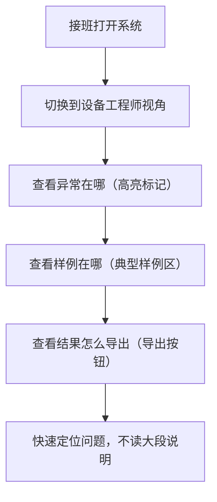

## 1. 产品概述

激光散斑误差归因系统是一款面向工业设备质量分析的数据看板产品，解决维修记录混杂导致误差归因不清的问题。系统支持双视角切换，帮助项目经理管控异常、帮助设备工程师快速定位问题和导出结果。

- 核心问题：维修备注旧版、正常记录、口头备注混杂，导致误差结论不可追溯、安全阈值篡改难发现
- 目标用户：项目经理（管理视角）、设备工程师老何（实操视角）
- 产品价值：归因可追溯、异常可分类、结果可复盘，一套数据三端口径统一

## 2. 核心功能

### 2.1 用户角色

| 角色 | 进入方式 | 核心诉求 |
|------|----------|----------|
| 项目经理 | 视角切换 | 安全阈值监控、异常队列分类管理、跳变原因追溯 |
| 设备工程师 | 视角切换 | 样例定位、异常排查、结果快速导出、减少阅读成本 |

### 2.2 功能模块

1. **总览看板**：误差趋势图、归因分类占比、异常概览、视角切换器
2. **归因分析**：场景标注、侧边说明、记录溯源（维修备注旧版/正常记录/口头备注）
3. **异常队列**：已处理 / 待补材料 / 人工改判 三栏分类
4. **跳变检测**：结果突变点标记、原因拆解（阈值变动/单位变化/正常记录影响）
5. **结果导出**：一键导出归因报告，保持场景标注、侧边说明、异常队列口径一致

### 2.3 页面详情

| 页面名称 | 模块名称 | 功能描述 |
|----------|----------|----------|
| 总览看板 | 视角切换器 | 项目经理/设备工程师两种视角一键切换 |
| 总览看板 | 误差趋势图 | 时间序列折线图，标注跳变点和阈值线 |
| 总览看板 | 归因分类占比 | 饼图/环形图展示三类记录对结论的影响占比 |
| 总览看板 | 异常概览卡片 | 三类异常数量统计（已处理/待补材料/人工改判） |
| 归因分析页 | 场景标注区 | 当前分析的场景描述，与侧边说明、异常队列联动 |
| 归因分析页 | 记录溯源列表 | 逐条展示每条记录的类型、影响权重、原始内容 |
| 归因分析页 | 阈值变动记录 | 单独拎出安全阈值被修改的记录，高亮警示 |
| 异常队列页 | 三栏看板 | 已处理/待补材料/人工改判三列拖拽式看板 |
| 跳变分析弹窗 | 原因拆解 | 标出跳变是由阈值、单位还是正常记录造成的 |
| 结果导出 | 报告生成 | 导出 PDF/图片，保持场景标注、侧边说明、异常队列口径一致 |

## 3. 核心流程

### 3.1 项目经理工作流

### 3.2 设备工程师工作流

## 4. 用户界面设计

### 4.1 设计风格

- **主色调**：深空蓝 #0F172A 为底色，搭配科技青绿 #10B981 作为正常态，警示橙 #F59E0B 作为待处理，警戒红 #EF4444 作为异常
- **辅助色**：浅蓝灰 #64748B 用于次要信息，金属银 #94A3B8 用于边框和分割线
- **按钮风格**：直角微圆角（4px），实心按钮带细微阴影，强调工业精密感
- **字体**：标题使用 JetBrains Mono（等宽科技感），正文使用 Noto Sans SC（清晰易读）
- **布局风格**：卡片式模块化布局，细密分割线，数据密度高但不拥挤
- **图标风格**：线性纤细图标（lucide），保持工业仪表的精密感

### 4.2 页面设计概述

| 页面名称 | 模块名称 | UI 元素 |
|----------|----------|---------|
| 总览看板 | 顶部导航 | 视角切换器、当前场景标签、导出按钮 |
| 总览看板 | 趋势图区 | 大面积折线图，跳变点用红点闪烁动画，阈值线用虚线标注 |
| 总览看板 | 归因卡片 | 三张卡片并排，分别显示三类记录占比，带图标和数值 |
| 总览看板 | 异常概览 | 三列迷你卡片，数字大号显示，状态色区分 |
| 归因分析页 | 左侧记录列表 | 可滚动列表，每条记录带类型标签和影响权重条 |
| 归因分析页 | 右侧详情面板 | 选中记录的完整内容、来源、修改历史 |
| 异常队列页 | 三栏看板 | 卡片可拖拽，每栏顶部有数量统计和筛选 |
| 跳变弹窗 | 原因拆解 | 三段式布局，分别展示阈值、单位、记录的影响程度 |

### 4.3 响应式

- 桌面端优先设计（1440px 基准）
- 平板端：异常队列三栏变两栏，归因卡片换行
- 移动端：单列流式布局，趋势图缩小，导航收起为汉堡菜单
- 触控优化：按钮最小 44px 高度，列表项增加点击热区

### 4.4 动效与交互

- 页面加载：卡片从下往上渐入，错落 50ms 延迟
- 跳变点：红色脉冲动画，呼吸效果吸引注意
- 视角切换：平滑过渡 300ms，内容淡入淡出
- 悬停态：卡片轻微上浮 2px，阴影加深
- 阈值变动记录：红边闪烁警示，鼠标悬停显示修改前后对比
