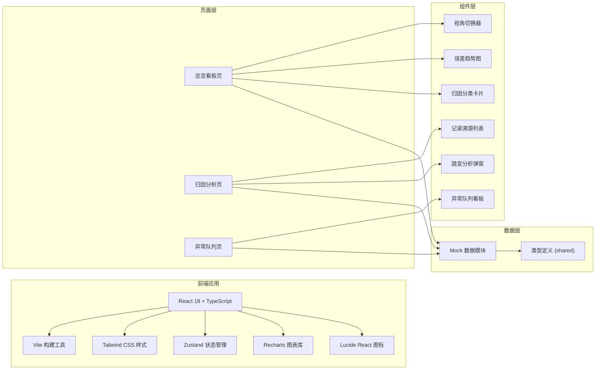

## 1. 架构设计



## 2. 技术描述

- **前端框架**: React@18 + TypeScript
- **构建工具**: Vite@5
- **样式方案**: Tailwind CSS@3
- **状态管理**: Zustand
- **图表库**: Recharts
- **图标库**: lucide-react
- **路由**: react-router-dom
- **后端**: 无（纯前端 + Mock 数据）
- **数据**: 内置 Mock 模拟数据，涵盖维修备注旧版、正常记录、口头备注三类

## 3. 路由定义

| 路由 | 页面 | 说明 |
|------|------|------|
| / | 总览看板 | 首页，误差趋势、归因概览、异常统计 |
| /analysis | 归因分析 | 记录溯源、阈值变动、场景标注 |
| /queue | 异常队列 | 三栏看板：已处理/待补材料/人工改判 |

## 4. 数据模型

### 4.1 核心数据类型

```typescript
// 记录类型
type RecordType = 'old_note' | 'normal' | 'verbal';

// 异常状态
type ExceptionStatus = 'resolved' | 'pending_material' | 'manual_overrule';

// 误差记录
interface SpeckleRecord {
  id: string;
  date: string;
  value: number;
  type: RecordType;
  source: string;
  content: string;
  impactWeight: number;
  isThresholdChanged?: boolean;
  thresholdBefore?: number;
  thresholdAfter?: number;
  unitChanged?: boolean;
  unitBefore?: string;
  unitAfter?: string;
  isJumpPoint?: boolean;
  jumpReason?: 'threshold' | 'unit' | 'normal_record';
}

// 异常项
interface ExceptionItem {
  id: string;
  recordId: string;
  title: string;
  description: string;
  status: ExceptionStatus;
  type: RecordType;
  createdAt: string;
  assignee?: string;
}

// 场景标注
interface SceneAnnotation {
  id: string;
  title: string;
  description: string;
  dateRange: [string, string];
  records: string[];
}

// 视角类型
type ViewMode = 'manager' | 'engineer';
```

### 4.2 状态管理

使用 Zustand 管理全局状态：

```typescript
interface AppState {
  viewMode: ViewMode;
  currentScene: SceneAnnotation | null;
  records: SpeckleRecord[];
  exceptions: ExceptionItem[];
  selectedRecordId: string | null;
  setViewMode: (mode: ViewMode) => void;
  setCurrentScene: (scene: SceneAnnotation) => void;
  selectRecord: (id: string | null) => void;
  updateExceptionStatus: (id: string, status: ExceptionStatus) => void;
}
```

## 5. 项目结构

```
src/
├── components/          # 可复用组件
│   ├── ViewSwitcher.tsx      # 视角切换器
│   ├── TrendChart.tsx        # 误差趋势图
│   ├── AttributionCard.tsx   # 归因分类卡片
│   ├── RecordList.tsx        # 记录溯源列表
│   ├── RecordDetail.tsx      # 记录详情面板
│   ├── ExceptionBoard.tsx    # 异常队列看板
│   ├── ExceptionCard.tsx     # 异常卡片
│   ├── JumpModal.tsx         # 跳变分析弹窗
│   ├── SceneTag.tsx          # 场景标签
│   └── ExportButton.tsx      # 导出按钮
├── pages/               # 页面
│   ├── Dashboard.tsx         # 总览看板
│   ├── Analysis.tsx          # 归因分析
│   └── Queue.tsx             # 异常队列
├── store/               # 状态管理
│   └── useAppStore.ts
├── data/                # Mock 数据
│   ├── records.ts
│   ├── exceptions.ts
│   └── scenes.ts
├── types/               # 类型定义
│   └── index.ts
├── utils/               # 工具函数
│   ├── export.ts
│   └── format.ts
├── App.tsx
├── main.tsx
└── index.css
```

## 6. 关键技术方案

### 6.1 视角切换方案

使用 Zustand 存储当前视角模式，各组件根据模式动态调整显示内容：
- 项目经理视角：显示完整数据、管理操作、阈值监控
- 设备工程师视角：精简信息、突出异常和样例、弱化管理功能

### 6.2 数据口径统一

场景标注、侧边说明、异常队列共享同一份数据源和计算逻辑，通过 Zustand 状态中心同步，确保三套展示的口径一致。

### 6.3 跳变检测算法

基于历史数据计算滑动窗口标准差，当新数据点偏离超过 2 倍标准差时标记为跳变点，并根据关联记录的属性（阈值变动/单位变化/正常记录）判定跳变原因。

### 6.4 导出方案

使用 html2canvas + jsPDF 实现报告导出，导出时锁定当前场景状态，确保场景标注、侧边说明、异常队列在导出文档中保持一致。
