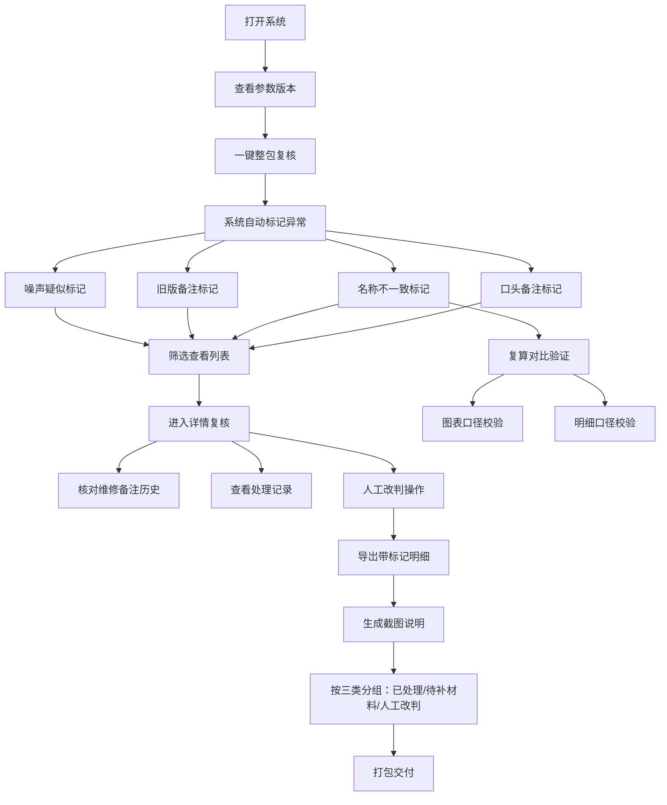

## 1. 产品概述

冷却塔水滴阈值预警复核系统是面向工业运维场景的数据复核工具，解决项目助理在阈值预警复核时面临的参数版本混乱、维修备注散落、极端值噪声难辨等问题。系统通过一条命令驱动整包样例复核，在筛选、详情、导出全链路保留标记，确保图表与明细口径一致，最终交付可追溯的复核说明材料。

- 核心目标：降低复核成本，确保结论可追溯，让项目助理小宋能将维修备注、处理记录、截图说明完整对给他人
- 目标用户：项目助理（复核执行人）、算法值班人（结果审阅人）

## 2. 核心功能

### 2.1 用户角色

| 角色 | 使用场景 | 核心权限 |
|------|----------|----------|
| 项目助理（小宋） | 每日复核、整理交付材料 | 运行复核、查看详情、人工改判、导出、生成截图说明 |
| 算法值班人 | 审阅复核结果、关注异常 | 查看标记分类、确认处理状态 |

### 2.2 功能模块

1. **复核概览页**：参数版本标识、整包运行入口、异常统计、极端值噪声卡点提示
2. **数据筛选与列表**：多维度筛选、全量标记展示（噪声/旧版备注/名称不一致/口头备注）
3. **详情复核页**：数据明细、维修备注历史、处理记录、人工改判操作
4. **复算对比**：名称不一致材料复算、图表与明细口径一致性验证
5. **导出与交付**：带标记的明细导出、截图说明生成（已处理/待补材料/人工改判分类）

### 2.3 页面详情

| 页面名称 | 模块名称 | 功能描述 |
|----------|----------|----------|
| 复核概览页 | 参数版本头 | 显示当前参数版本号、上次更新时间、版本差异提示 |
| 复核概览页 | 整包运行区 | 单按钮启动全量复核，退出时提示极端值噪声卡点位置 |
| 复核概览页 | 异常统计卡片 | 分类统计：噪声疑似、旧版备注、名称不一致、口头备注、待补材料 |
| 数据列表页 | 筛选栏 | 按状态、标记类型、时间范围、阈值等级筛选 |
| 数据列表页 | 数据表格 | 每行带标记标签，支持批量操作、快速改判 |
| 详情复核页 | 基本信息区 | 水滴数据、阈值、偏离度、所属冷却塔 |
| 详情复核页 | 维修备注区 | 历史版本备注对比，标注旧版/当前版 |
| 详情复核页 | 处理记录区 | 时间线展示处理动作、操作人、备注 |
| 详情复核页 | 人工改判区 | 标记为正常/噪声/待补材料，填写改判理由 |
| 复算对比页 | 材料选择 | 选择名称不一致材料进行复算 |
| 复算对比页 | 图表对比 | 左右分栏展示复算前后趋势图 |
| 复算对比页 | 明细对比 | 上下对齐的数据明细，标注口径差异 |
| 导出交付页 | 导出选项 | 选择导出范围、是否包含标记、格式选择 |
| 导出交付页 | 截图说明生成 | 自动生成给算法值班人的截图，按已处理/待补材料/人工改判分类 |

## 3. 核心流程

项目助理小宋每日上班后，打开系统查看当前参数版本，点击"整包复核"按钮一键运行。系统自动处理数据并标记四类异常：极端值疑似噪声、维修备注旧版、材料名称不一致、口头备注。小宋在列表中筛选查看各类标记，进入详情页核对维修备注历史与处理记录，对存疑数据进行人工改判。对于名称不一致的材料，可放入复算模块验证图表与明细口径一致性。复核完成后，导岀带标记的明细表，并生成给算法值班人的截图说明（按已处理、待补材料、人工改判三类分组），最终将维修备注、处理记录与截图说明打包交付。

## 4. 用户界面设计

### 4.1 设计风格

- **主色调**：深海蓝（#0F2B46）为主背景，搭配青绿色（#00D4AA）作为正常状态色，橙红色（#FF6B35）作为预警色，琥珀色（#FFB020）作为待处理色
- **视觉风格**：工业数据监控风格，深色主题，高对比度数据展示，网格化布局
- **字体**：JetBrains Mono 作为数据字体，Noto Sans SC 作为中文界面字体
- **标记系统**：每种异常类型有独特的色块标签 + 图标，列表、详情、导出中保持一致
- **布局**：左侧固定导航 + 顶部参数版本条 + 主内容区，数据密集型表格设计

### 4.2 页面设计概述

| 页面名称 | 模块名称 | UI元素 |
|----------|----------|--------|
| 复核概览页 | 参数版本头 | 深色横条，版本号高亮，差异提示角标 |
| 复核概览页 | 整包运行区 | 大号渐变按钮，脉冲动画，运行进度条 |
| 复核概览页 | 异常统计卡片 | 四色卡片网格，图标+数字+趋势箭头 |
| 数据列表页 | 筛选栏 | 胶囊状筛选标签，下拉选择器，搜索框 |
| 数据列表页 | 数据表格 | 斑马纹行，标记标签靠左，行悬停高亮，固定表头 |
| 详情复核页 | 基本信息区 | 左侧数据卡，右侧状态标签，大字号偏离度 |
| 详情复核页 | 维修备注区 | 版本对比卡片，旧版灰色弱化，当前版亮色边框 |
| 详情复核页 | 处理记录区 | 竖向时间线，节点图标，时间 + 操作人 + 内容 |
| 详情复核页 | 人工改判区 | 三态切换按钮，理由输入框，确认操作 |
| 复算对比页 | 图表对比 | 左右分栏，同步坐标轴，差异区域高亮 |
| 复算对比页 | 明细对比 | 上下两表，差异行底色标注 |
| 导出交付页 | 截图说明预览 | 三列卡片布局，每类一张示意缩略图 |

### 4.3 响应式

- 桌面端优先设计（1440px基准）
- 平板端折叠次要筛选条件，表格支持横向滚动
- 移动端简化为卡片列表，详情页堆叠展示

### 4.4 动效与交互

- 整包运行按钮：悬停放大、点击凹陷、运行时脉冲呼吸
- 标记标签：悬停显示tooltip说明标记原因
- 表格行：渐入加载动画，状态变更时闪烁提示
- 详情页切换：横向滑入过渡
- 复算图表：数据点逐个出现的绘制动画
