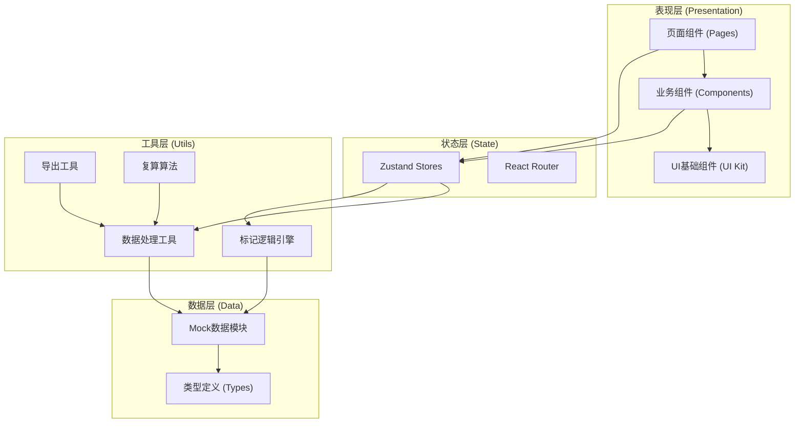
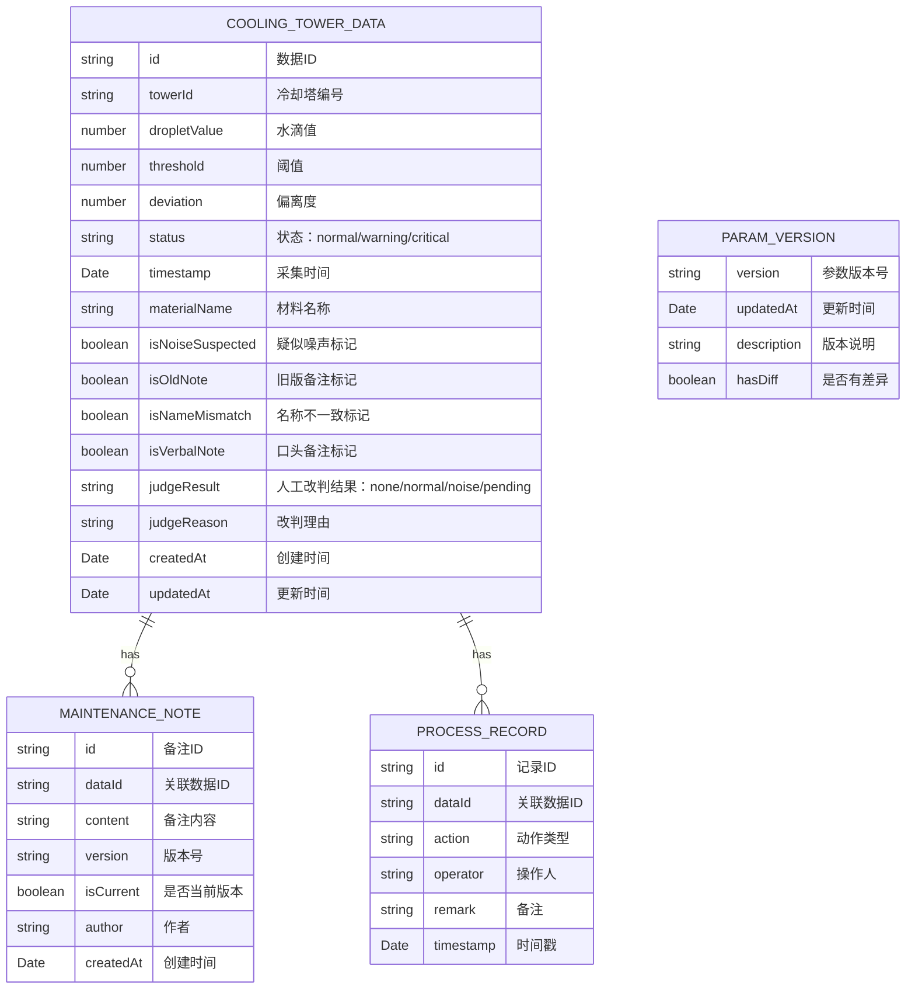

## 1. 架构设计

本系统为纯前端单页应用，采用React + TypeScript技术栈，数据层使用Mock数据模拟后端接口，状态管理通过Zustand实现。整体架构分为表现层、状态层、工具层和数据层，各层职责清晰，组件高度可复用。



## 2. 技术描述

- **前端框架**：React@18 + TypeScript
- **构建工具**：Vite@5
- **样式方案**：TailwindCSS@3 + CSS Variables
- **状态管理**：Zustand@4
- **路由方案**：react-router-dom@6
- **图表库**：Recharts@2（趋势图、对比图）
- **图标库**：lucide-react
- **后端**：无（纯前端Mock数据）
- **数据方案**：本地Mock数据模块，模拟接口请求与延迟

## 3. 路由定义

| 路由路径 | 页面名称 | 功能说明 |
|----------|----------|----------|
| / | 复核概览页 | 参数版本展示、整包运行、异常统计 |
| /list | 数据列表页 | 筛选、数据表格、批量操作 |
| /detail/:id | 详情复核页 | 数据明细、维修备注、处理记录、人工改判 |
| /recalc | 复算对比页 | 材料选择、图表对比、明细对比 |
| /export | 导出交付页 | 导出选项、截图说明生成预览 |

## 4. 数据模型

### 4.1 核心数据结构



### 4.2 标记类型定义

| 标记类型 | 枚举值 | 颜色 | 图标 | 说明 |
|----------|--------|------|------|------|
| 疑似噪声 | noise_suspected | 橙红色 | AlertTriangle | 极端值偏离正常范围 |
| 旧版备注 | old_note | 灰色 | Clock | 关联了历史版本维修备注 |
| 名称不一致 | name_mismatch | 琥珀色 | FileX | 材料名称与标准库不匹配 |
| 口头备注 | verbal_note | 紫色 | MessageSquare | 包含非正式口头记录 |
| 待补材料 | pending_material | 蓝色 | Package | 需要补充材料 |
| 人工改判 | manual_judged | 青色 | Edit3 | 已人工判定 |

### 4.3 Mock数据规划

- 冷却塔水滴数据：约50条，覆盖正常、预警、临界三种状态
- 维修备注：每条数据1-3条历史备注，其中部分为旧版
- 处理记录：每条数据0-5条处理历史
- 参数版本：当前版本 + 历史版本对比
- 混入异常：3条疑似噪声、2条旧版备注、2条名称不一致、3条口头备注

## 5. 核心模块设计

### 5.1 标记引擎模块

负责根据规则自动标记数据异常，输入原始数据，输出带标记的数据列表。标记规则可配置，支持扩展。

### 5.2 复算模块

对名称不一致材料进行口径转换和重新计算，对比复算前后的图表与明细数据，验证一致性。

### 5.3 导出模块

支持导出带标记的Excel/CSV明细，自动生成给算法值班人的截图说明（按已处理、待补材料、人工改判三类分组）。

### 5.4 参数版本管理

管理阈值参数版本，记录版本变更历史，在界面顶部展示当前版本及差异提示。

## 6. 目录结构

```
src/
├── components/           # 公共组件
│   ├── ui/              # 基础UI组件（Tag、Button、Card等）
│   ├── layout/          # 布局组件（Sidebar、Header）
│   ├── DataTable/       # 数据表格组件
│   ├── MarkTag/         # 标记标签组件
│   ├── StatusBadge/     # 状态徽章组件
│   └── Timeline/        # 时间线组件
├── pages/               # 页面组件
│   ├── Dashboard/       # 复核概览页
│   ├── DataList/        # 数据列表页
│   ├── DataDetail/      # 详情复核页
│   ├── RecalcCompare/   # 复算对比页
│   └── ExportDelivery/  # 导出交付页
├── stores/              # Zustand状态
│   ├── useDataStore.ts  # 数据状态
│   └── useUIStore.ts    # UI状态
├── utils/               # 工具函数
│   ├── markEngine.ts    # 标记引擎
│   ├── recalc.ts        # 复算算法
│   ├── export.ts        # 导出工具
│   └── format.ts        # 格式化工具
├── data/                # Mock数据
│   ├── towerData.ts     # 冷却塔数据
│   ├── notes.ts         # 维修备注
│   ├── records.ts       # 处理记录
│   └── params.ts        # 参数版本
├── types/               # 类型定义
│   └── index.ts
├── App.tsx
├── main.tsx
└── index.css
```
