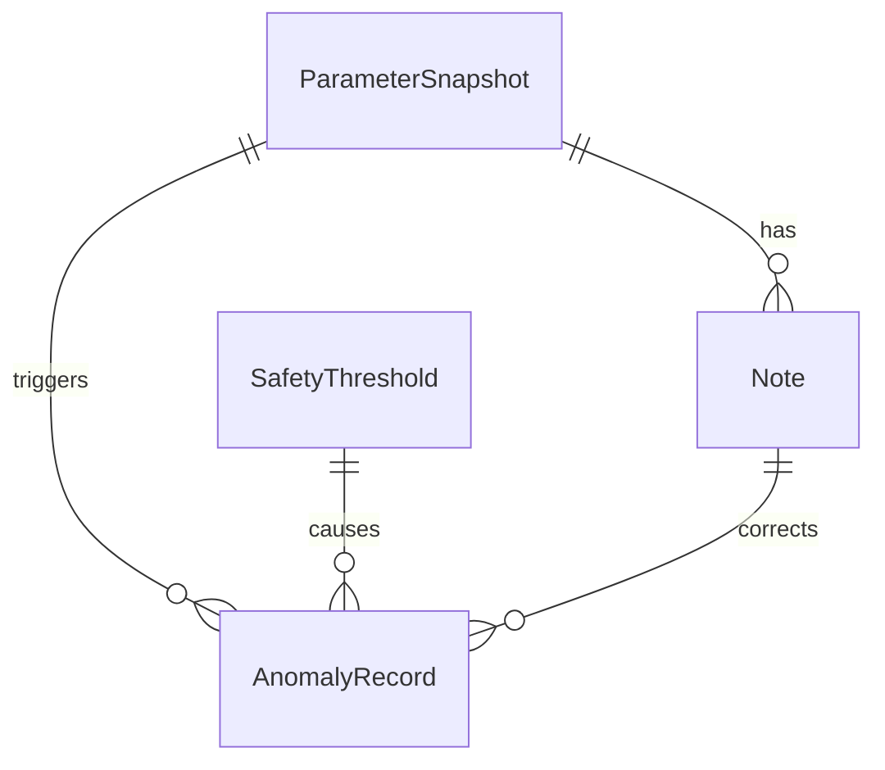

## 1. 架构设计

```mermaid
graph TD
    "前端 React" --> "Zustand 状态管理"
    "Zustand 状态管理" --> "参数回放页"
    "Zustand 状态管理" --> "异常队列页"
    "参数回放页" --> "时间轴组件"
    "参数回放页" --> "参数图表组件"
    "参数回放页" --> "历史备注面板"
    "参数回放页" --> "影响链路弹窗"
    "参数回放页" --> "中间计算面板"
    "异常队列页" --> "异常列表组件"
    "异常队列页" --> "一致性指示器"
    "Zustand 状态管理" --> "Mock 数据层"
```

纯前端架构，数据通过 Mock 数据层模拟传感器日志输入，状态由 Zustand 统一管理，保障重启后状态一致性。

## 2. 技术说明

- 前端：React@18 + TypeScript + Tailwind CSS@3 + Vite
- 状态管理：Zustand（持久化到 localStorage）
- 图表：Recharts
- 初始化工具：vite-init
- 后端：无
- 数据库：无（使用 Mock 数据 + localStorage 持久化）

## 3. 路由定义

| 路由 | 用途 |
|------|------|
| / | 参数回放主页，含时间轴、参数图表、历史备注面板、中间计算面板 |
| /anomalies | 异常队列页，含异常列表、一致性指示器 |

## 4. API 定义

无后端 API。所有数据通过前端 Mock 数据层提供。

### 4.1 核心数据类型

```typescript
interface ParameterSnapshot {
  id: string
  timestamp: number
  dropletDiameter: number
  dropletDiameterUnit: string
  flowRate: number
  flowRateUnit: string
  temperature: number
  temperatureUnit: string
  humidity: number
  humidityUnit: string
}

interface Note {
  id: string
  snapshotId: string
  content: string
  isRetrospective: boolean
  originalTimestamp: number
  addedTimestamp: number
  affectedParameters: string[]
  conclusionChange: string
  versionScreenshotUrl?: string
}

interface SafetyThreshold {
  id: string
  parameterName: string
  oldValue: number
  newValue: number
  unit: string
  changedAt: number
  changedBy: string
  reason: string
}

interface AnomalyRecord {
  id: string
  timestamp: number
  type: 'threshold_change' | 'parameter_exceeded' | 'note_correction'
  description: string
  relatedSnapshotId: string
  relatedNoteId?: string
  relatedThresholdId?: string
  processingResult: '阈值变更' | '参数超限' | '备注修正'
  calculationSteps: CalculationStep[]
}

interface CalculationStep {
  step: number
  description: string
  formula: string
  input: string
  output: string
  unitConversion?: string
}

interface ReplayState {
  snapshots: ParameterSnapshot[]
  notes: Note[]
  thresholds: SafetyThreshold[]
  anomalies: AnomalyRecord[]
  currentTimestamp: number
  lastRunId: string
  lastRunTimestamp: number
}
```

## 5. 服务端架构图

不适用（纯前端项目）

## 6. 数据模型

### 6.1 数据模型定义



### 6.2 数据定义语言

使用 localStorage 存储，初始化时写入 Mock 数据。数据结构如上方 TypeScript 类型定义所示。

Mock 数据包含：
- 12 个参数快照（模拟2小时传感器数据，每10分钟一个）
- 5 条备注（其中2条后补备注，含影响链路）
- 2 次安全阈值变更记录
- 4 条异常记录（覆盖三种类型）
- 完整的中间计算步骤和单位换算示例
