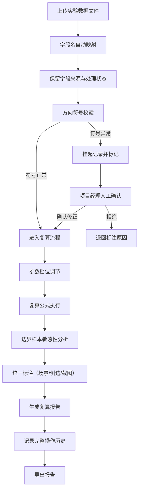

## 1. 产品概述

风洞烟线实验复算系统是为航空航天实验数据分析设计的专业工具，用于对风洞烟线实验数据进行复算、校验和报告生成。系统解决了当前实验复算过程中存在的标注不一致、字段名不统一、方向符号错误未校验、历史记录缺失、报告可追溯性差等核心问题。

- **核心目标**：确保实验复算结果的准确性、可追溯性和可解释性
- **目标用户**：维修师傅（如阿岑）、项目经理、实验工程师、数据分析人员
- **产品价值**：减少复盘时的临时解释成本，避免假稳定结论，完整保留判断历史，提升复算流程的专业度和可信度

## 2. 核心功能

### 2.1 用户角色

| 角色 | 使用场景 | 核心权限 |
|------|----------|----------|
| 维修师傅 | 执行实验复算、修正判断、查看历史 | 数据导入、复算操作、标注编辑、历史查看 |
| 项目经理 | 确认异常数据、审核结果、导出报告 | 异常确认、报告审核、字段映射配置 |
| 实验工程师 | 查看复算结果、理解边界样本影响 | 报告查看、公式追溯、数据导出 |
| 外部人员 | 试用系统、理解流程 | 浏览入口指引、查看异常出口说明 |

### 2.2 功能模块

1. **数据导入页**：Excel/CSV 文件上传、字段名自动映射、数据预览
2. **复算工作台**：参数调节、公式展示、边界样本分析、方向符号校验
3. **异常处理页**：挂起列表、方向符号确认、人工审核记录
4. **标注管理**：统一标注系统（场景/侧边/截图说明三统一）
5. **历史记录页**：操作轨迹、版本对比、判断修改追溯
6. **报告导出页**：多格式导出、公式单位展示、边界样本影响分析

### 2.3 页面详情

| 页面名称 | 模块名称 | 功能描述 |
|-----------|-------------|---------------------|
| 数据导入页 | 文件上传区 | 拖拽上传 Excel/CSV，支持格式校验和进度显示 |
| 数据导入页 | 字段映射配置 | 自动识别近似字段名，支持手动映射，保留原始字段来源 |
| 数据导入页 | 数据预览表格 | 展示导入数据，标记疑似方向符号异常的记录 |
| 复算工作台 | 参数调节面板 | 支持参数档位调节，实时预览复算结果变化 |
| 复算工作台 | 公式展示区 | 显示当前使用的计算公式、单位说明、边界样本定义 |
| 复算工作台 | 结果对比区 | 展示参数调整前后的结果差异，标注变化原因 |
| 复算工作台 | 统一标注面板 | 场景/侧边/截图说明联动编辑，一处修改三处同步 |
| 异常处理页 | 挂起列表 | 展示所有因方向符号异常而挂起的记录 |
| 异常处理页 | 确认对话框 | 项目经理确认或修正方向符号，记录确认意见 |
| 历史记录页 | 时间轴视图 | 按时间顺序展示所有操作，高亮显示阿岑等人员的修改 |
| 历史记录页 | 版本对比 | 对比不同版本的复算结果和标注差异 |
| 报告导出页 | 报告预览 | 完整预览报告内容，包含公式、单位、边界样本说明 |
| 报告导出页 | 导出选项 | 支持 PDF/Excel 格式导出，可选择是否包含历史记录 |
| 引导界面 | 材料入口指引 | 未参与开发人员也能理解的数据导入流程说明 |
| 引导界面 | 异常出口说明 | 清晰的异常处理流程和挂起规则说明 |

## 3. 核心流程

### 3.1 复算主流程

用户上传维修备注数据 → 系统自动映射字段（保留来源和处理状态） → 方向符号校验 → 如异常则挂起待项目经理确认 → 确认后或无异常则进行复算 → 参数调节并对比结果 → 统一标注三处说明 → 生成含公式/单位/边界样本分析的报告 → 导出并记录完整历史

### 3.2 Mermaid 流程图

### 3.3 异常挂起流程

检测到方向符号写反 → 自动挂起该条记录 → 推送至项目经理待办列表 → 项目经理核对原始数据 → 确认符号正误 → 修正或放行 → 记录确认意见和时间戳 → 继续复算流程

## 4. 用户界面设计

### 4.1 设计风格

- **主色调**：深空蓝 (#0F3460)，代表航空航天的专业感和科技感
- **辅助色**：警示橙 (#E94560) 用于异常挂起提示，成功绿 (#16C79A) 用于正常状态，中性灰 (#533483) 用于文本和边框
- **按钮风格**：扁平化设计，圆角 6px，悬停时有轻微上浮效果和阴影，禁用状态降低透明度
- **字体选择**：标题使用 'JetBrains Mono' 等宽字体体现数据专业性，正文使用 'Inter' 确保可读性
- **布局风格**：三栏式工作台布局（左侧导航+中间工作区+右侧信息面板），卡片化模块，清晰的视觉层次
- **图标风格**：使用 lucide-react 线性图标，统一 18px 尺寸，与文字保持 4px 间距

### 4.2 页面设计概览

| 页面名称 | 模块名称 | UI 元素设计 |
|-----------|-------------|-------------|
| 数据导入页 | 文件上传区 | 虚线边框拖拽区域，悬停时边框变为蓝色并显示提示文字，文件拖入后显示进度条和文件名 |
| 数据导入页 | 字段映射配置 | 左右两列对比布局，左侧原始字段，右侧目标字段，用带箭头的连线表示映射关系，可拖拽调整 |
| 复算工作台 | 参数调节面板 | 滑动条+档位按钮组合，滑动时实时显示数值，档位按钮点击可快速跳转到预设值 |
| 复算工作台 | 公式展示区 | 代码块样式展示公式，变量用不同颜色标注，悬停显示变量定义和单位 |
| 复算工作台 | 统一标注面板 | 三个输入框联动，一个输入时另外两个同步预览，点击"同步到全部"按钮一键同步 |
| 异常处理页 | 挂起列表 | 橙色高亮表头，每行显示风险等级，点击展开详情，右侧显示确认/拒绝操作按钮 |
| 历史记录页 | 时间轴视图 | 左侧垂直时间线，每个节点用不同颜色图标表示操作类型，阿岑的修改用特殊徽章标记 |
| 报告导出页 | 报告预览 | 模拟打印纸效果，分页显示，可缩放，公式和边界样本有特殊背景色标注 |
| 引导界面 | 入口指引 | 大号数字步骤引导，每个步骤配有简明图示和说明文字 |

### 4.3 响应式设计

采用桌面端优先设计，针对实验室大屏幕显示器优化，同时适配笔记本电脑屏幕：
- 桌面端（≥1440px）：三栏布局完整显示
- 笔记本端（1024px-1439px）：右侧面板可收起，两栏布局为主
- 平板端（768px-1023px）：单栏滚动布局，侧边导航转为顶部抽屉菜单
- 移动端（<768px）：简化布局，保留核心数据查看和异常确认功能

### 4.4 交互体验

- 页面加载：骨架屏占位，模块按顺序渐入动画
- 数据处理：进度条+状态文字，避免界面假死
- 异常提示：顶部横幅通知+颜色编码，重要异常需要用户明确点击确认
- 表单输入：即时校验，错误提示紧邻输入框，成功时显示绿色对勾
- 历史追溯：悬浮预览卡片，点击展开完整对比
