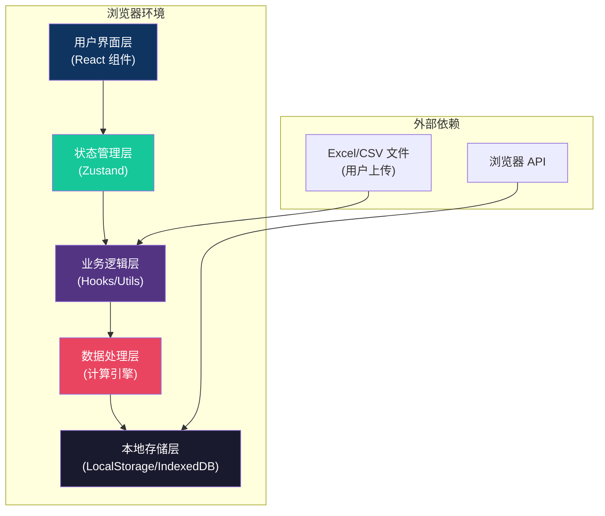
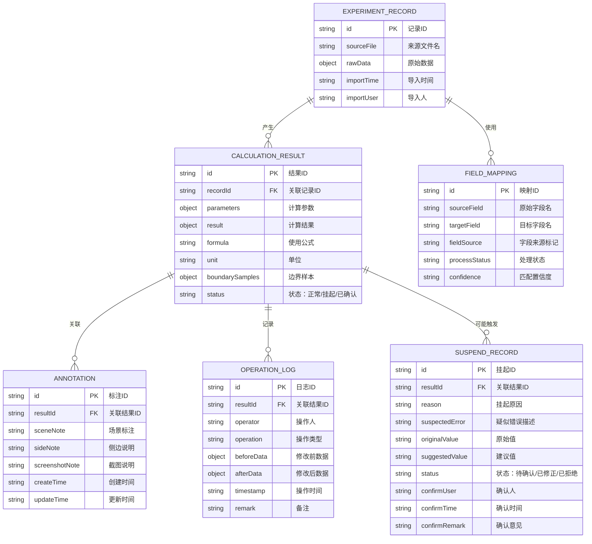

## 1. 架构设计

本系统为纯前端单页应用，所有数据处理在浏览器本地完成，无需后端服务，确保实验数据的安全性和隐私性。



## 2. 技术描述

### 2.1 核心技术栈

- **前端框架**：React@18.2.0 + TypeScript@5.0+
- **构建工具**：Vite@5.0+
- **样式方案**：TailwindCSS@3.4+
- **状态管理**：Zustand@4.5+
- **路由管理**：React Router Dom@6.20+
- **图标库**：Lucide React@0.300+

### 2.2 关键依赖库

- **文件解析**：xlsx@0.18.5（Excel 解析）、papaparse@5.4.1（CSV 解析）
- **数据导出**：jspdf@2.5.1（PDF 导出）、html2canvas@1.4.1（截图生成）
- **日期处理**：date-fns@3.0+
- **类型校验**：zod@3.22+（运行时数据校验）
- **动画库**：framer-motion@10.16+（交互动画）

### 2.3 项目初始化

- **初始化工具**：使用 `vite-init` 创建 react-ts 模板项目
- **包管理器**：优先使用 pnpm，如不可用则使用 npm
- **运行环境**：Node.js >= 18.0.0

## 3. 路由定义

| 路由路径 | 页面名称 | 功能说明 |
|-------|---------|---------|
| `/` | 首页/工作台 | 系统入口，展示最近复算记录和快捷操作 |
| `/import` | 数据导入 | Excel/CSV 文件上传、字段映射配置、数据预览 |
| `/calculator` | 复算工作台 | 参数调节、公式执行、结果对比、统一标注 |
| `/exceptions` | 异常处理 | 挂起记录列表、方向符号确认、人工审核 |
| `/history` | 历史记录 | 操作时间轴、版本对比、修改追溯 |
| `/report` | 报告导出 | 报告预览、多格式导出、打印设置 |
| `/guide` | 使用引导 | 材料入口说明、异常出口说明、功能介绍 |

## 4. 数据模型

### 4.1 ER 图



### 4.2 核心类型定义

```typescript
// 实验原始记录
interface ExperimentRecord {
  id: string;
  sourceFileName: string;
  rawData: Record<string, any>;
  importTimestamp: number;
  importedBy: string;
  fieldMappings: FieldMapping[];
  directionSignCheck: DirectionCheckResult;
}

// 字段映射
interface FieldMapping {
  id: string;
  sourceFieldName: string;
  targetFieldName: string;
  fieldSource: 'auto-detected' | 'manual-mapped' | 'inherited';
  processStatus: 'pending' | 'processed' | 'locked';
  matchConfidence: number;
}

// 方向符号校验结果
interface DirectionCheckResult {
  hasAnomaly: boolean;
  anomalousFields: string[];
  detectedValues: Record<string, number>;
  expectedDirection: 'positive' | 'negative';
}

// 复算结果
interface CalculationResult {
  id: string;
  recordId: string;
  version: number;
  parameters: CalculationParameters;
  result: CalculationOutput;
  formula: FormulaInfo;
  boundaryAnalysis: BoundarySampleAnalysis;
  status: 'normal' | 'suspended' | 'confirmed' | 'rejected';
  annotations: Annotation;
  createdAt: number;
  createdBy: string;
}

// 计算参数
interface CalculationParameters {
  airDensity: number;
  windSpeed: number;
  angleOfAttack: number;
  smokeLineDiameter: number;
  turbulenceIntensity: number;
  parameterLevel: 'level1' | 'level2' | 'level3' | 'custom';
}

// 公式信息
interface FormulaInfo {
  expression: string;
  variables: Record<string, { value: number; unit: string; description: string }>;
  unit: string;
  description: string;
}

// 边界样本分析
interface BoundarySampleAnalysis {
  samples: BoundarySample[];
  sensitivityReport: string;
  impactFactors: { factor: string; impact: 'high' | 'medium' | 'low'; change: string }[];
}

// 统一标注（三处同步）
interface Annotation {
  sceneNote: string;
  sideNote: string;
  screenshotNote: string;
  lastSyncedAt: number;
}

// 操作日志
interface OperationLog {
  id: string;
  resultId: string;
  operator: string;
  operationType: 'import' | 'calculate' | 'annotate' | 'suspend' | 'confirm' | 'reject' | 'export';
  beforeSnapshot: any;
  afterSnapshot: any;
  timestamp: number;
  remark: string;
}

// 挂起记录
interface SuspendRecord {
  id: string;
  resultId: string;
  reason: 'direction_sign_reversed' | 'boundary_anomaly' | 'manual_suspend';
  description: string;
  originalValue: any;
  suggestedValue?: any;
  status: 'pending' | 'corrected' | 'approved' | 'rejected';
  confirmUser?: string;
  confirmTime?: number;
  confirmRemark?: string;
}
```

## 5. 目录结构

```
src/
├── components/          # 可复用组件
│   ├── common/         # 通用组件（Button、Modal、Table等）
│   ├── import/         # 数据导入相关组件
│   ├── calculator/     # 复算工作台相关组件
│   ├── exception/      # 异常处理相关组件
│   ├── history/        # 历史记录相关组件
│   ├── report/         # 报告导出相关组件
│   └── annotation/     # 标注系统相关组件
├── hooks/              # 自定义 Hooks
│   ├── useCalculation.ts    # 复算逻辑
│   ├── useFieldMapping.ts   # 字段映射
│   ├── useAnnotationSync.ts # 标注同步
│   ├── useHistory.ts        # 历史记录
│   └── useSuspend.ts        # 异常挂起
├── pages/              # 页面组件
│   ├── Home.tsx
│   ├── DataImport.tsx
│   ├── Calculator.tsx
│   ├── Exceptions.tsx
│   ├── History.tsx
│   ├── ReportExport.tsx
│   └── Guide.tsx
├── store/              # Zustand 状态管理
│   ├── useExperimentStore.ts
│   ├── useCalculationStore.ts
│   └── useHistoryStore.ts
├── utils/              # 工具函数
│   ├── fileParser.ts       # 文件解析
│   ├── calculationEngine.ts # 计算引擎
│   ├── directionCheck.ts   # 方向校验
│   ├── formulaRenderer.ts  # 公式渲染
│   ├── exportGenerator.ts  # 导出生成
│   └── storage.ts          # 本地存储
├── types/              # 类型定义
│   ├── experiment.ts
│   ├── calculation.ts
│   ├── annotation.ts
│   └── history.ts
├── constants/          # 常量定义
│   ├── formulas.ts         # 计算公式常量
│   ├── parameters.ts       # 参数档位定义
│   └── fieldMapping.ts     # 字段映射规则
├── App.tsx
├── main.tsx
└── index.css
```

## 6. 核心技术方案

### 6.1 字段映射策略

- 使用字符串相似度算法（Levenshtein 距离）自动匹配字段名
- 维护常见字段名映射表（如"维修备注"/"维护记录"/"修备记录"映射到同一目标字段）
- 每条映射记录保留 `fieldSource` 和 `processStatus`，确保可追溯
- 映射关系可导出/导入，实现项目经理配置的复用

### 6.2 方向符号校验机制

- 预设各物理量的预期方向（如升力系数应为正、阻力系数方向等）
- 复算前自动校验数值符号，与预期方向相反则触发挂起
- 挂起记录锁定复算流程，必须经项目经理确认后才能继续
- 所有确认操作完整记录在 `OPERATION_LOG` 中

### 6.3 统一标注系统

- 三个标注字段（场景/侧边/截图）共享同一数据源
- 使用 `useAnnotationSync` Hook 实现一处修改三处同步
- 提供"仅修改此处"和"同步到全部"两种模式
- 支持标注版本历史，可回溯之前的标注内容

### 6.4 历史记录与审计

- 所有数据变更操作均通过 Immer 产生 immutable 快照
- 使用 `OPERATION_LOG` 表记录完整操作轨迹
- 维修师傅阿岑的修改通过操作人字段识别并高亮显示
- 支持任意两个版本之间的字段级差异对比

### 6.5 本地数据持久化

- 实验数据和复算结果存储在 IndexedDB 中
- 配置和用户偏好存储在 LocalStorage 中
- 支持数据的导入/导出备份功能
- 所有数据不上传服务器，确保数据安全

## 7. 质量保障

### 7.1 测试策略

- 单元测试：计算引擎、方向校验、字段映射等核心逻辑
- 组件测试：关键交互组件的渲染和行为测试
- 集成测试：完整复算流程的端到端测试
- 使用 Vitest 作为测试框架

### 7.2 代码质量

- TypeScript 严格模式，启用所有类型检查
- ESLint 代码规范检查
- Prettier 代码格式化
- 组件文件控制在 300 行以内，单一职责原则

### 7.3 性能优化

- 大数据量表格使用虚拟滚动
- 复杂计算使用 Web Worker 避免阻塞 UI
- 计算结果缓存，相同参数直接复用
- 图片和资源按需加载
