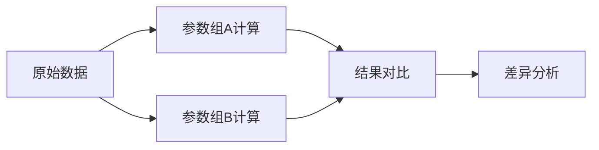

## 1. 产品概述
电池内阻阈值预警分析系统，用于解决传感器日志中报警结论与人工备注不一致的问题，帮助实验老师小林和算法值班人清晰追溯每一条预警记录的处理过程。

- 主要目的：梳理传感器日志数据，明确人工改判对预警结论的影响，确保数据处理过程透明可追溯
- 目标用户：实验老师（小林）、算法值班人员
- 核心价值：提供从原始日志到最终结论的完整链路展示，支持两组参数对照分析，生成可交接的Markdown报告

## 2. 核心功能

### 2.1 用户角色
| 角色 | 注册方式 | 核心权限 |
|------|----------|----------|
| 实验老师 | 无需注册（本地工具） | 上传日志、查看分析、生成报告、模拟交接 |
| 算法值班人 | 无需注册（本地工具） | 调整阈值参数、对照分析、查看计算过程 |

### 2.2 功能模块
1. **数据导入与解析**：支持多格式传感器日志上传，自动识别字段名差异
2. **阈值预警分析**：电池内阻阈值计算与预警判定，完整展示中间过程
3. **数据质量检查**：检测重复设备编号、坏数据、异常值
4. **人工改判分析**：对比自动判定与人工备注，量化改判影响
5. **参数对照**：支持两组阈值参数并行计算与结果对比
6. **报告生成**：自动生成包含原始数据、处理过程、结论的Markdown报告
7. **交接模拟**：提供从报告回溯原始日志的验证功能

### 2.3 页面详情
| 页面名称 | 模块名称 | 功能描述 |
|---------|----------|----------|
| 主分析页 | 数据上传区 | 拖拽或选择传感器日志文件，支持CSV/JSON格式 |
| 主分析页 | 原始数据展示 | 表格展示原始日志，高亮字段名映射关系，标注原始行号 |
| 主分析页 | 阈值计算区 | 分步展示内阻计算过程、单位换算、阈值比较 |
| 主分析页 | 数据质量区 | 列出重复设备编号、坏数据条目，标注风险等级 |
| 主分析页 | 改判分析区 | 逐条对比自动判定与人工备注，展示改判原因和影响 |
| 主分析页 | 参数对照区 | 两组参数并行计算结果对比表格 |
| 报告预览页 | 报告展示 | 完整Markdown报告预览，支持复制和下载 |
| 交接模拟页 | 回溯验证 | 从报告条目反向定位原始日志记录 |

## 3. 核心流程

### 3.1 主工作流程

### 3.2 参数对照流程

## 4. 用户界面设计

### 4.1 设计风格
- **主色调**：深蓝(#1e3a5f)作为主色，配合浅灰背景，营造专业、稳重的数据分析氛围
- **强调色**：红色(#dc2626)标注预警，橙色(#f59e0b)标注警告，绿色(#16a34a)标注正常
- **字体**：使用等宽字体展示数据和代码，确保数值对齐易读
- **按钮风格**：直角矩形，简洁边框，hover时轻微背景变化
- **布局**：卡片式分块布局，朴素实用，避免多余装饰
- **图标**：使用Lucide简约线性图标

### 4.2 页面设计概述
| 页面名称 | 模块名称 | UI元素 |
|---------|----------|--------|
| 主分析页 | 数据上传区 | 虚线边框上传区域，文件选择按钮，格式说明 |
| 主分析页 | 原始数据表格 | 固定表头，可横向滚动，行号列，字段映射标注 |
| 主分析页 | 计算过程区 | 分步公式展示，单位换算标注，中间结果高亮 |
| 主分析页 | 改判分析区 | 两列对比布局（自动判定 vs 人工备注），影响量化说明 |
| 主分析页 | 参数对照区 | 并排表格，差异单元格高亮 |
| 报告预览页 | 报告内容 | Markdown渲染，复制/下载按钮，目录导航 |
| 交接模拟页 | 回溯界面 | 报告条目选择，原始数据定位跳转 |

### 4.3 响应性
- 桌面端优先设计（1280px以上），主要用户在实验室电脑使用
- 支持中等屏幕（1024-1280px）自适应，表格允许横向滚动
- 核心数据展示区域使用固定高度+内部滚动，保持页面布局稳定

## 5. 数据展示规范

### 5.1 数据追溯要求
- 每条处理结果必须关联原始日志的行号或具体对象标识
- 字段名映射关系必须明确展示（如："设备编号" → "device_id" / "设备ID"）
- 人工改判记录必须保留原始备注内容和修改人信息

### 5.2 特殊数据标注
- 重复设备编号记录：橙色背景 + ⚠️ 图标，标注"重复记录"
- 坏数据（缺失值、异常值）：灰色背景 + ❌ 图标，标注"数据异常，不计入统计"
- 人工改判记录：蓝色边框 + ✏️ 图标，展示改判前后对比

### 5.3 计算过程展示
- 分步展示计算公式，每一步都有中间结果
- 单位换算明确标注（如：mΩ → Ω，×10⁻³）
- 阈值比较使用不等式形式展示（如：测量值 2.5Ω > 阈值 2.0Ω → 预警）
