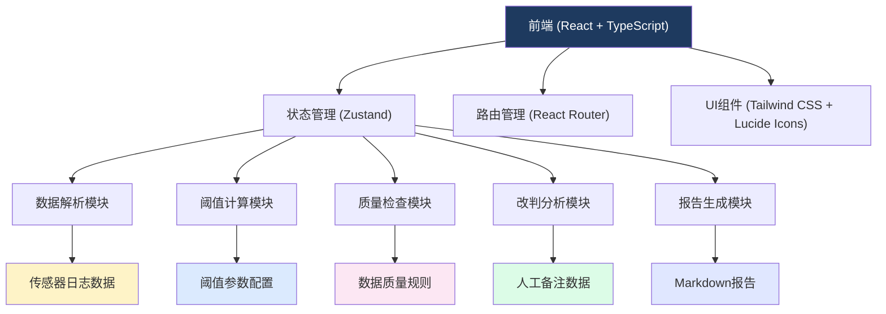

## 1. 架构设计



## 2. 技术描述

- **前端**：React@18 + TypeScript + Vite
- **状态管理**：Zustand
- **路由**：react-router-dom@6
- **样式**：Tailwind CSS@3
- **图标**：lucide-react
- **Markdown渲染**：react-markdown
- **数据解析**：papaparse（CSV解析）+ 自定义字段映射
- **后端**：无（纯前端应用，所有计算在浏览器端完成）
- **数据存储**：浏览器内存 + LocalStorage（用于保存参数配置）
- **初始化工具**：vite-init

## 3. 目录结构

```
src/
├── components/          # 可复用组件
│   ├── DataUpload.tsx       # 数据上传组件
│   ├── RawDataTable.tsx     # 原始数据表格
│   ├── CalculationSteps.tsx # 计算过程展示
│   ├── QualityReport.tsx    # 数据质量报告
│   ├── ManualOverride.tsx   # 人工改判分析
│   ├── ParamCompare.tsx     # 参数对照
│   ├── MarkdownReport.tsx   # 报告预览
│   └── HandoverSim.tsx      # 交接模拟
├── pages/               # 页面组件
│   ├── AnalysisPage.tsx     # 主分析页
│   ├── ReportPage.tsx       # 报告预览页
│   └── HandoverPage.tsx     # 交接模拟页
├── store/               # 状态管理
│   └── useAnalysisStore.ts  # 分析数据状态
├── utils/               # 工具函数
│   ├── dataParser.ts        # 数据解析与字段映射
│   ├── thresholdCalc.ts     # 阈值计算算法
│   ├── qualityCheck.ts      # 数据质量检查
│   ├── overrideAnalysis.ts  # 改判影响分析
│   └── reportGenerator.ts   # Markdown报告生成
├── types/               # TypeScript类型定义
│   └── index.ts
├── data/                # 测试数据
│   └── sampleLogs.ts        # 样例传感器日志
├── App.tsx
├── main.tsx
└── index.css
```

## 4. 路由定义

| 路由 | 页面 | 目的 |
|------|------|------|
| `/` | AnalysisPage | 主分析页，包含数据上传、原始数据展示、计算过程、质量检查、改判分析、参数对照 |
| `/report` | ReportPage | Markdown报告预览页，支持复制和下载 |
| `/handover` | HandoverPage | 交接模拟页，从报告回溯原始数据 |

## 5. 数据模型

### 5.1 核心数据结构

```mermaid
erDiagram
    SENSOR_LOG {
        string rawLineNumber "原始行号"
        string deviceId "设备编号"
        string deviceIdAlias "字段映射来源"
        number resistance "内阻测量值"
        string resistanceUnit "原始单位"
        number temperature "温度"
        string timestamp "采集时间"
        string manualRemark "人工备注"
        string manualOperator "改判人"
        string sourceField "来源字段名"
        object rawData "原始数据对象"
    }
    
    CALCULATION_STEP {
        string stepId "步骤ID"
        string description "步骤描述"
        string formula "计算公式"
        number inputValue "输入值"
        string inputUnit "输入单位"
        number outputValue "输出值"
        string outputUnit "输出单位"
        string conversion "单位换算说明"
    }
    
    THRESHOLD_RESULT {
        string logId "关联日志ID"
        number thresholdValue "阈值"
        string thresholdUnit "阈值单位"
        number measuredValue "测量值(换算后)"
        boolean isWarning "是否预警"
        CALCULATION_STEP[] calculationSteps "计算过程"
    }
    
    QUALITY_ISSUE {
        string issueId "问题ID"
        string logId "关联日志ID"
        string issueType "问题类型：duplicate/bad_data/missing"
        string description "问题描述"
        string severity "严重程度：warning/error"
        string rawReference "原始数据引用"
    }
    
    OVERRIDE_ANALYSIS {
        string logId "关联日志ID"
        string autoJudgement "自动判定"
        string manualJudgement "人工判定"
        string manualRemark "人工备注"
        string operator "改判人"
        string impactDescription "影响说明"
        number impactScore "影响量化值"
        boolean isConsistent "是否一致"
    }
    
    PARAM_COMPARE {
        string paramSetName "参数组名称"
        number warningThreshold "预警阈值"
        string thresholdUnit "阈值单位"
        number temperatureCoefficient "温度系数"
        THRESHOLD_RESULT[] results "计算结果"
    }
    
    ANALYSIS_REPORT {
        string reportId "报告ID"
        string generatedAt "生成时间"
        string dataSource "数据来源"
        number totalRecords "总记录数"
        number warningCount "预警数"
        number overrideCount "改判数"
        number qualityIssueCount "质量问题数"
        string markdownContent "Markdown内容"
    }
```



### 5.2 TypeScript 类型定义

```typescript
// 传感器日志记录
interface SensorLog {
  rawLineNumber: number;
  deviceId: string;
  deviceIdField: string;
  resistance: number | null;
  resistanceField: string;
  resistanceUnit: string;
  temperature: number | null;
  temperatureField: string;
  timestamp: string;
  timestampField: string;
  manualRemark: string | null;
  manualRemarkField: string;
  manualOperator: string | null;
  manualOperatorField: string;
  rawData: Record<string, any>;
}

// 字段映射配置
interface FieldMapping {
  deviceId: string[];
  resistance: string[];
  temperature: string[];
  timestamp: string[];
  manualRemark: string[];
  manualOperator: string[];
}

// 阈值参数
interface ThresholdParams {
  warningThreshold: number;
  thresholdUnit: 'mΩ' | 'Ω' | 'kΩ';
  temperatureCompensation: boolean;
  baseTemperature: number;
  temperatureCoefficient: number;
}

// 计算步骤
interface CalculationStep {
  stepId: string;
  description: string;
  formula: string;
  inputValue: number;
  inputUnit: string;
  outputValue: number;
  outputUnit: string;
  conversion?: string;
}

// 阈值计算结果
interface ThresholdResult {
  logId: string;
  rawLineNumber: number;
  thresholdValue: number;
  thresholdUnit: string;
  measuredValue: number;
  measuredUnit: string;
  isWarning: boolean;
  calculationSteps: CalculationStep[];
}

// 数据质量问题
interface QualityIssue {
  issueId: string;
  logId: string;
  rawLineNumber: number;
  issueType: 'duplicate' | 'bad_data' | 'missing_field' | 'out_of_range';
  description: string;
  severity: 'warning' | 'error';
  rawReference: string;
}

// 改判分析
interface OverrideAnalysis {
  logId: string;
  rawLineNumber: number;
  autoJudgement: 'normal' | 'warning';
  manualJudgement: 'normal' | 'warning' | null;
  manualRemark: string | null;
  operator: string | null;
  impactDescription: string;
  impactScore: number;
  isConsistent: boolean;
}

// 分析状态
interface AnalysisState {
  rawLogs: SensorLog[];
  fieldMapping: FieldMapping;
  thresholdParamsA: ThresholdParams;
  thresholdParamsB: ThresholdParams;
  resultsA: ThresholdResult[];
  resultsB: ThresholdResult[];
  qualityIssues: QualityIssue[];
  overrideAnalysis: OverrideAnalysis[];
  currentReport: AnalysisReport | null;
  selectedLogId: string | null;
}
```

## 6. 核心算法设计

### 6.1 字段名映射算法
- 输入：CSV/JSON表头字段名数组
- 输出：标准化字段映射关系
- 规则：
  1. 预定义同义词库（如：设备编号/设备ID/device_id/DeviceID）
  2. 大小写不敏感匹配
  3. 模糊匹配（Levenshtein距离）
  4. 记录原始字段名，保留溯源能力

### 6.2 电池内阻阈值计算
```
步骤1：温度补偿（如启用）
补偿后内阻 = 测量内阻 × [1 + 温度系数 × (测量温度 - 基准温度)]

步骤2：单位换算
统一换算为阈值单位（如mΩ → Ω: ×10⁻³）

步骤3：阈值比较
如果 补偿后内阻 > 预警阈值 → 预警
否则 → 正常
```

### 6.3 数据质量检查
- 重复设备编号检测：同设备+同时间戳判定为重复
- 坏数据检测：
  - 内阻为负、空值、超出合理范围（0 - 10000Ω）
  - 温度超出合理范围（-40°C - 100°C）
  - 时间戳格式无效
- 缺失字段检测：关键字段为空

### 6.4 改判影响分析
- 对比自动判定与人工备注的一致性
- 计算改判率：改判记录数 / 总记录数
- 量化影响：
  - 正常改预警：+1分（漏检风险）
  - 预警改正常：+1分（误报风险）
  - 不一致但无明确判定：+0.5分

### 6.5 Markdown报告生成
- 按标准模板生成，包含：
  1. 报告头（时间、数据来源）
  2. 数据概览（统计数据）
  3. 字段映射说明
  4. 数据质量问题列表
  5. 详细分析（逐条记录）
  6. 改判影响分析
  7. 参数对照结果
  8. 结论与建议

## 7. 样例数据设计

为了验证功能，将包含以下典型场景的样例数据：
1. 正常记录（内阻正常，无人工备注）
2. 预警记录（内阻超标，无人工备注）
3. 人工改判记录（自动预警→人工判定正常）
4. 反向改判记录（自动正常→人工判定预警）
5. 重复设备编号记录
6. 坏数据记录（内阻为负、缺失值、异常值）
7. 字段名不一致的记录（使用不同的字段名）
