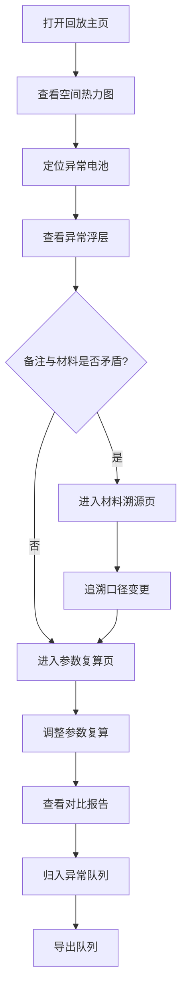

## 1. 产品概述

电池内阻参数回放系统——面向实验室现场老师的电池内阻数据回放与异常审查工具。解决核心问题：当维修备注、材料名称不一致和临时口头说明混杂时，能清晰追溯哪份材料改过口径、哪些数据因单位混写而数量级异常，最终交付让老师可自主跑通的异常队列。

- 目标用户：实验室现场老师、实验管理员小林
- 核心价值：材料溯源透明、异常可审计、参数可复算、现场可自操作

## 2. 核心功能

### 2.1 用户角色

| 角色 | 进入方式 | 核心权限 |
|------|----------|----------|
| 现场老师 | 打开页面即用 | 查看回放、调整参数、导出异常队列 |
| 实验管理员 | 打开页面即用 | 上述权限 + 标记人工改判、补录材料 |

### 2.2 功能模块

1. **回放主页**：电池空间位置热力图 + 内阻参数回放 + 异常高亮
2. **材料溯源页**：维修备注、材料口径变更时间线、来源标注
3. **参数复算页**：调参面板、公式/单位/边界样本对比报告
4. **异常队列页**：已处理 / 待补材料 / 人工改判 分列队列

### 2.3 页面详情

| 页面名称 | 模块名称 | 功能描述 |
|----------|----------|----------|
| 回放主页 | 空间热力图 | 电池阵列位置可视化，内阻值按色阶映射，异常单元高亮闪烁边框 |
| 回放主页 | 参数回放条 | 时间轴滑块，拖动回放不同采样时刻的内阻值变化 |
| 回放主页 | 异常标注浮层 | 鼠标悬停异常电池，浮层展示当前值、安全阈值、超标幅度、备注来源 |
| 材料溯源页 | 口径变更时间线 | 纵向时间轴列出每份材料的口径变更记录，标注改前/改后值及改口人 |
| 材料溯源页 | 材料对照表 | 左右对照：材料A原文 vs 材料B原文，不一致字段红底高亮 |
| 材料溯源页 | 维修备注卡 | 每条备注卡标注来源（书面/口头/临时）、关联电池位置、是否与材料矛盾 |
| 参数复算页 | 调参面板 | 安全阈值、单位换算系数、边界样本范围可调，一键复算 |
| 参数复算页 | 对比报告 | 左右并列展示调参前/调参后结果，差异行标注变化原因（公式/单位/边界） |
| 参数复算页 | 边界样本明细 | 列出恰好落在阈值附近的样本，标注因参数变化而跨入/跨出异常区间的样本 |
| 异常队列页 | 分列队列 | 三列：已处理、待补材料、人工改判，每列卡片可拖拽换列 |
| 异常队列页 | 卡片详情 | 展开卡片显示电池位置、当前内阻、异常原因、关联备注、处理人/改判人 |

## 3. 核心流程

用户打开系统 → 查看空间热力图定位异常电池 → 点击异常电池查看备注来源 → 发现材料口径冲突 → 进入材料溯源页追溯变更 → 调整参数复算验证 → 确认后归入异常队列对应列 → 导出队列交付复盘

## 4. 用户界面设计

### 4.1 设计风格

- 主色调：深灰底(#1a1a2e) + 琥珀色高亮(#f59e0b) + 红色异常(#ef4444) + 绿色正常(#22c55e)
- 按钮风格：圆角微阴影，hover 时上浮 + 亮边
- 字体：JetBrains Mono（数据）+ Noto Sans SC（中文界面）
- 布局：顶栏导航 + 左侧面板 + 右侧主内容区
- 图标风格：lucide-react 线性图标

### 4.2 页面设计概览

| 页面名称 | 模块名称 | UI元素 |
|----------|----------|--------|
| 回放主页 | 空间热力图 | Canvas 网格，色阶渐变，异常格闪烁红边框，tooltip浮层 |
| 回放主页 | 参数回放条 | 底部时间轴滑块 + 播放/暂停按钮 |
| 材料溯源页 | 口径变更时间线 | 左侧竖线 + 右侧卡片，变更节点圆形标记，改前灰/改后琥珀 |
| 材料溯源页 | 材料对照表 | 双栏表格，不一致行红底白字 |
| 参数复算页 | 调参面板 | 左侧表单：数字输入 + 单位下拉 + 范围滑块 |
| 参数复算页 | 对比报告 | 左右双栏 diff 视图，增减箭头 + 变化原因标签 |
| 异常队列页 | 分列队列 | 三列看板，卡片圆角阴影，拖拽把手，列头计数徽章 |

### 4.3 响应式

桌面优先，最小宽度 1280px。在现场大屏和笔记本均可正常使用。

### 4.4 3D场景指导

不适用
