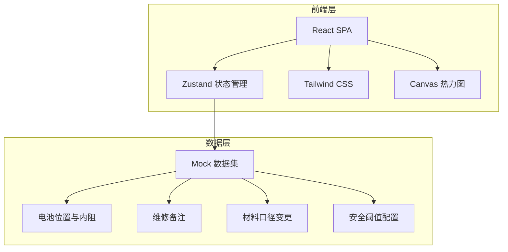
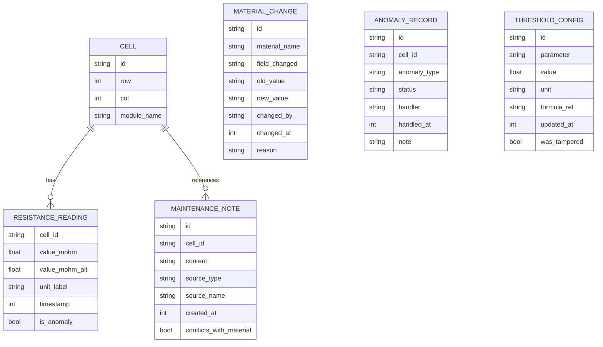

## 1. 架构设计



纯前端应用，数据通过 Mock 数据集内嵌，无需后端服务。所有计算在浏览器端完成，确保现场老师打开即可使用。

## 2. 技术说明

- 前端：React@18 + TypeScript + Tailwind CSS@3 + Vite
- 状态管理：Zustand
- 初始化工具：vite-init (react-ts 模板)
- 后端：无
- 数据库：无，使用 Mock 数据

## 3. 路由定义

| 路由 | 用途 |
|------|------|
| / | 回放主页：空间热力图 + 参数回放 + 异常高亮 |
| /trace | 材料溯源页：口径变更时间线 + 维修备注 + 材料对照 |
| /recalc | 参数复算页：调参面板 + 对比报告 + 边界样本 |
| /queue | 异常队列页：已处理/待补材料/人工改判分列 |

## 4. API定义

无后端 API。数据通过 Zustand store 管理，初始数据从 Mock 模块加载。

## 5. 服务器架构图

不适用

## 6. 数据模型

### 6.1 数据模型定义



### 6.2 数据定义语言

不适用（无数据库），使用 TypeScript 类型定义 + Mock JSON 数据。

核心类型：

```typescript
type SourceType = 'written' | 'oral' | 'temporary';
type AnomalyStatus = 'processed' | 'pending_material' | 'manual_override';
type UnitLabel = 'mΩ' | 'Ω' | 'mΩ·cm²';

interface Cell {
  id: string;
  row: number;
  col: number;
  moduleName: string;
}

interface ResistanceReading {
  cellId: string;
  valueMohm: number;
  valueMohmAlt: number;
  unitLabel: UnitLabel;
  timestamp: number;
  isAnomaly: boolean;
}

interface MaintenanceNote {
  id: string;
  cellId: string;
  content: string;
  sourceType: SourceType;
  sourceName: string;
  createdAt: number;
  conflictsWithMaterial: boolean;
}

interface MaterialChange {
  id: string;
  materialName: string;
  fieldChanged: string;
  oldValue: string;
  newValue: string;
  changedBy: string;
  changedAt: number;
  reason: string;
}

interface AnomalyRecord {
  id: string;
  cellId: string;
  anomalyType: string;
  status: AnomalyStatus;
  handler: string;
  handledAt: number | null;
  note: string;
}

interface ThresholdConfig {
  id: string;
  parameter: string;
  value: number;
  unit: UnitLabel;
  formulaRef: string;
  updatedAt: number;
  wasTampered: boolean;
}
```
