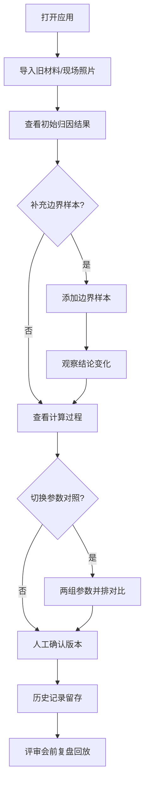

## 1. 产品概述

电池内阻误差归因分析工具，用于帮助维修师傅和排班同事快速定位电池内阻测试误差的来源。工具聚焦于"讲清楚为什么"——特别是边界样本如何影响结论，让评审会上的复盘有据可依。

- 目标用户：维修师傅（阿岑）、排班同事
- 核心价值：让误差归因透明化，参数版本可追溯，边界样本讲得清
- 使用场景：现场测试后分析、评审会前复盘、新旧参数对照

## 2. 核心功能

### 2.1 用户角色

| 角色 | 核心痛点 | 主要使用场景 |
|------|----------|--------------|
| 维修师傅阿岑 | 怕从现场照片翻出旧说法，第二天没人记得参数版本 | 现场测试后导入数据，确认分析结论 |
| 排班同事 | 怕采样缺口被揉进正常结果，需要两组参数对照 | 评审会前复盘，对比不同参数下的归因结果 |

### 2.2 功能模块

1. **样本列表区**：现场照片/测试样本列表，标注边界样本和采样缺口
2. **归因分析区**：误差分解计算，展示中间过程和单位换算
3. **参数版本区**：参数组管理，支持两组参数对照
4. **历史记录区**：人工确认前后的变化记录，支持复盘
5. **采样缺口区**：单独拎出的采样缺口记录，不混入正常结果

### 2.3 页面详情

| 页面名称 | 模块名称 | 功能描述 |
|---------|----------|----------|
| 归因分析页 | 样本列表 | 展示导入的现场照片样本，标记边界样本、正常样本、采样缺口 |
| 归因分析页 | 误差分解面板 | 分层展示内阻误差组成，展开可看计算过程和单位换算 |
| 归因分析页 | 参数版本对照 | 左右并排两组参数，实时对比归因结果差异 |
| 归因分析页 | 边界样本详情 | 点击边界样本后，详解其对最终结论的影响路径 |
| 归因分析页 | 历史时间线 | 记录每次人工确认的变更，支持回溯到任意版本 |
| 归因分析页 | 采样缺口专区 | 独立卡片展示所有采样缺口，标注对结论的影响程度 |

## 3. 核心流程

用户打开应用 → 导入旧材料（预设样本数据） → 查看初始归因结果 → 补充一条边界样本 → 观察结论变化 → 展开查看计算过程 → 切换参数组对照 → 人工确认当前版本 → 历史记录中查看变更 → 评审会前复盘回放

## 4. 用户界面设计

### 4.1 设计风格

- **整体风格**：工业工程风，朴素实用，数据优先
- **主色调**：深青灰底色（#1a2332）+ 橙红色警示（#ff6b35）+ 青绿色正常（#2ec4b6）
- **字体**：等宽字体 JetBrains Mono 用于数据展示，Inter 用于说明文字
- **布局**：三栏布局——左栏样本列表，中栏归因分析，右栏参数与历史
- **视觉重点**：边界样本用橙红边框高亮，采样缺口用黄色斜纹底纹

### 4.2 页面设计概述

| 模块 | UI元素 | 交互细节 |
|------|--------|----------|
| 样本列表 | 卡片式列表，缩略图+标签 | 悬停放大，点击选中，边界样本脉冲动画 |
| 误差分解 | 折叠面板，逐层展开 | 展开时显示计算公式和单位换算步骤 |
| 参数对照 | 左右分栏，中间VS标识 | 滑动切换参数组，差异处高亮闪烁 |
| 边界详情 | 模态弹窗，影响路径图 | 动画展示数据如何传导到最终误差 |
| 历史时间线 | 垂直时间线，节点可点击 | 点击节点快照回显，确认/回退操作 |
| 采样缺口 | 独立黄色区域，斜纹背景 | 标注缺口位置和对结论的影响权重 |

### 4.3 响应式

- Desktop-first，主布局三栏
- 平板端：两栏布局，样本列表收起为侧边抽屉
- 移动端：单栏堆叠，底部Tab切换

### 4.4 动效设计

- 边界样本添加时：橙红色脉冲扩散动画
- 参数切换时：差异数值平滑过渡（数字跳动）
- 展开计算过程：高度平滑过渡，公式渐入
- 历史记录确认：时间线节点打勾动画
