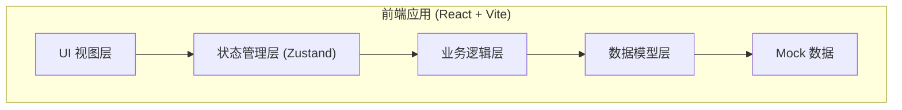

## 1. 架构设计



纯前端单页应用，无后端依赖。数据通过 Mock 方式预置现场样本，支持本地状态管理和历史记录回溯。

## 2. 技术描述

- **前端框架**：React@18 + TypeScript
- **构建工具**：Vite@5
- **样式方案**：Tailwind CSS@3
- **状态管理**：Zustand
- **路由**：react-router-dom（单页，主要用于Tab切换）
- **图标**：lucide-react
- **数据可视化**：原生 SVG + CSS 动画（避免引入重型图表库）
- **Mock数据**：内置 JSON 样本数据

## 3. 路由定义

| 路由 | 用途 |
|------|------|
| / | 归因分析主页面 |
| /history | 历史记录详情页 |

主应用为单页结构，主要内容区通过状态切换不同视图。

## 4. 数据模型

### 4.1 核心数据结构

```typescript
// 样本类型
type SampleType = 'normal' | 'boundary' | 'gap';

// 现场样本
interface BatterySample {
  id: string;
  name: string;           // 样本名称/编号
  photoUrl: string;       // 现场照片
  type: SampleType;       // 样本类型
  internalResistance: number;  // 实测内阻 (mΩ)
  temperature: number;    // 环境温度 (°C)
  testTime: string;       // 测试时间
  soc: number;            // 荷电状态 (%)
  notes?: string;         // 现场备注
}

// 参数组
interface ParameterSet {
  id: string;
  name: string;
  version: string;
  baseResistance: number;      // 基准内阻 (mΩ)
  temperatureCoefficient: number;  // 温度系数 (mΩ/°C)
  socCorrectionFactor: number;     // SOC修正系数
  tolerance: number;          // 容许误差 (mΩ)
  updatedAt: string;
}

// 误差分解项
interface ErrorComponent {
  id: string;
  name: string;
  value: number;      // 误差值 (mΩ)
  percentage: number; // 占总误差比例
  formula: string;    // 计算公式
  unitConversion?: string; // 单位换算说明
  description: string;
}

// 归因结果
interface AttributionResult {
  sampleId: string;
  parameterSetId: string;
  totalError: number;        // 总误差 (mΩ)
  totalErrorPercentage: number; // 误差率 (%)
  components: ErrorComponent[];
  conclusion: string;        // 结论描述
  boundaryImpact?: string;   // 边界样本影响说明
}

// 历史记录
interface HistoryRecord {
  id: string;
  timestamp: string;
  type: 'import' | 'add_sample' | 'param_change' | 'confirm' | 'revert';
  description: string;
  beforeSnapshot: AttributionResult | null;
  afterSnapshot: AttributionResult | null;
  operator: string;
}
```

### 4.2 状态管理 (Zustand Store)

```typescript
interface AppState {
  samples: BatterySample[];
  selectedSampleId: string | null;
  parameterSets: ParameterSet[];
  activeParamSetId: string;
  compareParamSetId: string | null;
  compareMode: boolean;
  currentResult: AttributionResult | null;
  history: HistoryRecord[];
  actions: {
    selectSample: (id: string) => void;
    addSample: (sample: BatterySample) => void;
    setCompareMode: (enabled: boolean) => void;
    switchParamSet: (id: string) => void;
    confirmVersion: (description: string) => void;
    revertToHistory: (historyId: string) => void;
    calculateAttribution: () => void;
  };
}
```

## 5. 目录结构

```
src/
├── components/
│   ├── SampleList/          # 样本列表组件
│   ├── AttributionPanel/    # 归因分析面板
│   ├── ErrorBreakdown/      # 误差分解组件
│   ├── ParamCompare/        # 参数对照组件
│   ├── BoundaryDetail/      # 边界样本详情
│   ├── GapSection/          # 采样缺口专区
│   └── HistoryTimeline/     # 历史时间线
├── pages/
│   └── AnalysisPage.tsx     # 主分析页面
├── store/
│   └── useAppStore.ts       # Zustand状态管理
├── data/
│   └── mockData.ts          # Mock样本和参数数据
├── utils/
│   ├── calculator.ts        # 误差计算逻辑
│   └── formatters.ts        # 格式化工具
├── types/
│   └── index.ts             # TypeScript类型定义
├── App.tsx
└── main.tsx
```

## 6. 核心计算逻辑

误差归因计算公式：

1. **基准误差** = 实测内阻 - 基准内阻
2. **温度引起的误差** = (实测温度 - 基准温度) × 温度系数
3. **SOC引起的误差** = 基准内阻 × SOC修正系数 × (实测SOC - 基准SOC) / 100
4. **其他误差** = 总误差 - 温度误差 - SOC误差
5. **误差率** = 总误差 / 基准内阻 × 100%

单位换算说明：
- 内阻单位：mΩ（毫欧），1Ω = 1000mΩ
- 温度系数：mΩ/°C
- 所有计算统一使用 mΩ 作为基本单位
