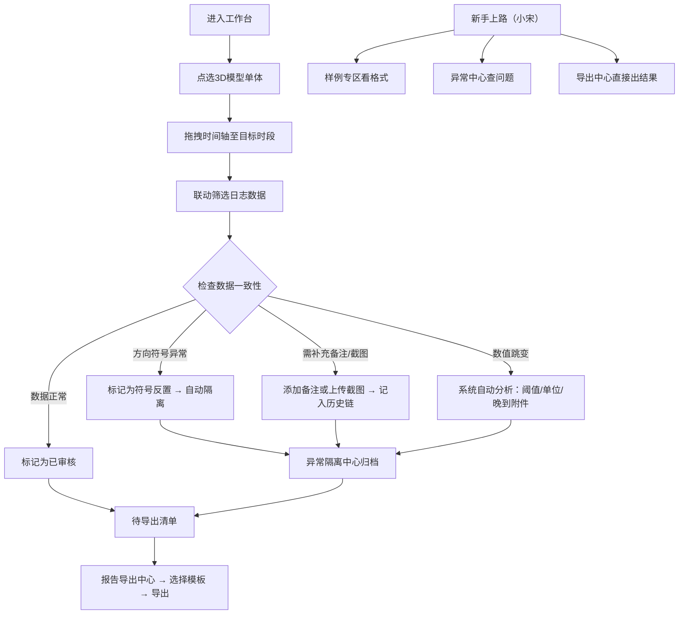

## 1. 产品概述

"电池内阻报告导出"是面向锂电池实验室现场测试场景的数据追溯与报告生成系统，解决传感器日志报警与人工备注不一致、历史版本丢失、异常数据混入正常结果等核心痛点。
- 目标用户：现场测试老师（主操作）、项目助理（接班/导出）
- 核心价值：保留完整数据历史链、自动隔离异常记录、精准定位跳变原因、一键输出可追溯报告

## 2. 核心功能

### 2.1 用户角色

| 角色 | 使用场景 | 核心诉求 |
|------|----------|----------|
| 现场老师 | 日常测试数据审核、标记异常、补充备注 | 快速定位异常、防止方向符号错误混入、跳变原因一目了然 |
| 项目助理（小宋） | 接班、整理报告、批量导出 | 快速知道样例在哪、异常在哪、结果怎么导出 |

### 2.2 功能模块
1. **工作台首页**：待处理清单、异常摘要、快速入口、新手上路引导卡
2. **Web3D 数据联动面板**：3D 电池组模型点选、时间轴切片、多维筛选器、传感器日志列表
3. **历史版本追溯页**：备注变更历史、截图版本归档、操作审计时间线
4. **异常隔离中心**：方向符号反置记录、跳变检测结果、证据补充状态看板
5. **报告导出中心**：报告预览、模板选择、批量导出队列、样例专区

### 2.3 页面详情

| 页面名称 | 模块名称 | 功能描述 |
|-----------|-------------|---------------------|
| 工作台首页 | 待处理清单 | 按电池编号列出未审核/待补证据/待导出条目，点击直接跳转定位 |
| 工作台首页 | 异常摘要仪表盘 | 数字卡片展示：方向符号异常数、跳变记录数、待补证据数、已完成数 |
| 工作台首页 | 新手上路引导卡 | 三张卡片：①样例在哪 ②异常在哪 ③结果怎么导出，点击直达对应区域 |
| 工作台首页 | 最近活动时间线 | 最近24小时操作记录：谁补了备注、谁标记了异常、谁导出了报告 |
| Web3D 数据联动面板 | 3D 电池组模型 | 可旋转/缩放的电池组3D模型，点击单体高亮并联动右侧数据 |
| Web3D 数据联动面板 | 时间轴切片器 | 横向拖拽时间轴，支持按小时/天/测试周期分段，实时联动筛选 |
| Web3D 数据联动面板 | 多维筛选器 | 电池编号、测试批次、阈值范围、单位制式、备注关键词组合筛选 |
| Web3D 数据联动面板 | 传感器日志列表 | 与3D/时间轴/筛选器实时联动，每行显示值+备注标签+截图缩略图 |
| 历史版本追溯页 | 备注变更历史 | 每条数据的所有备注版本，标记创建时间/操作人，支持对比视图 |
| 历史版本追溯页 | 截图版本归档 | 不同时间点上传的现场截图，按版本排列，点击放大对比 |
| 历史版本追溯页 | 操作审计时间线 | 所有操作的完整时间线，可回放某条数据的完整生命周期 |
| 异常隔离中心 | 方向符号反置专区 | 单独列出所有被标记为"+/-写反"的记录，红色标签醒目，不参与平均值 |
| 异常隔离中心 | 跳变检测详情卡 | 每条跳变记录自动标注原因类型：阈值调整/单位切换/晚到附件，附证据链 |
| 异常隔离中心 | 证据补充看板 | 按"已补证据/待补证据/无法补"三栏分列，拖拽式状态流转 |
| 报告导出中心 | 报告预览区 | 实时预览报告内容，异常记录红色边框标注，历史版本折叠展开 |
| 报告导出中心 | 模板选择器 | 标准报告/精简报告/含历史版报告 三种模板切换 |
| 报告导出中心 | 样例专区 | 预置3份样例报告（正常/含异常/含跳变），供小宋快速参考格式 |
| 报告导出中心 | 导出队列 | 批量任务进度显示，支持暂停/继续，完成后一键下载全部 |

## 3. 核心流程

现场老师完成一次数据审核的完整流程：从3D模型点选单体 → 切时间轴定位测试段 → 筛选查看日志 → 标记方向异常或补充备注 → 确认数据或标记待补证据 → 系统自动检测跳变并标注原因 → 生成可追溯报告。

## 4. 用户界面设计

### 4.1 设计风格
- **主色调**：深空蓝 (#0A1628) 为底，配合工业青 (#00D4AA) 作为正常态强调色，警示红 (#FF4757) 标注异常
- **辅助色**：琥珀黄 (#FFA502) 标记待处理、极光紫 (#7B2CBF) 标记历史版本
- **按钮风格**：微立体方角按钮，悬停时有 2px 发光边框，点击下沉 1px
- **字体方案**：标题用 JetBrains Mono（等宽科技感），正文用 Inter（高可读性），数据值用 Tabular Numbers 等宽数字
- **布局风格**：三栏式主布局（左侧导航+中间3D/数据区+右侧详情面板），卡片式容器配 1px 细边框和微弱内发光
- **图标风格**：线性填充混合图标，异常态图标带脉冲动画，历史图标带时钟角标

### 4.2 页面设计概览

| 页面名称 | 模块名称 | UI 元素与风格 |
|-----------|-------------|-------------|
| 工作台首页 | 异常摘要仪表盘 | 四个大数字卡片，底部配趋势迷你折线图，异常卡片带红色渐变边框脉冲 |
| 工作台首页 | 新手上路引导卡 | 三张竖向卡片，序号01/02/03超大号显示，hover时背景色渐变过渡 |
| Web3D 数据联动面板 | 3D 模型区 | 深色背景配网格地面和环境光反射，选中单体发出工业青光晕 |
| Web3D 数据联动面板 | 时间轴切片器 | 轨道式时间轴，当前时段发光高亮，阈值分割线用虚线标示 |
| Web3D 数据联动面板 | 传感器日志列表 | 斑马纹行，异常行红色左边框，历史版本行带紫色版本标签 |
| 异常隔离中心 | 方向符号反置专区 | 红色主题专区，每条记录前显示 ⚠️ 图标，"+/-"字样放大显示 |
| 异常隔离中心 | 跳变检测详情卡 | 三栏标签页（阈值/单位/附件），每个原因配对应图标和证据时间戳 |
| 报告导出中心 | 样例专区 | 三张报告缩略图，带放大镜悬停效果，右下角标注"样例"水印 |

### 4.3 响应式
- Desktop-first，最小支持宽度 1440px
- 面板宽度可拖拽调整，右侧详情面板可折叠为图标条
- 时间轴在窄屏下自动换行并启用缩放控制

### 4.4 3D 场景指引
- **环境**：深色太空感环境，弱蓝色雾效模拟实验室氛围，地面反射强度 0.3
- **光照**：主光平行光+冷色补光+单体选中时的点光源聚光
- **相机动画**：初始缓慢环绕一周展示全貌，点击单体时飞行相机聚焦至最佳视角
- **交互**：鼠标悬停单体显示编号标签，点击选中发光并联动数据，滚轮缩放
- **后处理**：Bloom 泛光（选中单体）+ 轻微胶片颗粒 + FXAA 抗锯齿
- **性能**：单体使用实例化渲染，100节以内电池保持 60fps，Lod 分级
