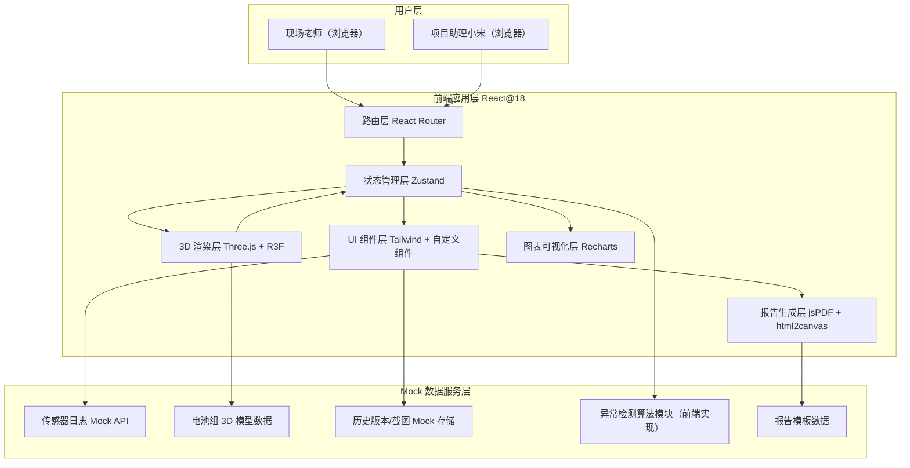
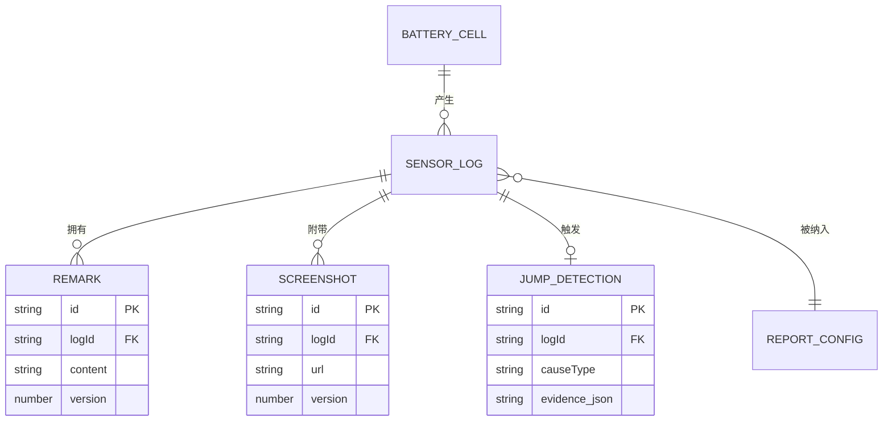

## 1. 架构设计



## 2. 技术说明

- **前端框架**：React@18 + TypeScript@5 + Vite@5
- **样式方案**：Tailwind CSS@3 + CSS Variables（主题色统一管理）
- **3D 渲染**：three@0.160 + @react-three/fiber@8 + @react-three/drei@9 + @react-three/postprocessing@2
- **状态管理**：Zustand@4（轻量、支持时间旅行调试，便于历史追溯）
- **数据图表**：Recharts@2（时间轴、趋势折线图、迷你仪表盘）
- **报告导出**：jspdf@2 + html2canvas@1（前端直接生成 PDF，无需后端）
- **路由**：react-router-dom@6
- **图标**：lucide-react（线性图标库，可定制 stroke 宽度）
- **数据层**：全量 Mock 数据，使用 MSW@2 或本地 JSON + 前端模拟延迟
- **动画**：framer-motion@10（页面切换、卡片展开、数字滚动等动效）

## 3. 路由定义

| 路由路径 | 页面名称 | 核心职责 |
|----------|----------|----------|
| `/` | 工作台首页 | 异常摘要仪表盘、待处理清单、新手上路引导、最近活动 |
| `/3d-panel` | Web3D 数据联动面板 | 3D 电池组模型、时间轴切片器、多维筛选器、传感器日志 |
| `/history/:batteryId` | 历史版本追溯页 | 备注变更对比、截图归档、操作审计时间线 |
| `/anomaly` | 异常隔离中心 | 方向符号反置专区、跳变检测详情、证据补充看板 |
| `/export` | 报告导出中心 | 报告预览、模板选择、样例专区、导出队列 |

## 4. 核心类型定义（TypeScript）

```typescript
// 电池单体
interface BatteryCell {
  id: string;
  position: { row: number; col: number; layer: number };
  model: string;
  nominalResistance: number; // mΩ
}

// 传感器日志条目
interface SensorLogEntry {
  id: string;
  batteryId: string;
  timestamp: number;
  resistance: number; // mΩ
  voltage: number;    // V
  temperature: number; // °C
  directionSign: 'positive' | 'negative' | 'reversed'; // 方向符号
  unit: 'mΩ' | 'μΩ' | 'Ω';
  thresholdVersion: string; // 阈值版本号
  remarkId?: string;
  screenshotIds: string[];
  source: 'realtime' | 'delayed-attachment'; // 实时 / 晚到附件
  isAudited: boolean;
  isAnomaly: boolean;
  anomalyType?: 'direction-reversed' | 'jump-threshold' | 'jump-unit' | 'jump-late-data';
}

// 备注历史
interface Remark {
  id: string;
  logId: string;
  content: string;
  operator: string;
  createdAt: number;
  version: number;
  isLatest: boolean;
}

// 截图版本
interface Screenshot {
  id: string;
  logId: string;
  url: string;
  version: number;
  uploadedBy: string;
  uploadedAt: number;
  description?: string;
}

// 跳变检测结果
interface JumpDetection {
  id: string;
  logId: string;
  previousLogId: string;
  delta: number;
  deltaPercent: number;
  causeType: 'threshold' | 'unit' | 'late-attachment' | 'unknown';
  evidence: {
    field: string;
    oldValue: string;
    newValue: string;
    timestamp: number;
  }[];
}

// 报告配置
interface ReportConfig {
  id: string;
  template: 'standard' | 'simplified' | 'full-history';
  batteryIds: string[];
  timeRange: { start: number; end: number };
  includeAnomalies: boolean;
  includeHistory: boolean;
  status: 'queued' | 'generating' | 'completed' | 'failed';
  progress: number;
  createdAt: number;
  createdBy: string;
  downloadUrl?: string;
}

// 证据看板状态
type EvidenceStatus = 'pending' | 'collected' | 'unavailable';
```

## 5. 状态管理切片（Zustand Store 分层）

```
appStore
├── uiSlice        // 主题、面板折叠状态、当前选中导航
├── batterySlice   // 电池组数据、当前选中单体、3D视角
├── logSlice       // 传感器日志、筛选条件、时间轴范围
├── historySlice   // 备注历史、截图版本、操作审计
├── anomalySlice   // 方向异常、跳变检测、证据状态
└── reportSlice    // 报告配置、导出队列、模板选择
```

## 6. 关键算法模块（前端实现）

### 6.1 跳变原因检测算法
输入：当前日志条目 + 前一条日志条目
优先级判断链：
1. **单位切换**：`current.unit !== previous.unit` → 标记为 `jump-unit`
2. **阈值版本变更**：`current.thresholdVersion !== previous.thresholdVersion` → 标记为 `jump-threshold`
3. **晚到附件**：`current.source === 'delayed-attachment'` 且时间戳晚于批次平均 → 标记为 `jump-late-data`
4. **未知跳变**：阻值变化率 > 30% 且以上均不满足 → 标记为 `unknown`，需人工确认

### 6.2 数据联动刷新机制
- 3D 选中单体 → 更新 `batterySlice.selectedId` → 触发 `logSlice` 的派生筛选
- 时间轴拖拽 → 更新 `logSlice.timeRange` → 联动日志列表 + 3D 高亮该时段有数据的单体
- 筛选器变更 → 更新 `logSlice.filters` → 使用 `useMemo` 计算过滤后的日志

## 7. 数据模型关系图



## 8. 目录结构

```
src/
├── assets/              # 字体、样例截图、3D 材质贴图
├── components/
│   ├── layout/          # 导航栏、侧边栏、面板容器
│   ├── dashboard/       # 仪表盘卡片、待处理清单、新手引导
│   ├── three3d/         # 3D 场景、电池单体、相机控制
│   ├── timeline/        # 时间轴、播放控制、阈值标记
│   ├── logs/            # 日志列表、行组件、筛选器
│   ├── history/         # 备注对比、截图画廊、审计时间线
│   ├── anomaly/         # 方向异常卡、跳变详情、证据看板
│   └── export/          # 报告预览、模板选择、导出队列
├── store/               # Zustand stores 分层
├── hooks/               # 自定义 hooks：useLogFilter, useJumpDetection
├── utils/               # 跳变检测算法、单位换算、PDF 生成工具
├── mock/                # Mock 数据生成器
├── types/               # TypeScript 类型定义
├── pages/               # 页面级组件（对应路由）
└── App.tsx              # 路由入口
```
