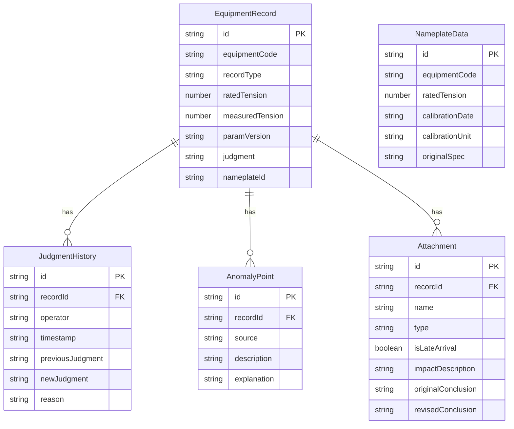

## 1. 架构设计

```mermaid
graph TB
    "前端 React SPA" --> "状态管理 Zustand"
    "状态管理 Zustand" --> "Mock 数据层"
    "Mock 数据层" --> "设备铭牌数据"
    "Mock 数据层" --> "判断历史数据"
    "Mock 数据层" --> "附件数据"
```

纯前端应用，无后端服务。所有数据以 Mock 数据形式内嵌于前端，使用 Zustand 管理状态，localStorage 持久化判断修改历史。

## 2. 技术说明

- 前端：React@18 + TypeScript + tailwindcss@3 + Vite
- 初始化工具：vite-init
- 后端：无
- 数据库：无，使用内存 Mock 数据 + localStorage 持久化
- 状态管理：Zustand

## 3. 路由定义

| 路由 | 用途 |
|------|------|
| / | 复算主页面：设备铭牌列表、参数版本、异常点、晚到附件影响分析、设备编号追踪 |
| /history/:recordId | 判断历史页面：某条记录的完整判断修改时间线 |

## 4. 数据模型

### 4.1 数据模型定义



### 4.2 TypeScript 类型定义

```typescript
interface EquipmentRecord {
  id: string;
  equipmentCode: string;
  recordType: 'smooth' | 'supplementary' | 'anomalous';
  ratedTension: number;
  measuredTension: number;
  paramVersion: string;
  paramVersionHistory?: string[];
  judgment: string;
  nameplateId: string;
  attachments: Attachment[];
  anomalyPoints: AnomalyPoint[];
}

interface NameplateData {
  id: string;
  equipmentCode: string;
  ratedTension: number;
  calibrationDate: string;
  calibrationUnit: string;
  originalSpec: string;
}

interface JudgmentHistory {
  id: string;
  recordId: string;
  operator: string;
  timestamp: string;
  previousJudgment: string;
  newJudgment: string;
  reason: string;
}

interface AnomalyPoint {
  id: string;
  recordId: string;
  source: 'alarm' | 'manual_note' | 'late_attachment';
  description: string;
  explanation: string;
}

interface Attachment {
  id: string;
  recordId: string;
  name: string;
  type: string;
  isLateArrival: boolean;
  impactDescription?: string;
  originalConclusion?: string;
  revisedConclusion?: string;
  paramChanges?: ParamChange[];
}

interface ParamChange {
  paramName: string;
  beforeValue: string;
  afterValue: string;
}
```
