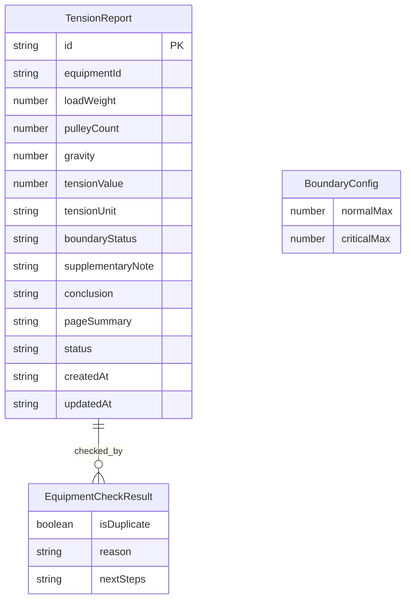

## 1. 架构设计

```mermaid
flowchart TB
    subgraph "前端层"
        "A[报告生成页]" 
        "B[排班摘要页]"
        "C[设备校验页]"
    end
    subgraph "数据与逻辑层"
        "D[张力计算引擎]"
        "E[边界判定模块]"
        "F[设备去重校验]"
        "G[备注-结论联动]"
    end
    subgraph "数据存储层"
        "H[Zustand Store]"
        "I[LocalStorage 持久化]"
    end
    "A" --> "D"
    "A" --> "E"
    "A" --> "F"
    "A" --> "G"
    "B" --> "H"
    "C" --> "F"
    "D" --> "H"
    "E" --> "H"
    "F" --> "H"
    "G" --> "H"
    "H" --> "I"
```

## 2. 技术说明

- 前端：React@18 + TypeScript + Tailwind CSS@3 + Vite
- 初始化工具：vite-init（react-ts 模板）
- 后端：无（纯前端，数据持久化至 LocalStorage）
- 数据库：无（使用 Zustand + LocalStorage 模拟）
- 状态管理：Zustand
- 路由：react-router-dom

## 3. 路由定义

| 路由 | 用途 |
|------|------|
| / | 报告生成页——输入设备编号与测量值，生成张力报告 |
| /summary | 排班摘要页——按状态分类展示所有报告 |
| /verify | 设备校验页——设备编号重复检测与处理 |

## 4. API 定义

无后端 API，所有逻辑在前端完成。

### 4.1 核心类型定义

```typescript
interface TensionReport {
  id: string
  equipmentId: string
  loadWeight: number
  pulleyCount: number
  gravity: number
  tensionValue: number
  tensionUnit: 'kN'
  boundaryStatus: 'normal' | 'critical' | 'exceeded'
  supplementaryNote: string
  conclusion: string
  pageSummary: string
  status: 'processed' | 'pending_material' | 'manual_override'
  createdAt: string
  updatedAt: string
}

interface BoundaryConfig {
  normalMax: number
  criticalMax: number
}

interface EquipmentCheckResult {
  isDuplicate: boolean
  existingReports: TensionReport[]
  reason: string
  nextSteps: string[]
}
```

### 4.2 核心计算逻辑

- 张力公式：F = (W × g) / n
  - F：张力值（kN）
  - W：载荷重量（kg）
  - g：重力加速度（默认 9.81 m/s²）
  - n：滑轮组数（正整数）
- 边界判定：
  - 正常：F ≤ 50 kN
  - 临界：50 kN < F ≤ 80 kN
  - 超限：F > 80 kN

## 5. 数据模型

### 5.1 数据模型定义



### 5.2 数据定义

使用 Zustand Store + LocalStorage 持久化，无需 DDL。
