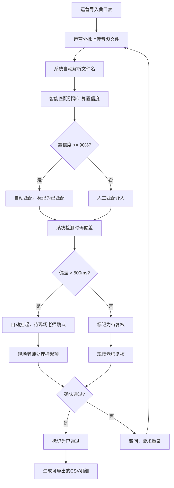
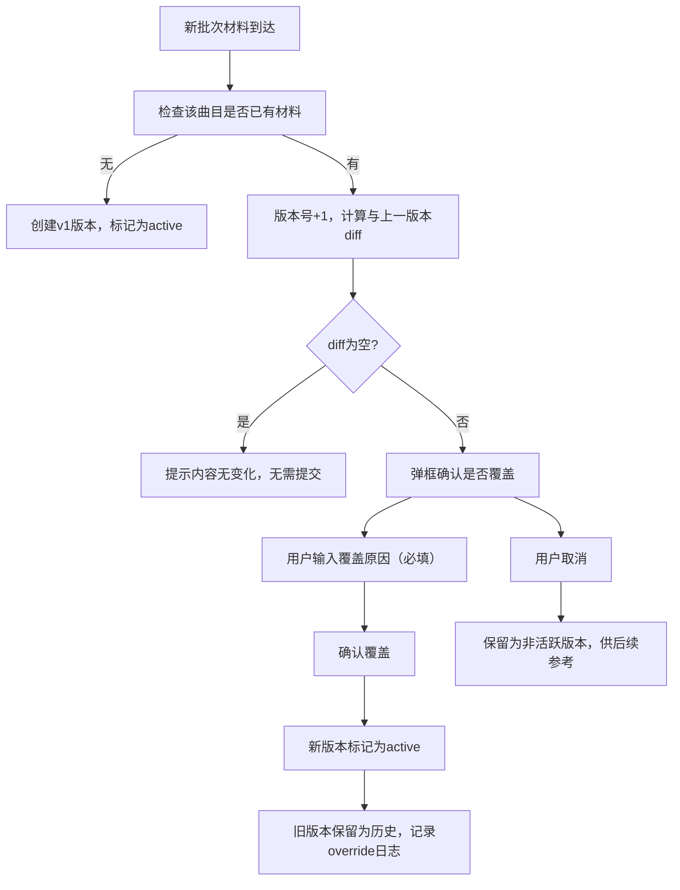
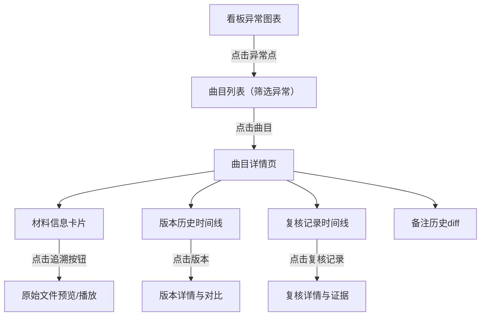

# 巡演耳返版本复核系统 - 产品需求文档 (PRD)

## 1. 产品概述

巡演耳返版本复核系统是面向现场音频制作流程的专业协作工具，解决厂牌运营与现场老师在耳返音频版本复核过程中的效率痛点。系统通过智能文件名匹配、全链路追溯、版本历史管理、时码偏差自动检测等核心能力，将原本依赖人工核对的繁琐流程数字化，确保复核过程可追溯、可审计、可沟通。

**核心价值**：
- 解决"文件名和曲目表对不上"的最大痛点，实现智能匹配
- 确保后补材料不覆盖历史判断，版本全程可追溯
- 时码偏差异常自动挂起，避免误导现场决策
- 备注修改全程留痕，支持历史回溯
- 输出可直接用于沟通的CSV明细，而非功能清单

## 2. 核心功能

### 2.1 用户角色

| 角色 | 注册方式 | 核心权限 |
|------|---------|---------|
| 厂牌运营 | 账号登录 | 曲目导入、音频上传、文件名匹配、补充材料、CSV导出 |
| 现场老师 | 账号登录 | 复核判断、时码确认、备注修改、挂起处理、最终审批 |
| 系统管理员 | 账号登录 | 用户管理、配置管理、模板维护 |

### 2.2 功能模块

1. **巡演看板页**：状态总览、异常图表、待办清单、快速操作入口
2. **曲目列表页**：曲目表格、状态筛选、批量操作、文件名匹配结果
3. **曲目详情页**：材料信息、版本历史、复核记录、备注管理、全链路追溯
4. **文件上传页**：批量上传、文件名解析、匹配预览、批次管理
5. **CSV导出页**：多模板选择、字段配置、筛选导出、历史导出记录

### 2.3 页面详情

| 页面名称 | 模块名称 | 功能描述 |
|---------|---------|---------|
| 巡演看板页 | 状态分布图表 | 饼图展示各状态曲目占比，点击色块筛选 |
| 巡演看板页 | 时码偏差柱状图 | 按曲目序号展示时码偏差，超出阈值标红 |
| 巡演看板页 | 待办清单卡片 | 分类展示待处理项，点击直达处理页 |
| 巡演看板页 | 进度时间线 | 展示提交/复核进度，预测完成时间 |
| 曲目列表页 | 曲目表格 | 展示曲目完整信息，支持排序、筛选、搜索 |
| 曲目列表页 | 匹配结果标识 | 显示匹配状态、置信度、异常标签 |
| 曲目列表页 | 批量操作 | 批量导出、批量匹配、批量状态变更 |
| 曲目详情页 | 材料信息卡片 | 显示当前版本材料的完整信息 |
| 曲目详情页 | 版本历史时间线 | 展示所有版本，支持切换、对比、追溯 |
| 曲目详情页 | 复核记录模块 | 展示历次复核意见和决策记录 |
| 曲目详情页 | 备注历史模块 | 字段级备注变更记录，支持diff对比 |
| 曲目详情页 | 证据清单模块 | 勾选式证据追踪，标记缺口 |
| 文件上传页 | 批量上传组件 | 拖拽上传、进度显示、错误提示 |
| 文件上传页 | 文件名解析预览 | 解析结果预览、人工调整、匹配确认 |
| CSV导出页 | 模板选择器 | 4种预设场景模板切换 |
| CSV导出页 | 字段配置器 | 自定义导出字段，保存配置 |
| CSV导出页 | 筛选条件面板 | 按状态、批次、时间范围筛选 |

## 3. 核心流程

### 3.1 主业务流程

### 3.2 后补材料版本管理流程

### 3.3 全链路追溯流程

## 4. 用户界面设计

### 4.1 设计风格

**设计定位**：专业音频制作工具，强调数据准确性和操作效率

- **主色调**：深靛蓝 `#1E3A5F` - 代表专业、可靠
- **辅助色**：琥珀橙 `#F59E0B` - 用于警告、待处理
- **成功色**：翡翠绿 `#10B981` - 用于已通过、正常
- **危险色**：珊瑚红 `#EF4444` - 用于已挂起、不匹配
- **信息色**：天空蓝 `#3B82F6` - 用于处理中、进行中

**视觉风格**：
- 暗色主题为主，适合长时间专业使用，减少视觉疲劳
- 卡片式布局，信息层级清晰
- 数据表格为主，辅以图表可视化
- 状态标签醒目，颜色编码统一
- 微交互反馈：悬停高亮、点击动效、加载动画

**字体选择**：
- 标题：`JetBrains Mono` - 等宽字体，数字对齐，专业感
- 正文：`Inter` - 清晰易读，支持多语言
- 数据/时码：`JetBrains Mono` - 确保数字等宽对齐

### 4.2 页面设计概述

| 页面名称 | 模块名称 | UI元素 |
|---------|---------|--------|
| 巡演看板页 | 顶部导航栏 | 巡演切换、用户信息、全局搜索、导出按钮 |
| 巡演看板页 | 状态统计卡片 | 4张关键指标卡片（总数/待处理/处理中/已完成） |
| 巡演看板页 | 图表区域 | 2x2网格布局：状态饼图、时码偏差柱状图、进度时间线、异常分布 |
| 巡演看板页 | 待办清单 | 分类标签页：运营待办 / 老师待办 / 全部待办 |
| 曲目列表页 | 筛选工具栏 | 状态筛选、批次筛选、搜索框、批量操作按钮 |
| 曲目列表页 | 数据表格 | 固定表头、可排序列、状态标签、快捷操作按钮 |
| 曲目列表页 | 分页控件 | 页码跳转、每页条数选择 |
| 曲目详情页 | 头部信息区 | 曲目基本信息、状态标签、快速操作按钮 |
| 曲目详情页 | Tab导航 | 材料信息 / 版本历史 / 复核记录 / 备注历史 / 审计日志 |
| 曲目详情页 | 材料信息卡 | 文件信息、匹配结果、时码偏差、证据清单 |
| 曲目详情页 | 版本时间线 | 垂直时间线，每个版本节点含diff对比入口 |
| 文件上传页 | 上传区域 | 拖拽上传框、文件列表、进度条 |
| 文件上传页 | 匹配预览表 | 解析结果、匹配置信度、人工调整下拉框 |
| CSV导出页 | 模板选择卡 | 4种模板卡片，选中高亮 |
| CSV导出页 | 字段配置器 | 可拖拽排序的字段列表，勾选启用 |
| CSV导出页 | 筛选面板 | 展开/收起的筛选条件区域 |
| CSV导出页 | 导出预览 | 数据样例预览、导出按钮、历史导出列表 |

### 4.3 响应式设计

- **桌面优先**：主布局针对1920x1080优化，最小支持1280px宽度
- **平板适配**：≥768px，表格可横向滚动，侧边栏可收起
- **核心操作触屏优化**：按钮最小尺寸44x44px，重要操作有触控反馈

### 4.4 关键交互细节

**异常点追溯交互**：
- 所有状态标签均可点击，悬停显示快速预览卡片
- 点击后平滑滚动到对应曲目并高亮
- 追溯链路中每页保留返回按钮，支持快速返回上一级

**版本覆盖确认交互**：
- 模态框展示diff对比，变更内容高亮显示
- 覆盖原因输入框为必填，禁用确认按钮直到输入
- 明确提示"旧版本会保留在历史记录中，不会删除"

**时码挂起处理交互**：
- 挂起状态使用醒目的红色边框和背景高亮
- 处理表单展示历史版本偏差趋势
- 三种处理选项单选，选择后显示对应的备注输入框

## 5. 非功能性需求

### 5.1 性能要求
- 页面首屏加载 < 2s
- 表格渲染1000条数据 < 1s
- 文件上传支持500MB单文件，进度实时更新
- CSV导出1000条数据 < 3s

### 5.2 安全要求
- 所有操作记录审计日志，不可篡改
- 文件上传类型限制，仅允许音频格式
- SQL注入防护，XSS防护

### 5.3 兼容性要求
- 支持Chrome 90+、Firefox 88+、Safari 14+
- 支持Windows/macOS/Linux
