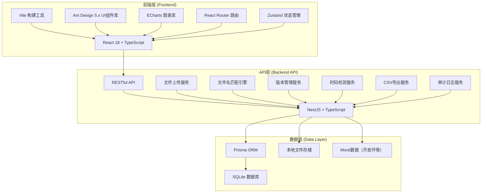
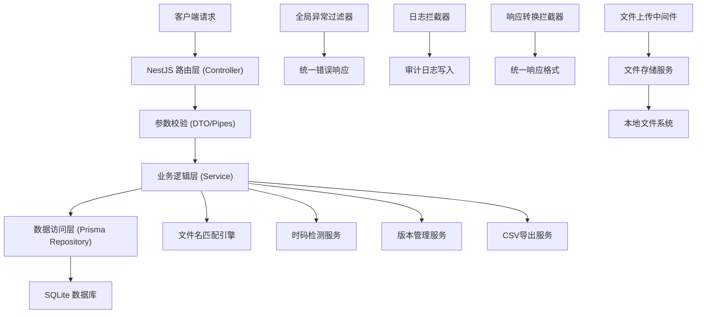
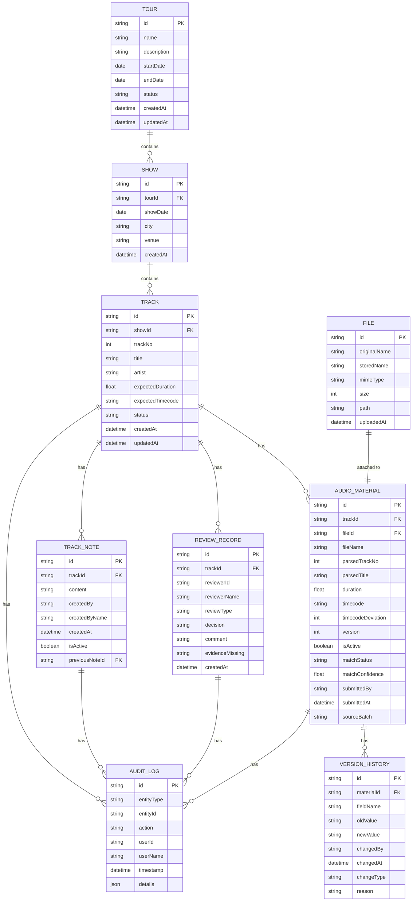

# 巡演耳返版本复核系统 - 技术架构文档

## 1. 架构设计



## 2. 技术描述

| 层级 | 技术选型 | 版本 | 选型理由 |
|-----|---------|------|---------|
| 前端框架 | React | 18.x | 生态成熟，类型安全，适合复杂交互 |
| 前端语言 | TypeScript | 5.x | 类型安全，减少运行时错误 |
| 构建工具 | Vite | 5.x | 启动快，热更新流畅，开发体验好 |
| UI组件库 | Ant Design | 5.x | 企业级组件，表格/表单能力强，暗色主题支持好 |
| 图表库 | ECharts | 5.x | 时码可视化、偏差图表展示能力强 |
| 状态管理 | Zustand | 4.x | 轻量、简单、API友好，适合中小型应用 |
| 路由 | React Router | 6.x | 声明式路由，嵌套路由支持好 |
| HTTP客户端 | Axios | 1.x | 拦截器、取消请求等功能完善 |
| 后端框架 | NestJS | 10.x | 模块化、TypeScript原生支持、适合业务系统 |
| 后端语言 | TypeScript | 5.x | 前后端语言统一，类型共享 |
| 数据库 | SQLite | 3.x | 无需单独安装，文件型数据库，适合快速开发和部署 |
| ORM | Prisma | 5.x | 类型安全、迁移管理方便、Schema驱动开发 |
| 文件存储 | 本地文件系统 | - | 简单易用，无需额外服务，数据保存在项目目录 |
| CSV处理 | Papaparse | 5.x | 高性能CSV解析和生成 |
| 字符串相似度 | natural | 6.x | Jaro-Winkler等字符串相似度算法 |

## 3. 项目结构

```
y13200/
├── .trae/
│   └── documents/
│       ├── prd.md
│       └── tech-arch.md
├── client/                          # 前端应用
│   ├── public/
│   ├── src/
│   │   ├── api/                     # API接口定义
│   │   ├── components/              # 公共组件
│   │   │   ├── charts/             # 图表组件
│   │   │   ├── common/             # 通用组件
│   │   │   └── layout/             # 布局组件
│   │   ├── pages/                  # 页面组件
│   │   │   ├── dashboard/          # 巡演看板
│   │   │   ├── tracks/             # 曲目列表
│   │   │   ├── track-detail/       # 曲目详情
│   │   │   ├── upload/             # 文件上传
│   │   │   └── export/             # CSV导出
│   │   ├── store/                  # Zustand状态管理
│   │   ├── types/                  # TypeScript类型定义
│   │   ├── utils/                  # 工具函数
│   │   ├── App.tsx
│   │   ├── main.tsx
│   │   └── index.css
│   ├── index.html
│   ├── package.json
│   ├── tsconfig.json
│   └── vite.config.ts
├── server/                          # 后端应用
│   ├── src/
│   │   ├── common/                 # 公共模块
│   │   │   ├── filters/            # 异常过滤器
│   │   │   └── interceptors/       # 拦截器
│   │   ├── config/                 # 配置模块
│   │   ├── modules/                # 业务模块
│   │   │   ├── tour/               # 巡演模块
│   │   │   ├── track/              # 曲目模块
│   │   │   ├── material/           # 材料模块
│   │   │   ├── review/             # 复核模块
│   │   │   ├── note/               # 备注模块
│   │   │   ├── audit/              # 审计模块
│   │   │   ├── file/               # 文件模块
│   │   │   ├── matching/           # 匹配引擎
│   │   │   └── export/             # 导出模块
│   │   ├── prisma/                 # Prisma Schema
│   │   │   └── schema.prisma
│   │   ├── app.module.ts
│   │   └── main.ts
│   ├── uploads/                    # 上传文件存储目录
│   ├── package.json
│   ├── tsconfig.json
│   └── nest-cli.json
├── design.md                        # 原始设计方案
├── package.json                     # 根package.json（monorepo管理）
└── README.md
```

## 4. 路由定义

| 路由路径 | 页面名称 | 权限要求 |
|---------|---------|---------|
| `/` | 巡演看板页 | 所有登录用户 |
| `/tracks` | 曲目列表页 | 所有登录用户 |
| `/tracks/:id` | 曲目详情页 | 所有登录用户 |
| `/upload` | 文件上传页 | 厂牌运营、管理员 |
| `/export` | CSV导出页 | 所有登录用户 |
| `/login` | 登录页 | 公开 |

## 5. API 定义

### 5.1 响应格式统一

```typescript
interface ApiResponse<T> {
  code: number;
  message: string;
  data: T;
  timestamp: string;
}
```

### 5.2 核心接口定义

```typescript
// 巡演模块
interface Tour {
  id: string;
  name: string;
  description: string;
  startDate: string;
  endDate: string;
  status: 'active' | 'completed' | 'archived';
}

// GET /api/tours - 获取巡演列表
// GET /api/tours/:id - 获取巡演详情
// GET /api/tours/:id/stats - 获取巡演统计数据

// 曲目模块
interface Track {
  id: string;
  tourId: string;
  showId: string;
  trackNo: number;
  title: string;
  artist: string;
  expectedDuration: number;
  expectedTimecode?: string;
  status: TrackStatus;
  latestNote?: string;
  createdAt: string;
  updatedAt: string;
}

type TrackStatus = 'pending' | 'matching' | 'matched' | 'mismatch' | 'reviewing' | 'suspended' | 'approved' | 'rejected';

// GET /api/tracks - 获取曲目列表（支持筛选、分页）
// GET /api/tracks/:id - 获取曲目详情
// POST /api/tracks - 批量导入曲目
// PUT /api/tracks/:id/status - 更新曲目状态

// 材料模块
interface AudioMaterial {
  id: string;
  trackId: string;
  fileId: string;
  fileName: string;
  parsedTrackNo?: number;
  parsedTitle?: string;
  duration: number;
  timecode?: string;
  timecodeDeviation?: number;
  version: number;
  isActive: boolean;
  matchStatus: 'auto' | 'manual' | 'mismatch' | 'none';
  matchConfidence: number;
  submittedBy: string;
  submittedAt: string;
  sourceBatch: string;
}

// GET /api/tracks/:id/materials - 获取曲目材料列表
// POST /api/materials - 上传新材料（含文件）
// POST /api/materials/:id/activate - 激活指定版本
// GET /api/materials/:id/versions - 获取版本对比

// 匹配模块
interface MatchResult {
  materialId: string;
  trackId: string | null;
  confidence: number;
  matchType: 'auto' | 'suggest' | 'manual';
  anomalies: string[];
}

// POST /api/matching/analyze - 分析文件名并匹配
// POST /api/matching/confirm - 确认匹配结果
// POST /api/matching/batch - 批量匹配

// 复核模块
interface ReviewRecord {
  id: string;
  trackId: string;
  reviewerId: string;
  reviewerName: string;
  reviewType: 'timecode' | 'quality' | 'note' | 'final';
  decision: 'approve' | 'reject' | 'suspend' | 'pass';
  comment: string;
  evidenceMissing?: string[];
  createdAt: string;
}

// GET /api/tracks/:id/reviews - 获取复核记录
// POST /api/reviews - 创建复核记录
// POST /api/reviews/suspend/resolve - 处理挂起项

// 备注模块
interface TrackNote {
  id: string;
  trackId: string;
  content: string;
  createdBy: string;
  createdByName: string;
  createdAt: string;
  isActive: boolean;
}

// GET /api/tracks/:id/notes - 获取备注历史
// POST /api/notes - 创建新备注

// 审计模块
interface AuditLog {
  id: string;
  entityType: 'track' | 'material' | 'review' | 'note';
  entityId: string;
  action: string;
  userId: string;
  userName: string;
  timestamp: string;
  details: Record<string, any>;
}

// GET /api/tracks/:id/audit-logs - 获取审计日志

// 导出模块
interface ExportTemplate {
  id: string;
  name: string;
  description: string;
  fields: string[];
  applicableScene: string;
}

interface ExportRequest {
  templateId: string;
  customFields?: string[];
  filters: {
    status?: string[];
    tourId?: string;
    batch?: string;
    dateRange?: [string, string];
  };
}

// GET /api/export/templates - 获取导出模板列表
// POST /api/export - 导出CSV
// GET /api/export/history - 获取导出历史
```

## 6. 服务端架构



### 6.1 模块职责划分

| 模块 | 核心职责 | 关键文件 |
|-----|---------|---------|
| TourModule | 巡演和场次管理 | `modules/tour/tour.controller.ts` `modules/tour/tour.service.ts` |
| TrackModule | 曲目CRUD、状态管理 | `modules/track/track.controller.ts` `modules/track/track.service.ts` |
| MaterialModule | 音频材料上传、版本管理 | `modules/material/material.controller.ts` `modules/material/material.service.ts` |
| MatchingModule | 文件名解析、智能匹配 | `modules/matching/matching.service.ts` `modules/matching/match.engine.ts` |
| ReviewModule | 复核记录、挂起处理 | `modules/review/review.controller.ts` `modules/review/review.service.ts` |
| NoteModule | 备注历史、变更链 | `modules/note/note.controller.ts` `modules/note/note.service.ts` |
| AuditModule | 审计日志、操作记录 | `modules/audit/audit.service.ts` `modules/audit/audit.interceptor.ts` |
| FileModule | 文件上传、存储管理 | `modules/file/file.controller.ts` `modules/file/file.service.ts` |
| ExportModule | CSV导出、模板管理 | `modules/export/export.controller.ts` `modules/export/export.service.ts` |

## 7. 数据模型

### 7.1 ER图



### 7.2 Prisma Schema

```prisma
generator client {
  provider = "prisma-client-js"
}

datasource db {
  provider = "sqlite"
  url      = "file:./dev.db"
}

model Tour {
  id          String   @id @default(uuid())
  name        String
  description String?
  startDate   DateTime
  endDate     DateTime
  status      String   @default("active")
  shows       Show[]
  createdAt   DateTime @default(now())
  updatedAt   DateTime @updatedAt
}

model Show {
  id        String  @id @default(uuid())
  tourId    String
  tour      Tour    @relation(fields: [tourId], references: [id])
  showDate  DateTime
  city      String
  venue     String?
  tracks    Track[]
  createdAt DateTime @default(now())
}

model Track {
  id               String          @id @default(uuid())
  showId           String
  show             Show            @relation(fields: [showId], references: [id])
  trackNo          Int
  title            String
  artist           String
  expectedDuration Float
  expectedTimecode String?
  status           String          @default("pending")
  materials        AudioMaterial[]
  reviews          ReviewRecord[]
  notes            TrackNote[]
  auditLogs        AuditLog[]
  createdAt        DateTime        @default(now())
  updatedAt        DateTime        @updatedAt
}

model AudioMaterial {
  id                String           @id @default(uuid())
  trackId           String
  track             Track            @relation(fields: [trackId], references: [id])
  fileId            String
  file              File             @relation(fields: [fileId], references: [id])
  fileName          String
  parsedTrackNo     Int?
  parsedTitle       String?
  duration          Float
  timecode          String?
  timecodeDeviation Int?
  version           Int
  isActive          Boolean          @default(true)
  matchStatus       String           @default("none")
  matchConfidence   Float            @default(0)
  submittedBy       String
  submittedAt       DateTime         @default(now())
  sourceBatch       String
  versionHistories  VersionHistory[]
  auditLogs         AuditLog[]
}

model VersionHistory {
  id         String   @id @default(uuid())
  materialId String
  material   AudioMaterial @relation(fields: [materialId], references: [id])
  fieldName  String
  oldValue   String?
  newValue   String?
  changedBy  String
  changedAt  DateTime @default(now())
  changeType String
  reason     String?
}

model ReviewRecord {
  id               String   @id @default(uuid())
  trackId          String
  track            Track    @relation(fields: [trackId], references: [id])
  reviewerId       String
  reviewerName     String
  reviewType       String
  decision         String
  comment          String
  evidenceMissing  String?
  auditLogs        AuditLog[]
  createdAt        DateTime @default(now())
}

model TrackNote {
  id             String     @id @default(uuid())
  trackId        String
  track          Track      @relation(fields: [trackId], references: [id])
  content        String
  createdBy      String
  createdByName  String
  createdAt      DateTime   @default(now())
  isActive       Boolean    @default(true)
  previousNoteId String?
  previousNote   TrackNote? @relation("NoteChain", fields: [previousNoteId], references: [id])
  nextNotes      TrackNote[] @relation("NoteChain")
  auditLogs      AuditLog[]
}

model AuditLog {
  id         String   @id @default(uuid())
  entityType String
  entityId   String
  action     String
  userId     String
  userName   String
  timestamp  DateTime @default(now())
  details    Json?
}

model File {
  id           String          @id @default(uuid())
  originalName String
  storedName   String
  mimeType     String
  size         Int
  path         String
  material     AudioMaterial?
  uploadedAt   DateTime        @default(now())
}
```

### 7.3 初始化数据 (Mock)

```typescript
// 初始化巡演数据
const mockTour = {
  id: 'tour-001',
  name: '2026周杰伦嘉年华世界巡回演唱会',
  description: '北京首演',
  startDate: '2026-06-20',
  endDate: '2026-06-20',
  status: 'active'
};

// 初始化场次数据
const mockShow = {
  id: 'show-001',
  tourId: 'tour-001',
  showDate: '2026-06-20',
  city: '北京',
  venue: '国家体育场（鸟巢）'
};

// 初始化20首曲目数据
const mockTracks = [
  { trackNo: 1, title: '夜曲', artist: '周杰伦', expectedDuration: 225, expectedTimecode: '00:03:45.000', status: 'suspended' },
  { trackNo: 2, title: '七里香', artist: '周杰伦', expectedDuration: 299, expectedTimecode: '00:04:59.000', status: 'approved' },
  { trackNo: 3, title: '青花瓷', artist: '周杰伦', expectedDuration: 239, expectedTimecode: '00:03:59.000', status: 'mismatch' },
  { trackNo: 4, title: '东风破', artist: '周杰伦', expectedDuration: 313, expectedTimecode: '00:05:13.000', status: 'pending' },
  { trackNo: 5, title: '发如雪', artist: '周杰伦', expectedDuration: 295, expectedTimecode: '00:04:55.000', status: 'reviewing' },
  { trackNo: 6, title: '霍元甲', artist: '周杰伦', expectedDuration: 215, expectedTimecode: '00:03:35.000', status: 'approved' },
  { trackNo: 7, title: '双截棍', artist: '周杰伦', expectedDuration: 198, expectedTimecode: '00:03:18.000', status: 'suspended' },
  { trackNo: 8, title: '龙拳', artist: '周杰伦', expectedDuration: 230, expectedTimecode: '00:03:50.000', status: 'matched' },
  { trackNo: 9, title: '本草纲目', artist: '周杰伦', expectedDuration: 245, expectedTimecode: '00:04:05.000', status: 'approved' },
  { trackNo: 10, title: '公公偏头痛', artist: '周杰伦', expectedDuration: 252, expectedTimecode: '00:04:12.000', status: 'pending' },
  { trackNo: 11, title: '晴天', artist: '周杰伦', expectedDuration: 269, expectedTimecode: '00:04:29.000', status: 'reviewing' },
  { trackNo: 12, title: '稻香', artist: '周杰伦', expectedDuration: 223, expectedTimecode: '00:03:43.000', status: 'approved' },
  { trackNo: 13, title: '听妈妈的话', artist: '周杰伦', expectedDuration: 264, expectedTimecode: '00:04:24.000', status: 'matched' },
  { trackNo: 14, title: '以父之名', artist: '周杰伦', expectedDuration: 342, expectedTimecode: '00:05:42.000', status: 'suspended' },
  { trackNo: 15, title: '止战之殇', artist: '周杰伦', expectedDuration: 285, expectedTimecode: '00:04:45.000', status: 'pending' },
  { trackNo: 16, title: '七里香', artist: '周杰伦', expectedDuration: 299, expectedTimecode: '00:04:59.000', status: 'approved' },
  { trackNo: 17, title: '千里之外', artist: '周杰伦', expectedDuration: 258, expectedTimecode: '00:04:18.000', status: 'reviewing' },
  { trackNo: 18, title: '菊花台', artist: '周杰伦', expectedDuration: 273, expectedTimecode: '00:04:33.000', status: 'matched' },
  { trackNo: 19, title: '烟花易冷', artist: '周杰伦', expectedDuration: 294, expectedTimecode: '00:04:54.000', status: 'approved' },
  { trackNo: 20, title: '不能说的秘密', artist: '周杰伦', expectedDuration: 266, expectedTimecode: '00:04:26.000', status: 'pending' }
];

// 初始化材料数据（部分曲目有多个版本）
const mockMaterials = [
  { trackNo: 1, fileName: '01_夜曲_立体声_v3.wav', duration: 225.3, timecode: '00:03:45.620', timecodeDeviation: 620, version: 3, isActive: true, matchStatus: 'auto', matchConfidence: 95.5, submittedBy: '小孟', sourceBatch: 'BATCH-20260618-03' },
  { trackNo: 1, fileName: '01_夜曲_立体声_v2.wav', duration: 225.1, timecode: '00:03:45.150', timecodeDeviation: 150, version: 2, isActive: false, matchStatus: 'auto', matchConfidence: 95.5, submittedBy: '小孟', sourceBatch: 'BATCH-20260614-02' },
  { trackNo: 2, fileName: '02_七里香_立体声.wav', duration: 299.0, timecode: '00:04:59.050', timecodeDeviation: 50, version: 1, isActive: true, matchStatus: 'auto', matchConfidence: 98.2, submittedBy: '小孟', sourceBatch: 'BATCH-20260614-01' },
  { trackNo: 3, fileName: '青花瓷_现场版.wav', duration: 238.5, timecode: '00:03:58.800', timecodeDeviation: -200, version: 1, isActive: true, matchStatus: 'mismatch', matchConfidence: 62.3, submittedBy: '小孟', sourceBatch: 'BATCH-20260614-01' },
  { trackNo: 5, fileName: '05_发如雪_立体声.wav', duration: 294.8, timecode: '00:04:55.200', timecodeDeviation: 200, version: 1, isActive: true, matchStatus: 'auto', matchConfidence: 96.0, submittedBy: '小孟', sourceBatch: 'BATCH-20260614-02' },
  { trackNo: 6, fileName: '06_霍元甲_立体声.wav', duration: 215.2, timecode: '00:03:35.100', timecodeDeviation: 100, version: 1, isActive: true, matchStatus: 'auto', matchConfidence: 97.5, submittedBy: '小孟', sourceBatch: 'BATCH-20260614-01' },
  { trackNo: 7, fileName: '07_双截棍_remix_v2.wav', duration: 198.4, timecode: '00:03:18.750', timecodeDeviation: 750, version: 2, isActive: true, matchStatus: 'auto', matchConfidence: 94.8, submittedBy: '小孟', sourceBatch: 'BATCH-20260618-01' },
  { trackNo: 8, fileName: '08_龙拳_立体声.wav', duration: 230.1, timecode: '00:03:50.080', timecodeDeviation: 80, version: 1, isActive: true, matchStatus: 'auto', matchConfidence: 96.8, submittedBy: '小孟', sourceBatch: 'BATCH-20260614-02' },
  { trackNo: 9, fileName: '09_本草纲目_立体声.wav', duration: 245.3, timecode: '00:04:05.120', timecodeDeviation: 120, version: 1, isActive: true, matchStatus: 'auto', matchConfidence: 97.2, submittedBy: '小孟', sourceBatch: 'BATCH-20260614-01' },
  { trackNo: 11, fileName: '11_晴天_立体声_v2.wav', duration: 269.2, timecode: '00:04:29.300', timecodeDeviation: 300, version: 2, isActive: true, matchStatus: 'auto', matchConfidence: 95.0, submittedBy: '小孟', sourceBatch: 'BATCH-20260618-02' },
  { trackNo: 12, fileName: '12_稻香_立体声.wav', duration: 223.0, timecode: '00:03:43.030', timecodeDeviation: 30, version: 1, isActive: true, matchStatus: 'auto', matchConfidence: 98.5, submittedBy: '小孟', sourceBatch: 'BATCH-20260614-01' },
  { trackNo: 13, fileName: '13_听妈妈的话_立体声.wav', duration: 264.2, timecode: '00:04:24.150', timecodeDeviation: 150, version: 1, isActive: true, matchStatus: 'auto', matchConfidence: 97.8, submittedBy: '小孟', sourceBatch: 'BATCH-20260614-02' },
  { trackNo: 14, fileName: '14_以父之名_立体声_v3.wav', duration: 342.5, timecode: '00:05:42.800', timecodeDeviation: 800, version: 3, isActive: true, matchStatus: 'auto', matchConfidence: 96.2, submittedBy: '小孟', sourceBatch: 'BATCH-20260618-03' },
  { trackNo: 16, fileName: '16_七里香_en remix.wav', duration: 299.4, timecode: '00:04:59.200', timecodeDeviation: 200, version: 1, isActive: true, matchStatus: 'manual', matchConfidence: 88.5, submittedBy: '小孟', sourceBatch: 'BATCH-20260614-02' },
  { trackNo: 17, fileName: '17_千里之外_feat费玉清.wav', duration: 258.3, timecode: '00:04:18.250', timecodeDeviation: 250, version: 1, isActive: true, matchStatus: 'auto', matchConfidence: 92.0, submittedBy: '小孟', sourceBatch: 'BATCH-20260618-01' },
  { trackNo: 18, fileName: '18_菊花台_立体声.wav', duration: 273.1, timecode: '00:04:33.100', timecodeDeviation: 100, version: 1, isActive: true, matchStatus: 'auto', matchConfidence: 97.0, submittedBy: '小孟', sourceBatch: 'BATCH-20260614-02' },
  { trackNo: 19, fileName: '19_烟花易冷_立体声.wav', duration: 294.2, timecode: '00:04:54.150', timecodeDeviation: 150, version: 1, isActive: true, matchStatus: 'auto', matchConfidence: 96.5, submittedBy: '小孟', sourceBatch: 'BATCH-20260614-01' }
];

// 初始化复核记录
const mockReviews = [
  { trackNo: 2, reviewerId: 'teacher-001', reviewerName: '张老师', reviewType: 'final', decision: 'approve', comment: '时码准确，音质良好，通过。' },
  { trackNo: 6, reviewerId: 'teacher-001', reviewerName: '张老师', reviewType: 'final', decision: 'approve', comment: '确认通过。' },
  { trackNo: 9, reviewerId: 'teacher-001', reviewerName: '张老师', reviewType: 'final', decision: 'approve', comment: '通过。' },
  { trackNo: 12, reviewerId: 'teacher-002', reviewerName: '李老师', reviewType: 'final', decision: 'approve', comment: '时码准确，通过。' },
  { trackNo: 16, reviewerId: 'teacher-002', reviewerName: '李老师', reviewType: 'final', decision: 'approve', comment: '英文版确认可用。' },
  { trackNo: 18, reviewerId: 'teacher-001', reviewerName: '张老师', reviewType: 'final', decision: 'approve', comment: '通过。' },
  { trackNo: 19, reviewerId: 'teacher-001', reviewerName: '张老师', reviewType: 'final', decision: 'approve', comment: '通过。' },
  { trackNo: 1, reviewerId: 'teacher-001', reviewerName: '张老师', reviewType: 'timecode', decision: 'suspend', comment: '时码偏半拍，待现场确认。', evidenceMissing: ['现场老师复核意见'] },
  { trackNo: 7, reviewerId: 'teacher-002', reviewerName: '李老师', reviewType: 'timecode', decision: 'suspend', comment: '偏差较大，请现场老师确认。', evidenceMissing: ['现场老师复核意见'] },
  { trackNo: 14, reviewerId: 'teacher-001', reviewerName: '张老师', reviewType: 'timecode', decision: 'suspend', comment: '时码偏差800ms，需要现场确认。', evidenceMissing: ['现场老师复核意见'] }
];

// 初始化备注历史
const mockNotes = [
  { trackNo: 1, content: '初版提交，时码正常', createdBy: 'operator-001', createdByName: '小孟', isActive: false },
  { trackNo: 1, content: 'v2版本，时码微调+150ms', createdBy: 'operator-001', createdByName: '小孟', isActive: false },
  { trackNo: 1, content: '时码偏半拍，待现场老师确认', createdBy: 'teacher-001', createdByName: '张老师', isActive: true },
  { trackNo: 3, content: '文件名缺少序号，待重新命名', createdBy: 'operator-001', createdByName: '小孟', isActive: true },
  { trackNo: 7, content: 'remix版本，时码偏差较大，挂起待确认', createdBy: 'teacher-002', createdByName: '李老师', isActive: true },
  { trackNo: 14, content: 'v3版本，导演要求加长前奏，时码偏移', createdBy: 'operator-001', createdByName: '小孟', isActive: false },
  { trackNo: 14, content: '时码偏差800ms，需要现场乐队确认', createdBy: 'teacher-001', createdByName: '张老师', isActive: true }
];
```

## 8. 核心算法

### 8.1 文件名解析算法

```typescript
interface ParsedFileName {
  trackNo?: number;
  title?: string;
  artist?: string;
  version?: string;
  tags?: string[];
}

function parseFileName(fileName: string): ParsedFileName {
  const result: ParsedFileName = {};
  const nameWithoutExt = fileName.replace(/\.[^/.]+$/, '');
  
  // 1. 提取曲目号 (开头的数字)
  const trackNoMatch = nameWithoutExt.match(/^(\d+)[_\-.\s]+/);
  if (trackNoMatch) {
    result.trackNo = parseInt(trackNoMatch[1], 10);
  }
  
  // 2. 提取版本号 (v1, v2, version2, 版本2)
  const versionMatch = nameWithoutExt.match(/[vV](\d+)|version\s*(\d+)|版本\s*(\d+)/i);
  if (versionMatch) {
    result.version = 'v' + (versionMatch[1] || versionMatch[2] || versionMatch[3]);
  }
  
  // 3. 提取标签 (方括号或括号中的内容)
  const tagPattern = /[\[\(]([^\]\)]+)[\]\)]/g;
  const tags: string[] = [];
  let tagMatch;
  while ((tagMatch = tagPattern.exec(nameWithoutExt)) !== null) {
    tags.push(tagMatch[1].trim());
  }
  if (tags.length > 0) {
    result.tags = tags;
  }
  
  // 4. 提取标题和艺人
  let cleanName = nameWithoutExt
    .replace(/^(\d+)[_\-.\s]+/, '')
    .replace(/[vV]\d+|version\s*\d+|版本\s*\d+/gi, '')
    .replace(/[\[\(][^\]\)]+[\]\)]/g, '')
    .trim();
  
  const separators = /[_\-.\s]+/;
  const parts = cleanName.split(separators).filter(p => p.trim());
  
  if (parts.length >= 1) {
    result.title = parts[0];
  }
  if (parts.length >= 2) {
    result.artist = parts[1];
  }
  
  return result;
}
```

### 8.2 字符串相似度算法 (Jaro-Winkler)

```typescript
function jaroWinkler(s1: string, s2: string): number {
  const m = s1.length;
  const n = s2.length;
  
  if (m === 0 || n === 0) return 0;
  if (s1 === s2) return 1;
  
  const matchDistance = Math.floor(Math.max(m, n) / 2) - 1;
  const s1Matches = new Array(m).fill(false);
  const s2Matches = new Array(n).fill(false);
  
  let matches = 0;
  for (let i = 0; i < m; i++) {
    const start = Math.max(0, i - matchDistance);
    const end = Math.min(n, i + matchDistance + 1);
    for (let j = start; j < end; j++) {
      if (!s2Matches[j] && s1[i] === s2[j]) {
        s1Matches[i] = true;
        s2Matches[j] = true;
        matches++;
        break;
      }
    }
  }
  
  if (matches === 0) return 0;
  
  let transpositions = 0;
  let k = 0;
  for (let i = 0; i < m; i++) {
    if (s1Matches[i]) {
      while (!s2Matches[k]) k++;
      if (s1[i] !== s2[k]) transpositions++;
      k++;
    }
  }
  
  transpositions = Math.floor(transpositions / 2);
  
  const jaro = (matches / m + matches / n + (matches - transpositions) / matches) / 3;
  
  const prefix = Math.min(4, m, n);
  let prefixMatch = 0;
  for (let i = 0; i < prefix && s1[i] === s2[i]; i++) {
    prefixMatch++;
  }
  
  const prefixScale = 0.1;
  return jaro + prefixMatch * prefixScale * (1 - jaro);
}
```

### 8.3 文件名匹配引擎

```typescript
interface MatchCandidate {
  trackId: string;
  trackNo: number;
  title: string;
  artist: string;
}

interface MatchResult {
  trackId: string | null;
  confidence: number;
  matchType: 'auto' | 'suggest' | 'manual' | 'none';
  anomalies: string[];
}

function matchFileName(
  parsed: ParsedFileName,
  candidates: MatchCandidate[],
  actualDuration: number
): MatchResult {
  const anomalies: string[] = [];
  let bestMatch: MatchCandidate | null = null;
  let highestConfidence = 0;
  
  for (const candidate of candidates) {
    let score = 0;
    const weights = {
      trackNo: 0.4,
      title: 0.35,
      artist: 0.15,
      duration: 0.1
    };
    
    // 1. 曲目号匹配 (最高权重)
    if (parsed.trackNo !== undefined) {
      if (parsed.trackNo === candidate.trackNo) {
        score += weights.trackNo;
      } else {
        anomalies.push(`曲目号不匹配：解析为${parsed.trackNo}，应为${candidate.trackNo}`);
      }
    } else {
      anomalies.push('文件名缺少曲目号');
    }
    
    // 2. 标题相似度
    if (parsed.title) {
      const titleSimilarity = jaroWinkler(
        parsed.title.toLowerCase(),
        candidate.title.toLowerCase()
      );
      score += titleSimilarity * weights.title;
      
      if (titleSimilarity < 0.7) {
        anomalies.push(`曲名相似度低：${(titleSimilarity * 100).toFixed(1)}%`);
      }
    }
    
    // 3. 艺人相似度
    if (parsed.artist && candidate.artist) {
      const artistSimilarity = jaroWinkler(
        parsed.artist.toLowerCase(),
        candidate.artist.toLowerCase()
      );
      score += artistSimilarity * weights.artist;
    }
    
    // 4. 时长接近度
    const expectedDuration = candidate.expectedDuration || 0;
    if (expectedDuration > 0) {
      const durationDiff = Math.abs(actualDuration - expectedDuration);
      if (durationDiff <= 5) {
        score += weights.duration;
      } else if (durationDiff <= 15) {
        score += weights.duration * (1 - durationDiff / 30);
        anomalies.push(`时长偏差${durationDiff.toFixed(1)}秒`);
      } else {
        anomalies.push(`时长偏差过大：${durationDiff.toFixed(1)}秒`);
      }
    }
    
    if (score > highestConfidence) {
      highestConfidence = score;
      bestMatch = candidate;
    }
  }
  
  // 确定匹配类型
  let matchType: MatchResult['matchType'] = 'none';
  if (highestConfidence >= 0.9) {
    matchType = 'auto';
  } else if (highestConfidence >= 0.7) {
    matchType = 'suggest';
  } else if (highestConfidence >= 0.5) {
    matchType = 'manual';
  }
  
  return {
    trackId: bestMatch ? bestMatch.id : null,
    confidence: Math.round(highestConfidence * 1000) / 10,
    matchType,
    anomalies
  };
}
```

### 8.4 时码偏差检测

```typescript
function parseTimecode(timecode: string): number {
  const parts = timecode.split(':');
  if (parts.length === 3) {
    const [minutes, seconds, ms] = parts;
    const [sec, millisec] = seconds.split('.');
    return parseInt(minutes, 10) * 60000 + 
           parseInt(sec, 10) * 1000 + 
           parseInt(millisec.padEnd(3, '0'), 10);
  }
  return 0;
}

function calculateDeviation(actual: string, expected: string): number {
  const actualMs = parseTimecode(actual);
  const expectedMs = parseTimecode(expected);
  return actualMs - expectedMs;
}

function checkTimecodeDeviation(
  actualTimecode: string,
  expectedTimecode: string
): { status: 'pass' | 'warning' | 'suspend'; deviation: number; message: string } {
  const deviation = calculateDeviation(actualTimecode, expectedTimecode);
  const absDeviation = Math.abs(deviation);
  
  if (absDeviation <= 100) {
    return {
      status: 'pass',
      deviation,
      message: '时码偏差在允许范围内'
    };
  } else if (absDeviation <= 500) {
    return {
      status: 'warning',
      deviation,
      message: `时码轻微偏差：${deviation > 0 ? '+' : ''}${deviation}ms`
    };
  } else {
    return {
      status: 'suspend',
      deviation,
      message: `时码偏差超过半拍（${deviation > 0 ? '+' : ''}${deviation}ms），已自动挂起，请现场老师确认`
    };
  }
}
```

### 8.5 CSV导出模板

```typescript
interface ExportTemplate {
  id: string;
  name: string;
  description: string;
  applicableScene: string;
  fields: string[];
}

const exportTemplates: ExportTemplate[] = [
  {
    id: 'scene-communication',
    name: '现场沟通版',
    description: '用于与现场老师快速沟通问题',
    applicableScene: '日常沟通、现场核对',
    fields: ['trackNo', 'title', 'status', 'problemDescription', 'todo', 'deadline', 'reviewerName']
  },
  {
    id: 'operation-audit',
    name: '运营核对版',
    description: '厂牌运营内部核对材料状态',
    applicableScene: '运营内部核对、批次管理',
    fields: ['trackNo', 'title', 'fileName', 'matchStatus', 'matchConfidence', 'version', 'sourceBatch', 'submittedBy', 'submittedAt']
  },
  {
    id: 'complete-detail',
    name: '完整明细版',
    description: '包含所有字段的完整明细',
    applicableScene: '归档、审计、全面复盘',
    fields: ['tourName', 'showDate', 'showCity', 'trackNo', 'title', 'artist', 'status', 'fileName', 'matchStatus', 'matchConfidence', 'version', 'sourceBatch', 'submittedBy', 'submittedAt', 'expectedDuration', 'actualDuration', 'durationDeviation', 'expectedTimecode', 'actualTimecode', 'timecodeDeviation', 'latestNote', 'latestReviewBy', 'latestReviewAt', 'latestReviewDecision', 'evidenceComplete', 'evidenceMissing', 'hasVersionHistory', 'versionCount']
  },
  {
    id: 'timecode-special',
    name: '时码专项版',
    description: '时码问题专项沟通',
    applicableScene: '时码问题排查、乐队沟通',
    fields: ['trackNo', 'title', 'expectedTimecode', 'actualTimecode', 'timecodeDeviation', 'status', 'reviewerName', 'comment']
  }
];
```

## 9. 构建与部署

### 9.1 启动脚本

```json
{
  "scripts": {
    "dev": "concurrently \"npm run dev:server\" \"npm run dev:client\"",
    "dev:server": "cd server && npm run start:dev",
    "dev:client": "cd client && npm run dev",
    "build": "npm run build:server && npm run build:client",
    "build:server": "cd server && npm run build",
    "build:client": "cd client && npm run build",
    "start": "cd server && npm run start:prod",
    "db:init": "cd server && npx prisma migrate dev --name init && npm run seed",
    "seed": "cd server && npm run seed",
    "install:all": "npm install && cd server && npm install && cd ../client && npm install"
  }
}
```

### 9.2 环境变量

**服务端 (.env)：**
```
DATABASE_URL="file:./dev.db"
PORT=3001
UPLOAD_DIR="./uploads"
MAX_FILE_SIZE=524288000
ALLOWED_MIME_TYPES="audio/wav,audio/mp3,audio/flac,audio/aiff,audio/m4a"
CORS_ORIGIN="http://localhost:5173"
JWT_SECRET="your-secret-key-here"
NODE_ENV="development"
```

**客户端 (.env.local)：**
```
VITE_API_BASE_URL="http://localhost:3001/api"
VITE_APP_TITLE="巡演耳返版本复核系统"
```
