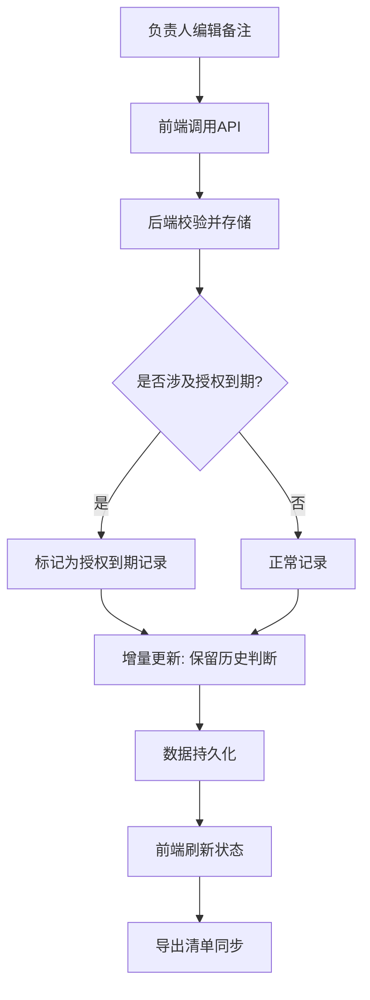

## 1. 产品概述

巡演耳返排期冲突管理系统——面向巡演演出团队，解决耳返设备排期冲突、材料断续提交、授权到期等排期管理难题，确保前端正向操作与后端数据/导出结果实时同步，后补材料不覆盖早先判断，授权到期记录单独标识。

## 2. 核心功能

### 2.1 用户角色

| 角色 | 注册方式 | 核心权限 |
|------|----------|----------|
| 负责人 | 系统分配 | 编辑备注、标记授权到期、导出清单、查看全部冲突 |
| 演出统筹 | 系统分配 | 查看曲目表、补充材料、查看进度 |
| 老师 | 系统分配 | 仅查看学生进步摘要 |

### 2.2 功能模块

1. **冲突总览页**：展示所有"巡演耳返排期冲突"记录，区分正常/授权到期/名称不一致，支持筛选和搜索
2. **曲目表页**：分批凑齐的曲目列表，展示主线拼装进度，后补材料标注补入时间
3. **备注编辑页**：负责人编辑冲突备注（含授权备注），前端修改即时同步后端
4. **导出清单页**：汇总当前所有冲突状态，一键导出 CSV，授权到期记录单独列出

### 2.3 页面详情

| 页面名称 | 模块名称 | 功能描述 |
|----------|----------|----------|
| 冲突总览页 | 冲突卡片列表 | 展示冲突记录，标注状态（正常/授权到期/名称不一致），支持筛选 |
| 冲突总览页 | 状态摘要面板 | 统计正常、授权到期、名称不一致各多少条 |
| 曲目表页 | 曲目分批列表 | 按提交批次分组展示曲目，标注补入时间和批次号 |
| 曲目表页 | 主线拼装视图 | 从曲目表拼出巡演主线，标注已确认/待确认 |
| 备注编辑页 | 备注编辑表单 | 编辑冲突备注，支持添加授权到期备注 |
| 备注编辑页 | 变更历史时间线 | 展示备注变更历史，后补材料不覆盖早先判断 |
| 导出清单页 | 清单预览 | 预览最终导出清单，授权到期单独分区 |
| 导出清单页 | CSV 导出按钮 | 一键导出，确保备注/状态/授权信息齐全 |

## 3. 核心流程

负责人在前端编辑"巡演耳返排期冲突"备注 → 前端调用 API 更新后端数据 → 后端校验授权到期标记 → 增量更新保留历史判断（不覆盖） → 导出时同步最新状态 → 授权到期记录单独列出

## 4. 用户界面设计

### 4.1 设计风格

- 主色调：深灰(#1a1a2e) + 琥珀色(#f59e0b)作为警示/强调色 + 翠绿(#10b981)表示正常状态
- 次色调：淡紫(#8b5cf6)用于授权到期标记
- 按钮风格：圆角微阴影，hover 有色变反馈
- 字体：使用 Noto Sans SC 作为主字体，标题使用 ZCOOL QingKe HuangYou
- 布局：左侧固定导航 + 右侧内容区，卡片式布局
- 图标：lucide-react 图标库

### 4.2 页面设计概览

| 页面名称 | 模块名称 | UI 元素 |
|----------|----------|---------|
| 冲突总览页 | 冲突卡片列表 | 深色卡片，琥珀色边框标注异常，翠绿标注正常，淡紫标注授权到期 |
| 冲突总览页 | 状态摘要面板 | 三个统计圆环/数字块，动画计数 |
| 曲目表页 | 曲目分批列表 | 按批次折叠面板，每条曲目标注补入时间戳 |
| 曲目表页 | 主线拼装视图 | 时间线样式，从上到下串联曲目节点 |
| 备注编辑页 | 备注编辑表单 | 文本域 + 授权到期开关 + 保存按钮，即时反馈 toast |
| 备注编辑页 | 变更历史时间线 | 竖向时间线，每条历史备注标注时间、操作人、是否后补 |
| 导出清单页 | 清单预览 | 表格式预览，授权到期行淡紫背景 |
| 导出清单页 | CSV 导出按钮 | 琥珀色按钮，点击后下载文件 |

### 4.3 响应式设计

- 桌面优先设计，最小宽度 1024px
- 平板端导航折叠为汉堡菜单
- 移动端卡片堆叠，表格横向滚动

### 4.4 演示数据要求

- 包含至少 6 条冲突记录
- 其中 1 条材料名称不一致（如曲目名"夜曲" vs "夜的小夜曲"）
- 其中 2 条授权到期记录
- 曲目表分 3 批凑齐，第 3 批为后补材料
- 后补材料在变更历史中可见，不覆盖早先判断
