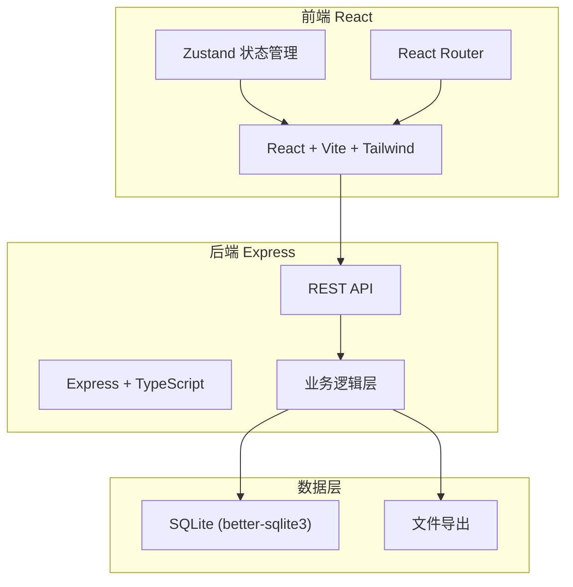
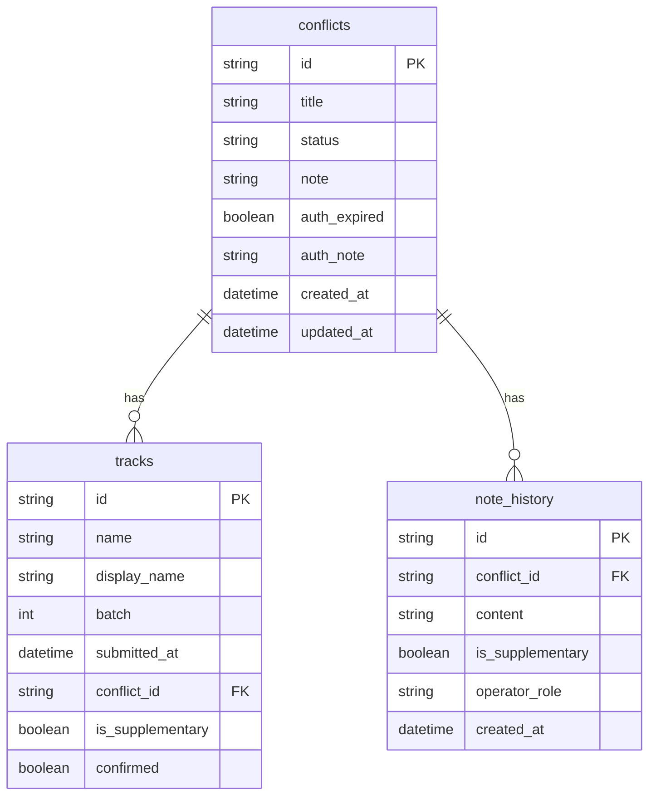

## 1. 架构设计



## 2. 技术说明

- 前端：React@18 + TailwindCSS@3 + Vite + Zustand
- 初始化工具：vite-init (react-express-ts 模板)
- 后端：Express@4 + TypeScript (ESM)
- 数据库：SQLite (better-sqlite3)，无需外部服务
- 导出：后端生成 CSV 文件供下载

## 3. 路由定义

| 路由 | 用途 |
|------|------|
| / | 冲突总览页，展示所有冲突记录和状态摘要 |
| /tracks | 曲目表页，分批展示曲目和主线拼装 |
| /notes/:id | 备注编辑页，编辑指定冲突的备注和历史 |
| /export | 导出清单页，预览和导出 CSV |

## 4. API 定义

### 4.1 冲突记录 API

```typescript
interface ConflictRecord {
  id: string;
  title: string;
  status: "normal" | "auth_expired" | "name_mismatch";
  note: string;
  authExpired: boolean;
  authNote: string;
  createdAt: string;
  updatedAt: string;
}

// GET /api/conflicts - 获取所有冲突记录
// GET /api/conflicts/:id - 获取单条冲突记录
// PATCH /api/conflicts/:id - 更新冲突记录（备注、授权标记等）
```

### 4.2 曲目表 API

```typescript
interface TrackItem {
  id: string;
  name: string;
  displayName: string;
  batch: number;
  submittedAt: string;
  conflictId: string | null;
  isSupplementary: boolean;
  confirmed: boolean;
}

// GET /api/tracks - 获取所有曲目（按批次分组）
// PATCH /api/tracks/:id - 更新曲目确认状态
```

### 4.3 备注历史 API

```typescript
interface NoteHistory {
  id: string;
  conflictId: string;
  content: string;
  isSupplementary: boolean;
  operatorRole: "manager" | "coordinator" | "teacher";
  createdAt: string;
}

// GET /api/conflicts/:id/history - 获取备注变更历史
// POST /api/conflicts/:id/history - 添加新备注（后补材料标记 isSupplementary）
```

### 4.4 导出 API

```typescript
// GET /api/export - 导出 CSV 文件
// 响应：CSV 文件下载，授权到期记录单独分区
```

### 4.5 状态摘要 API

```typescript
interface StatusSummary {
  total: number;
  normal: number;
  authExpired: number;
  nameMismatch: number;
}

// GET /api/summary - 获取状态摘要统计
```

## 5. 服务器架构图


## 6. 数据模型

### 6.1 数据模型定义



### 6.2 数据定义语言

```sql
CREATE TABLE conflicts (
  id TEXT PRIMARY KEY,
  title TEXT NOT NULL,
  status TEXT NOT NULL DEFAULT 'normal' CHECK(status IN ('normal', 'auth_expired', 'name_mismatch')),
  note TEXT NOT NULL DEFAULT '',
  auth_expired INTEGER NOT NULL DEFAULT 0,
  auth_note TEXT NOT NULL DEFAULT '',
  created_at TEXT NOT NULL DEFAULT (datetime('now')),
  updated_at TEXT NOT NULL DEFAULT (datetime('now'))
);

CREATE TABLE tracks (
  id TEXT PRIMARY KEY,
  name TEXT NOT NULL,
  display_name TEXT NOT NULL,
  batch INTEGER NOT NULL DEFAULT 1,
  submitted_at TEXT NOT NULL DEFAULT (datetime('now')),
  conflict_id TEXT,
  is_supplementary INTEGER NOT NULL DEFAULT 0,
  confirmed INTEGER NOT NULL DEFAULT 0,
  FOREIGN KEY (conflict_id) REFERENCES conflicts(id)
);

CREATE TABLE note_history (
  id TEXT PRIMARY KEY,
  conflict_id TEXT NOT NULL,
  content TEXT NOT NULL,
  is_supplementary INTEGER NOT NULL DEFAULT 0,
  operator_role TEXT NOT NULL DEFAULT 'manager' CHECK(operator_role IN ('manager', 'coordinator', 'teacher')),
  created_at TEXT NOT NULL DEFAULT (datetime('now')),
  FOREIGN KEY (conflict_id) REFERENCES conflicts(id)
);

CREATE INDEX idx_conflicts_status ON conflicts(status);
CREATE INDEX idx_tracks_batch ON tracks(batch);
CREATE INDEX idx_tracks_conflict_id ON tracks(conflict_id);
CREATE INDEX idx_note_history_conflict_id ON note_history(conflict_id);
```

### 6.3 初始演示数据

插入 6 条冲突记录，其中：
- 1 条 status='name_mismatch'（名称不一致）
- 2 条 status='auth_expired'（授权到期）
- 其余 3 条 status='normal'
- 曲目表分 3 批（batch 1/2/3），第 3 批标记 is_supplementary=1
- 备注历史含后补材料记录（is_supplementary=1），保留早先判断
