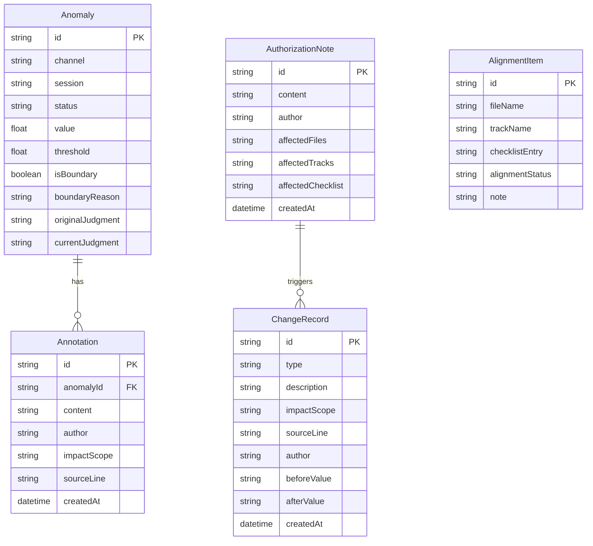

## 1. 架构设计

```mermaid
flowchart TD
    "前端 React SPA" --> "本地状态管理 Zustand"
    "本地状态管理 Zustand" --> "Mock 数据层"
    "Mock 数据层" --> "异常数据"
    "Mock 数据层" --> "批注数据"
    "Mock 数据层" --> "变更历史"
    "Mock 数据层" --> "对齐数据"
```

纯前端应用，无后端服务。所有数据通过 Mock 数据层在浏览器本地维护，状态管理使用 Zustand 持久化到 localStorage。

## 2. 技术说明

- 前端：React@18 + TypeScript + Tailwind CSS@3 + Vite
- 初始化工具：Vite (react-ts 模板)
- 后端：无
- 数据库：无（localStorage 持久化）

## 3. 路由定义

| 路由 | 用途 |
|------|------|
| / | 异常提醒与分析页（默认页） |
| /history | 变更溯源与对齐页 |

## 4. API 定义

不适用（纯前端，无 API）

## 5. 服务端架构

不适用

## 6. 数据模型

### 6.1 数据模型定义



### 6.2 数据定义语言

使用 TypeScript 类型定义，存储于 localStorage：

```typescript
interface Anomaly {
  id: string;
  channel: string;
  session: string;
  status: "pending" | "confirmed" | "overridden";
  value: number;
  threshold: number;
  thresholdUpper: number;
  isBoundary: boolean;
  boundaryReason: string;
  originalJudgment: string;
  currentJudgment: string;
}

interface Annotation {
  id: string;
  anomalyId: string;
  content: string;
  author: string;
  impactScope: string[];
  sourceLine: string;
  createdAt: string;
}

interface AuthorizationNote {
  id: string;
  content: string;
  author: string;
  affectedFiles: string[];
  affectedTracks: string[];
  affectedChecklist: string[];
  createdAt: string;
}

interface ChangeRecord {
  id: string;
  type: "annotation" | "authorization" | "override";
  description: string;
  impactScope: string[];
  sourceLine: string;
  author: string;
  beforeValue: string;
  afterValue: string;
  createdAt: string;
}

interface AlignmentItem {
  id: string;
  fileName: string;
  trackName: string;
  checklistEntry: string;
  alignmentStatus: "aligned" | "offset";
  note: string;
}
```
