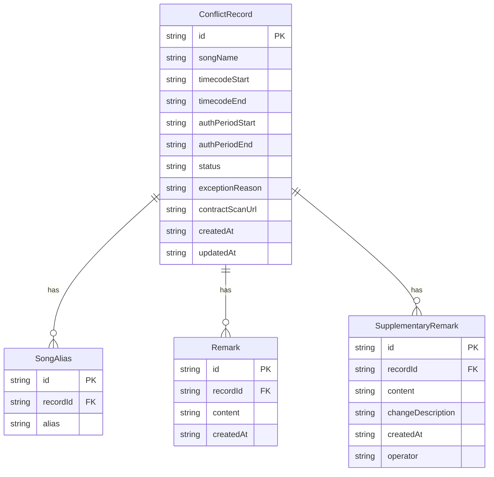

## 1. 架构设计

```mermaid
flowchart TD
    "前端 React SPA" --> "本地状态管理 Zustand"
    "本地状态管理 Zustand" --> "LocalStorage 持久化"
    "前端 React SPA" --> "CSV导出服务"
    "前端 React SPA" --> "文件上传处理"
    "文件上传处理" --> "FileReader API"
    "CSV导出服务" --> "Blob下载"
```

纯前端架构，数据存储在 LocalStorage，无需后端服务。

## 2. 技术说明

- 前端：React@18 + TypeScript + tailwindcss@3 + vite
- 初始化工具：vite-init
- 状态管理：Zustand（轻量，适合单页应用）
- 后端：无（纯前端，数据存 LocalStorage）
- 数据库：无（LocalStorage + 内存）

## 3. 路由定义

| 路由 | 用途 |
|------|------|
| / | 排期冲突总览页，冲突列表、状态筛选、异常统计 |
| /contracts | 合同导入与管理页，上传扫描件、编辑记录、后补备注 |
| /export | CSV导出与校验页，导出配置、一致性校验、别名重复检测 |

## 4. API定义

无后端API，所有数据操作通过 Zustand store 完成。

### 4.1 数据操作接口

```typescript
interface ConflictRecord {
  id: string
  songName: string
  songAlias: string[]
  timecodeStart: string
  timecodeEnd: string
  authPeriodStart: string
  authPeriodEnd: string
  status: 'normal' | 'conflict' | 'pending' | 'resolved'
  exceptionReason: string
  remarks: Remark[]
  supplementaryRemarks: SupplementaryRemark[]
  contractScanUrl: string | null
  createdAt: string
  updatedAt: string
}

interface Remark {
  id: string
  content: string
  createdAt: string
}

interface SupplementaryRemark {
  id: string
  content: string
  changeDescription: string
  createdAt: string
  operator: string
}

interface FilterCriteria {
  status: string[]
  timecodeRange: { start: string; end: string }
  keyword: string
  hasSupplementaryRemark: boolean | null
}

interface ExportConfig {
  includeFilterCriteria: boolean
  selectedColumns: string[]
  includeSupplementaryRemarks: boolean
}
```

## 5. 服务端架构

不适用（纯前端应用）

## 6. 数据模型

### 6.1 数据模型定义



### 6.2 数据定义语言

使用 LocalStorage 存储，数据结构为 JSON 序列化的 ConflictRecord 数组。初始数据包含一组含后补备注的样本合同记录。

```typescript
const INITIAL_DATA: ConflictRecord[] = [
  {
    id: 'demo-001',
    songName: '月光奏鸣曲',
    songAlias: ['Moonlight Sonata', '月光'],
    timecodeStart: '01:23:45:12',
    timecodeEnd: '01:25:30:00',
    authPeriodStart: '2024-01-01',
    authPeriodEnd: '2025-12-31',
    status: 'conflict',
    exceptionReason: '与"月光小夜曲"的时码区间重叠，授权期限在备注中标注为延期6个月',
    remarks: [{ id: 'r-001', content: '授权期限延期6个月，至2025-12-31', createdAt: '2024-06-15' }],
    supplementaryRemarks: [],
    contractScanUrl: null,
    createdAt: '2024-01-10',
    updatedAt: '2024-06-15',
  },
  {
    id: 'demo-002',
    songName: '春江花月夜',
    songAlias: ['春江', '花月夜'],
    timecodeStart: '02:00:00:00',
    timecodeEnd: '02:05:15:20',
    authPeriodStart: '2024-03-01',
    authPeriodEnd: '2025-02-28',
    status: 'normal',
    exceptionReason: '',
    remarks: [],
    supplementaryRemarks: [],
    contractScanUrl: null,
    createdAt: '2024-03-05',
    updatedAt: '2024-03-05',
  },
  {
    id: 'demo-003',
    songName: '月光小夜曲',
    songAlias: ['Moonlight', '月光'],
    timecodeStart: '01:24:00:00',
    timecodeEnd: '01:27:00:00',
    authPeriodStart: '2024-02-01',
    authPeriodEnd: '2025-01-31',
    status: 'conflict',
    exceptionReason: '与"月光奏鸣曲"时码重叠，且别名"月光"重复',
    remarks: [{ id: 'r-003', content: '原合同授权期只到2025-01-31，需确认是否续约', createdAt: '2024-07-20' }],
    supplementaryRemarks: [
      {
        id: 'sr-001',
        content: '续约确认中，临时授权延期至2025-06-30',
        changeDescription: '授权期限从2025-01-31延期至2025-06-30',
        createdAt: '2025-01-15',
        operator: '林姐',
      },
    ],
    contractScanUrl: null,
    createdAt: '2024-02-10',
    updatedAt: '2025-01-15',
  },
  {
    id: 'demo-004',
    songName: '高山流水',
    songAlias: ['流水', '高山'],
    timecodeStart: '03:10:00:00',
    timecodeEnd: '03:15:00:00',
    authPeriodStart: '2023-06-01',
    authPeriodEnd: '2024-05-31',
    status: 'pending',
    exceptionReason: '授权已过期，等待续约确认',
    remarks: [],
    supplementaryRemarks: [],
    contractScanUrl: null,
    createdAt: '2023-06-05',
    updatedAt: '2024-06-01',
  },
  {
    id: 'demo-005',
    songName: '二泉映月',
    songAlias: ['二泉', '映月'],
    timecodeStart: '01:23:50:00',
    timecodeEnd: '01:28:00:00',
    authPeriodStart: '2024-01-01',
    authPeriodEnd: '2025-12-31',
    status: 'conflict',
    exceptionReason: '时码与"月光奏鸣曲"和"月光小夜曲"三方重叠，需重新排期',
    remarks: [{ id: 'r-005', content: '三方冲突，建议重新分配时码区间', createdAt: '2024-08-01' }],
    supplementaryRemarks: [],
    contractScanUrl: null,
    createdAt: '2024-01-15',
    updatedAt: '2024-08-01',
  },
]
```
