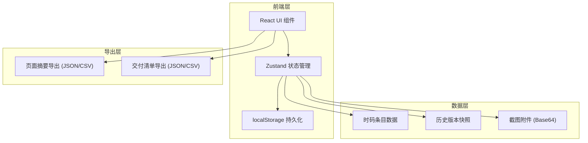
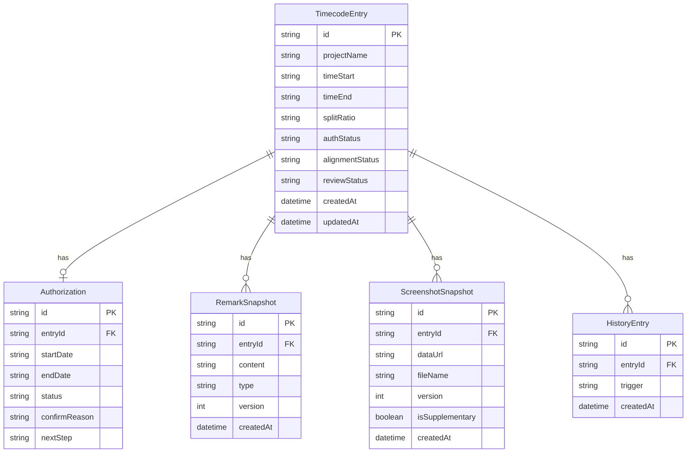

## 1. 架构设计



纯前端架构，无需后端服务。所有数据通过 localStorage 持久化，确保刷新后筛选条件、备注和摘要不丢失。

## 2. 技术说明

- 前端：React@18 + TypeScript + Tailwind CSS@3 + Vite
- 初始化工具：vite-init
- 状态管理：Zustand（含 persist 中间件实现 localStorage 持久化）
- 后端：无（纯前端工具）
- 数据库：localStorage（浏览器本地存储）
- 图标：lucide-react
- 导出：原生 Blob + URL.createObjectURL 实现文件下载

## 3. 路由定义

| 路由 | 用途 |
|------|------|
| / | 对齐面板主页，包含时码条目、授权到期卡、筛选摘要、备注截图、历史版本、导出交付 |

单页应用，核心功能集中在一个页面内，通过面板区域和抽屉组件组织信息层级。

## 4. API定义

无后端API。所有数据操作通过 Zustand store 完成。

### 4.1 Store 接口定义

```typescript
interface TimecodeEntry {
  id: string
  projectName: string
  timeRange: { start: string; end: string }
  splitRatio: string
  authorization: {
    startDate: string
    endDate: string
    status: 'valid' | 'expiring' | 'expired' | 'needs_confirmation'
    confirmReason?: string
    nextStep?: string
  }
  remarks: RemarkSnapshot[]
  screenshots: ScreenshotSnapshot[]
  alignmentStatus: 'aligned' | 'misaligned' | 'pending'
  reviewStatus: 'unreviewed' | 'in_review' | 'confirmed' | 'flagged'
  createdAt: string
  updatedAt: string
}

interface RemarkSnapshot {
  id: string
  content: string
  type: 'rehearsal' | 'authorization' | 'manual'
  createdAt: string
  version: number
}

interface ScreenshotSnapshot {
  id: string
  dataUrl: string
  fileName: string
  relatedRemarkId?: string
  createdAt: string
  version: number
  isSupplementary: boolean
}

interface HistoryEntry {
  id: string
  entryId: string
  snapshot: {
    remarks: RemarkSnapshot[]
    screenshots: ScreenshotSnapshot[]
    alignmentStatus: string
    authorization: TimecodeEntry['authorization']
  }
  trigger: 'remark_added' | 'screenshot_added' | 'rescan' | 'manual_override'
  createdAt: string
}

interface FilterState {
  dateRange: { start: string; end: string } | null
  project: string | null
  status: string | null
}

interface AppStore {
  entries: TimecodeEntry[]
  history: HistoryEntry[]
  filter: FilterState
  activeEntryId: string | null
  historyDrawerOpen: boolean

  addEntry: (entry: Omit<TimecodeEntry, 'id' | 'createdAt' | 'updatedAt'>) => void
  updateEntry: (id: string, partial: Partial<TimecodeEntry>) => void
  deleteEntry: (id: string) => void
  addRemark: (entryId: string, remark: Omit<RemarkSnapshot, 'id' | 'createdAt' | 'version'>) => void
  addScreenshot: (entryId: string, screenshot: Omit<ScreenshotSnapshot, 'id' | 'createdAt' | 'version'>) => void
  rescan: (entryId: string) => void
  setFilter: (filter: Partial<FilterState>) => void
  setActiveEntry: (id: string | null) => void
  toggleHistoryDrawer: () => void
  exportSummary: () => string
  exportChecklist: () => string
  confirmAuthorization: (entryId: string, reason: string, nextStep: string) => void
  updateReviewStatus: (entryId: string, status: TimecodeEntry['reviewStatus']) => void
}
```

## 5. 服务器架构图

不适用（纯前端项目）

## 6. 数据模型

### 6.1 数据模型定义



### 6.2 数据定义语言

使用 localStorage 存储，数据结构为 JSON 序列化的 AppStore 状态。初始化时写入示例数据供演示使用。

## 7. 持久化策略

- Zustand persist 中间件自动将 store 同步到 localStorage
- key: `studio-timecode-alignment-store`
- 筛选条件、备注、摘要、选中条目等均持久化
- 刷新页面后自动恢复状态，筛选条件、人工备注和页面摘要保持一致
